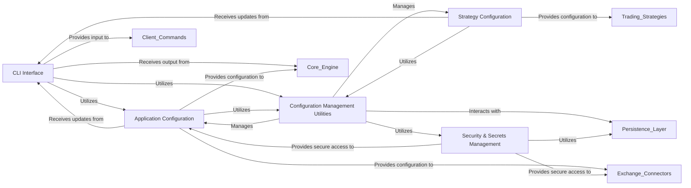

## Details

The User Interface & Configuration (UIC) subsystem in Hummingbot serves as the primary point of interaction for users and the central hub for managing all application and strategy configurations. It is designed to provide a robust, intuitive, and secure environment for controlling and monitoring the bot's operations.

### CLI Interface
This component provides the interactive command-line interface (CLI) through which users interact with Hummingbot. It is responsible for displaying real-time status updates, logs, and market data, as well as processing user commands and inputs. It ensures a responsive and user-friendly environment for bot control and monitoring.

**Related Classes/Methods**:

- <a href="https://github.com/hummingbot/hummingbot/blob/master/hummingbot/client/ui/hummingbot_cli.py#L51-L276" target="_blank" rel="noopener noreferrer">`hummingbot.client.ui.hummingbot_cli.HummingbotCLI` (51:276)</a>
- <a href="https://github.com/hummingbot/hummingbot/blob/master/hummingbot/client/ui/completer.py#L1-L1" target="_blank" rel="noopener noreferrer">`hummingbot.client.ui.completer` (1:1)</a>
- <a href="https://github.com/hummingbot/hummingbot/blob/master/hummingbot/client/ui/parser.py#L1-L1" target="_blank" rel="noopener noreferrer">`hummingbot.client.ui.parser` (1:1)</a>
- <a href="https://github.com/hummingbot/hummingbot/blob/master/hummingbot/client/ui/layout.py#L1-L1" target="_blank" rel="noopener noreferrer">`hummingbot.client.ui.layout` (1:1)</a>
- <a href="https://github.com/hummingbot/hummingbot/blob/master/hummingbot/client/ui/style.py#L1-L1" target="_blank" rel="noopener noreferrer">`hummingbot.client.ui.style` (1:1)</a>
- <a href="https://github.com/hummingbot/hummingbot/blob/master/hummingbot/client/ui/custom_widgets.py#L1-L1" target="_blank" rel="noopener noreferrer">`hummingbot.client.ui.custom_widgets` (1:1)</a>

### Application Configuration
This component defines and manages the global, client-specific, and connector-specific settings for the entire Hummingbot application. It uses structured data maps to store various parameters, ensuring consistent behavior across different modules.

**Related Classes/Methods**:

- <a href="https://github.com/hummingbot/hummingbot/blob/master/hummingbot/client/config/client_config_map.py#L684-L932" target="_blank" rel="noopener noreferrer">`hummingbot.client.config.client_config_map.ClientConfigMap` (684:932)</a>
- <a href="https://github.com/hummingbot/hummingbot/blob/master/hummingbot/client/config/global_config_map.py#L1-L1" target="_blank" rel="noopener noreferrer">`hummingbot.client.config.global_config_map` (1:1)</a>
- <a href="https://github.com/hummingbot/hummingbot/blob/master/hummingbot/client/config/config_data_types.py#L1-L1" target="_blank" rel="noopener noreferrer">`hummingbot.client.config.config_data_types` (1:1)</a>
- <a href="https://github.com/hummingbot/hummingbot/blob/master/hummingbot/client/config/fee_overrides_config_map.py#L1-L1" target="_blank" rel="noopener noreferrer">`hummingbot.client.config.fee_overrides_config_map` (1:1)</a>
- <a href="https://github.com/hummingbot/hummingbot/blob/master/hummingbot/client/config/gateway_ssl_config_map.py#L1-L1" target="_blank" rel="noopener noreferrer">`hummingbot.client.config.gateway_ssl_config_map` (1:1)</a>

### Configuration Management Utilities
This component provides a set of helper functions and adapters responsible for the lifecycle management of configurations. This includes loading configurations from storage, saving changes, validating inputs against defined schemas, and migrating configurations between different software versions to maintain compatibility.

**Related Classes/Methods**:

- <a href="https://github.com/hummingbot/hummingbot/blob/master/hummingbot/client/config/config_helpers.py#L57-L334" target="_blank" rel="noopener noreferrer">`hummingbot.client.config.config_helpers.ClientConfigAdapter` (57:334)</a>
- <a href="https://github.com/hummingbot/hummingbot/blob/master/hummingbot/client/config/config_helpers.py#L337-L346" target="_blank" rel="noopener noreferrer">`hummingbot.client.config.config_helpers.ReadOnlyClientConfigAdapter` (337:346)</a>
- <a href="https://github.com/hummingbot/hummingbot/blob/master/hummingbot/client/config/config_validators.py#L1-L1" target="_blank" rel="noopener noreferrer">`hummingbot.client.config.config_validators` (1:1)</a>
- <a href="https://github.com/hummingbot/hummingbot/blob/master/hummingbot/client/config/conf_migration.py#L1-L1" target="_blank" rel="noopener noreferrer">`hummingbot.client.config.conf_migration` (1:1)</a>
- <a href="https://github.com/hummingbot/hummingbot/blob/master/hummingbot/client/config/config_methods.py#L1-L1" target="_blank" rel="noopener noreferrer">`hummingbot.client.config.config_methods` (1:1)</a>
- <a href="https://github.com/hummingbot/hummingbot/blob/master/hummingbot/client/config/config_var.py#L1-L1" target="_blank" rel="noopener noreferrer">`hummingbot.client.config.config_var` (1:1)</a>

### Security & Secrets Management
This component is dedicated to the secure handling of sensitive user data, primarily API keys and other credentials. It provides mechanisms for encrypting, storing, and retrieving these secrets, protecting them from unauthorized access.

**Related Classes/Methods**:

- <a href="https://github.com/hummingbot/hummingbot/blob/master/hummingbot/client/config/security.py#L1-L1" target="_blank" rel="noopener noreferrer">`hummingbot.client.config.security.BaseSecretsManager` (1:1)</a>
- <a href="https://github.com/hummingbot/hummingbot/blob/master/hummingbot/client/config/config_crypt.py#L1-L1" target="_blank" rel="noopener noreferrer">`hummingbot.client.config.config_crypt` (1:1)</a>

### Strategy Configuration
This component specifically manages the parameters and settings for individual trading strategies. It allows users to define and customize how each strategy operates, including market pairs, order sizes, and specific algorithmic parameters.

**Related Classes/Methods**:

- <a href="https://github.com/hummingbot/hummingbot/blob/master/hummingbot/client/config/strategy_config_data_types.py#L12-L27" target="_blank" rel="noopener noreferrer">`hummingbot.client.config.strategy_config_data_types.BaseStrategyConfigMap` (12:27)</a>
- <a href="https://github.com/hummingbot/hummingbot/blob/master/hummingbot/client/config/strategy_config_data_types.py#L30-L65" target="_blank" rel="noopener noreferrer">`hummingbot.client.config.strategy_config_data_types.BaseTradingStrategyConfigMap` (30:65)</a>

### [FAQ](https://github.com/CodeBoarding/GeneratedOnBoardings/tree/main?tab=readme-ov-file#faq)