```mermaid
graph LR
    Core_Orchestration_Engine_COE_["Core Orchestration Engine (COE)"]
    User_Interface_Configuration_UIC_["User Interface & Configuration (UIC)"]
    Exchange_Gateway_Integration_EGI_["Exchange & Gateway Integration (EGI)"]
    Market_Intelligence_Data_MID_["Market Intelligence & Data (MID)"]
    Trading_Logic_Order_Management_TLOM_["Trading Logic & Order Management (TLOM)"]
    Performance_Reporting_PR_["Performance & Reporting (PR)"]
    Core_Orchestration_Engine_COE_ -- "orchestrates" --> User_Interface_Configuration_UIC_
    Core_Orchestration_Engine_COE_ -- "initializes" --> Exchange_Gateway_Integration_EGI_
    Core_Orchestration_Engine_COE_ -- "initializes" --> Market_Intelligence_Data_MID_
    Core_Orchestration_Engine_COE_ -- "manages" --> Trading_Logic_Order_Management_TLOM_
    Core_Orchestration_Engine_COE_ -- "sends events to" --> Performance_Reporting_PR_
    User_Interface_Configuration_UIC_ -- "configures" --> Core_Orchestration_Engine_COE_
    User_Interface_Configuration_UIC_ -- "configures" --> Exchange_Gateway_Integration_EGI_
    User_Interface_Configuration_UIC_ -- "configures" --> Trading_Logic_Order_Management_TLOM_
    Performance_Reporting_PR_ -- "reports to" --> User_Interface_Configuration_UIC_
    Exchange_Gateway_Integration_EGI_ -- "reports events to" --> Core_Orchestration_Engine_COE_
    Exchange_Gateway_Integration_EGI_ -- "feeds" --> Market_Intelligence_Data_MID_
    Exchange_Gateway_Integration_EGI_ -- "updates" --> Trading_Logic_Order_Management_TLOM_
    Trading_Logic_Order_Management_TLOM_ -- "requests" --> Exchange_Gateway_Integration_EGI_
    Exchange_Gateway_Integration_EGI_ -- "reports to" --> Performance_Reporting_PR_
    Market_Intelligence_Data_MID_ -- "feeds" --> Trading_Logic_Order_Management_TLOM_
    Market_Intelligence_Data_MID_ -- "feeds" --> Performance_Reporting_PR_
    Trading_Logic_Order_Management_TLOM_ -- "reports to" --> User_Interface_Configuration_UIC_
    Trading_Logic_Order_Management_TLOM_ -- "reports to" --> Performance_Reporting_PR_
    Performance_Reporting_PR_ -- "reports to" --> User_Interface_Configuration_UIC_
    click Core_Orchestration_Engine_COE_ href "/codeboarding/Core_Orchestration_Engine_COE_" "Details"
    click User_Interface_Configuration_UIC_ href "/codeboarding/User_Interface_Configuration_UIC_" "Details"
    click Exchange_Gateway_Integration_EGI_ href "/codeboarding/Exchange_Gateway_Integration_EGI_" "Details"
    click Performance_Reporting_PR_ href "/codeboarding/Performance_Reporting_PR_" "Details"
```

## Details

High-Level Data Flow Overview of the `hummingbot` project, analyzed through its Control Flow Graph (CFG) and source code, structured into core architectural components.

### Core Orchestration Engine (COE) [[Expand]](./Core_Orchestration_Engine_COE_.md)
The central orchestrator of the Hummingbot application. It manages the bot's lifecycle, initializes core services, dispatches system-wide events, and coordinates the overall operation of all other components.

**Related Classes/Methods**:

- <a href="https://github.com/hummingbot/hummingbot/blob/master/hummingbot/client/hummingbot_application.py#L1-L1" target="_blank" rel="noopener noreferrer">`hummingbot/client/hummingbot_application.py` (1:1)</a>
- `hummingbot/core/clock.pyx` (1:1)
- <a href="https://github.com/hummingbot/hummingbot/blob/master/hummingbot/core/network_base.py#L1-L1" target="_blank" rel="noopener noreferrer">`hummingbot/core/network_base.py` (1:1)</a>

### User Interface & Configuration (UIC) [[Expand]](./User_Interface_Configuration_UIC_.md)
Provides the interactive command-line interface (CLI) for users to interact with the bot, input commands, and view real-time status updates and logs. It also handles loading, saving, validating, and migrating all application and strategy configurations, including sensitive API keys and global settings.

**Related Classes/Methods**:

- <a href="https://github.com/hummingbot/hummingbot/blob/master/hummingbot/client/ui/hummingbot_cli.py#L1-L1" target="_blank" rel="noopener noreferrer">`hummingbot/client/ui/hummingbot_cli.py` (1:1)</a>
- <a href="https://github.com/hummingbot/hummingbot/blob/master/hummingbot/client/ui/completer.py#L1-L1" target="_blank" rel="noopener noreferrer">`hummingbot/client/ui/completer.py` (1:1)</a>
- <a href="https://github.com/hummingbot/hummingbot/blob/master/hummingbot/client/config/config_helpers.py#L1-L1" target="_blank" rel="noopener noreferrer">`hummingbot/client/config/config_helpers.py` (1:1)</a>
- <a href="https://github.com/hummingbot/hummingbot/blob/master/hummingbot/client/config/client_config_map.py#L1-L1" target="_blank" rel="noopener noreferrer">`hummingbot/client/config/client_config_map.py` (1:1)</a>
- <a href="https://github.com/hummingbot/hummingbot/blob/master/hummingbot/client/config/security.py#L1-L1" target="_blank" rel="noopener noreferrer">`hummingbot/client/config/security.py` (1:1)</a>

### Exchange & Gateway Integration (EGI) [[Expand]](./Exchange_Gateway_Integration_EGI_.md)
Provides standardized interfaces for interacting with various centralized exchanges (CEX) and decentralized exchanges (DEX) for both spot and perpetual markets. It handles order placement, cancellation, balance updates, and adheres to trading rules, including low-level API communication and rate limiting.

**Related Classes/Methods**:

- <a href="https://github.com/hummingbot/hummingbot/blob/master/hummingbot/connector/exchange_py_base.py#L1-L1" target="_blank" rel="noopener noreferrer">`hummingbot/connector/exchange_py_base.py` (1:1)</a>
- <a href="https://github.com/hummingbot/hummingbot/blob/master/hummingbot/connector/derivative_base.py#L1-L1" target="_blank" rel="noopener noreferrer">`hummingbot/connector/derivative_base.py` (1:1)</a>
- <a href="https://github.com/hummingbot/hummingbot/blob/master/hummingbot/connector/exchange/binance/binance_exchange.py#L1-L1" target="_blank" rel="noopener noreferrer">`hummingbot/connector/exchange/binance/binance_exchange.py` (1:1)</a>
- <a href="https://github.com/hummingbot/hummingbot/blob/master/hummingbot/core/gateway/gateway_http_client.py#L1-L1" target="_blank" rel="noopener noreferrer">`hummingbot/core/gateway/gateway_http_client.py` (1:1)</a>
- <a href="https://github.com/hummingbot/hummingbot/blob/master/hummingbot/connector/gateway/gateway_base.py#L1-L1" target="_blank" rel="noopener noreferrer">`hummingbot/connector/gateway/gateway_base.py` (1:1)</a>
- <a href="https://github.com/hummingbot/hummingbot/blob/master/hummingbot/core/web_assistant/web_assistants_factory.py#L1-L1" target="_blank" rel="noopener noreferrer">`hummingbot/core/web_assistant/web_assistants_factory.py` (1:1)</a>
- <a href="https://github.com/hummingbot/hummingbot/blob/master/hummingbot/core/web_assistant/rest_assistant.py#L1-L1" target="_blank" rel="noopener noreferrer">`hummingbot/core/web_assistant/rest_assistant.py` (1:1)</a>
- <a href="https://github.com/hummingbot/hummingbot/blob/master/hummingbot/core/web_assistant/ws_assistant.py#L1-L1" target="_blank" rel="noopener noreferrer">`hummingbot/core/web_assistant/ws_assistant.py` (1:1)</a>
- <a href="https://github.com/hummingbot/hummingbot/blob/master/hummingbot/core/api_throttler/async_throttler.py#L1-L1" target="_blank" rel="noopener noreferrer">`hummingbot/core/api_throttler/async_throttler.py` (1:1)</a>

### Market Intelligence & Data (MID)
Aggregates and processes external market data, such as historical candles, real-time prices, and order book depth. It also provides real-time and historical exchange rate conversions between different assets, crucial for cross-market calculations and strategy logic.

**Related Classes/Methods**:

- <a href="https://github.com/hummingbot/hummingbot/blob/master/hummingbot/data_feed/market_data_provider.py#L1-L1" target="_blank" rel="noopener noreferrer">`hummingbot/data_feed/market_data_provider.py` (1:1)</a>
- <a href="https://github.com/hummingbot/hummingbot/blob/master/hummingbot/data_feed/candles_feed/candles_base.py#L1-L1" target="_blank" rel="noopener noreferrer">`hummingbot/data_feed/candles_feed/candles_base.py` (1:1)</a>
- <a href="https://github.com/hummingbot/hummingbot/blob/master/hummingbot/data_feed/coin_gecko_data_feed/coin_gecko_data_feed.py#L1-L1" target="_blank" rel="noopener noreferrer">`hummingbot/data_feed/coin_gecko_data_feed/coin_gecko_data_feed.py` (1:1)</a>
- <a href="https://github.com/hummingbot/hummingbot/blob/master/hummingbot/core/data_type/order_book_tracker.py#L1-L1" target="_blank" rel="noopener noreferrer">`hummingbot/core/data_type/order_book_tracker.py` (1:1)</a>
- <a href="https://github.com/hummingbot/hummingbot/blob/master/hummingbot/core/data_type/user_stream_tracker.py#L1-L1" target="_blank" rel="noopener noreferrer">`hummingbot/core/data_type/user_stream_tracker.py` (1:1)</a>
- <a href="https://github.com/hummingbot/hummingbot/blob/master/hummingbot/core/rate_oracle/rate_oracle.py#L1-L1" target="_blank" rel="noopener noreferrer">`hummingbot/core/rate_oracle/rate_oracle.py` (1:1)</a>
- <a href="https://github.com/hummingbot/hummingbot/blob/master/hummingbot/core/rate_oracle/sources/rate_source_base.py#L1-L1" target="_blank" rel="noopener noreferrer">`hummingbot/core/rate_oracle/sources/rate_source_base.py` (1:1)</a>

### Trading Logic & Order Management (TLOM)
Implements various pre-defined algorithmic trading strategies (V1) and provides a modular framework for advanced strategies (V2). It tracks the lifecycle and state of all active orders placed by the bot, ensuring accurate order status, and manages the storage and retrieval of historical trading data.

**Related Classes/Methods**:

- `hummingbot/strategy/pure_market_making/pure_market_making.pyx` (1:1)
- <a href="https://github.com/hummingbot/hummingbot/blob/master/hummingbot/strategy/amm_arb/amm_arb.py#L1-L1" target="_blank" rel="noopener noreferrer">`hummingbot/strategy/amm_arb/amm_arb.py` (1:1)</a>
- `hummingbot/strategy_v2/strategy_v2_base.py` (1:1)
- <a href="https://github.com/hummingbot/hummingbot/blob/master/hummingbot/strategy_v2/controllers/controller_base.py#L1-L1" target="_blank" rel="noopener noreferrer">`hummingbot/strategy_v2/controllers/controller_base.py` (1:1)</a>
- <a href="https://github.com/hummingbot/hummingbot/blob/master/hummingbot/strategy_v2/executors/executor_base.py#L1-L1" target="_blank" rel="noopener noreferrer">`hummingbot/strategy_v2/executors/executor_base.py` (1:1)</a>
- <a href="https://github.com/hummingbot/hummingbot/blob/master/hummingbot/connector/client_order_tracker.py#L1-L1" target="_blank" rel="noopener noreferrer">`hummingbot/connector/client_order_tracker.py` (1:1)</a>
- <a href="https://github.com/hummingbot/hummingbot/blob/master/hummingbot/core/data_type/in_flight_order.py#L1-L1" target="_blank" rel="noopener noreferrer">`hummingbot/core/data_type/in_flight_order.py` (1:1)</a>
- <a href="https://github.com/hummingbot/hummingbot/blob/master/hummingbot/model/sql_connection_manager.py#L1-L1" target="_blank" rel="noopener noreferrer">`hummingbot/model/sql_connection_manager.py` (1:1)</a>
- <a href="https://github.com/hummingbot/hummingbot/blob/master/hummingbot/model/trade_fill.py#L1-L1" target="_blank" rel="noopener noreferrer">`hummingbot/model/trade_fill.py` (1:1)</a>
- <a href="https://github.com/hummingbot/hummingbot/blob/master/hummingbot/model/order.py#L1-L1" target="_blank" rel="noopener noreferrer">`hummingbot/model/order.py` (1:1)</a>

### Performance & Reporting (PR) [[Expand]](./Performance_Reporting_PR_.md)
Manages the logging of all bot operations, errors, and performance metrics. It provides mechanisms for sending user notifications, tracks consolidated user asset balances across exchanges, and includes a backtesting engine for simulating strategies with historical data.

**Related Classes/Methods**:

- <a href="https://github.com/hummingbot/hummingbot/blob/master/hummingbot/logger/logger.py#L1-L1" target="_blank" rel="noopener noreferrer">`hummingbot/logger/logger.py` (1:1)</a>
- <a href="https://github.com/hummingbot/hummingbot/blob/master/hummingbot/logger/log_server_client.py#L1-L1" target="_blank" rel="noopener noreferrer">`hummingbot/logger/log_server_client.py` (1:1)</a>
- <a href="https://github.com/hummingbot/hummingbot/blob/master/hummingbot/notifier/notifier_base.py#L1-L1" target="_blank" rel="noopener noreferrer">`hummingbot/notifier/notifier_base.py` (1:1)</a>
- <a href="https://github.com/hummingbot/hummingbot/blob/master/hummingbot/user/user_balances.py#L1-L1" target="_blank" rel="noopener noreferrer">`hummingbot/user/user_balances.py` (1:1)</a>
- <a href="https://github.com/hummingbot/hummingbot/blob/master/hummingbot/remote_iface/mqtt.py#L1-L1" target="_blank" rel="noopener noreferrer">`hummingbot/remote_iface/mqtt.py` (1:1)</a>
- <a href="https://github.com/hummingbot/hummingbot/blob/master/hummingbot/strategy_v2/backtesting/backtesting_engine_base.py#L1-L1" target="_blank" rel="noopener noreferrer">`hummingbot/strategy_v2/backtesting/backtesting_engine_base.py` (1:1)</a>
- <a href="https://github.com/hummingbot/hummingbot/blob/master/hummingbot/strategy_v2/backtesting/backtesting_data_provider.py#L1-L1" target="_blank" rel="noopener noreferrer">`hummingbot/strategy_v2/backtesting/backtesting_data_provider.py` (1:1)</a>

### [FAQ](https://github.com/CodeBoarding/GeneratedOnBoardings/tree/main?tab=readme-ov-file#faq)