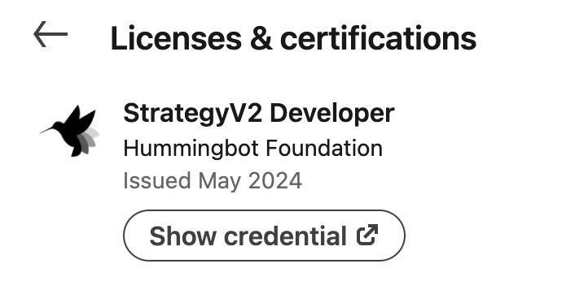

Hummingbot certified market makers and strategy developers have successfully completed a [Hummingbot Botcamp](https://www.botcamp.xyz) cohort, demonstrating their ability to design, code, and present a custom trading strategy.

Watch the Demo Day video from the last cohort (Cohort 11):

<iframe style="width:100%; min-height:400px;" src="https://www.youtube.com/embed/8lglLz7tYgs" frameborder="0" allow="accelerometer; autoplay; encrypted-media; gyroscope; picture-in-picture" allowfullscreen></iframe>

See [Certifications List](list.md) for current certified developers.

## Benefits of Certification

Earning your Hummingbot certificate offers several valuable benefits:

1. **Botcamp Member Profile**:
   Your personal profile will be featured on [botcamp.xyz/members](https://www.botcamp.xyz/members), showcasing your skills, strategies, and achievements to the broader community. This public profile serves as a portfolio of your work and helps you connect with potential employers, collaborators, and bounty sponsors.

2. **NFT Certificate**:
   Upon completion of the certification process, you'll receive a unique certificate in the form of an Ethereum NFT. This serves as formal recognition of your skills and achievements in the Hummingbot ecosystem. Here are examples of the NFT certificates provided to a recent batch of Botcamp graduates: [Cohort 9 NFTs](https://opensea.io/assets/ethereum/0x59072271620d3528cb6d7565158b11492b25a4e5/2). The top strategy presenters in each cohort also receive an additional [Cohort MVP NFT](https://opensea.io/assets/ethereum/0x59072271620d3528cb6d7565158b11492b25a4e5/2).

3. **Certifications List**:
   Your name and credentials will be included in the [master list](list.md) of certified developers. This list is maintained on the Hummingbot website and serves as a public record of all certified developers. Being listed here can increase your visibility within the community and enhance your credibility as a Hummingbot developer to potential employers and bounty sponsors.

4. **LinkedIn Certification**:
   You'll be able to add your Hummingbot certification to your LinkedIn profile, showcasing your skills on this professional networking platform. For more information on adding the certification to LinkedIn, see [LinkedIn's help article](https://www.linkedin.com/help/linkedin/answer/a567169) or [this walkthrough](https://www.linkedin.com/pulse/how-add-certification-linkedin-step-by-step-maia-digital-ltd/).

5. **Discord Badge**:
   You'll receive special certification badge(s) on the Hummingbot Discord server. This badge system integrates with Discord's role system, giving you special recognition within the Hummingbot community. It's a great way to showcase your expertise and connect with other certified developers.

## Certification Process

The Hummingbot certification process is designed to be comprehensive and challenging, ensuring that participants have the skills to code and operate custom algorithmic trading strategies. This process is overseen by the core maintainers of the Hummingbot codebase.

The certification process involves completing a [Hummingbot Botcamp](https://www.botcamp.xyz) cohort and submitting a strategy template and video for presentation at Demo Day. Botcamp members can also submit strategies for certification after their cohort ends, allowing them to continue building and refining their trading strategies.

### 1. Submit Strategy Template and Video

Botcamp participants are expected to:

- Complete the strategy template for their strategy
- Record a brief video (3 minutes) explaining the strategy thesis and demonstrating it in action

### 2. Pass Review by Hummingbot Maintainers

After submitting their strategy template and video, Hummingbot maintainers will evaluate the work based on the following criteria:

- **Effort**: Overall thoroughness and effort invested
- **Technical**: Quality of implementation and use of Hummingbot framework components
- **Presentation Quality**: Clarity and effectiveness of the video presentation

### 3. Present at Demo Day

After the review process, the accepted strategies are presented at Demo Day, the capstone event for each Botcamp cohort.

- **Voting Process**: Attendees vote for the top strategies presented at Demo Day.
- **Certification NFT**: All presenters receive a limited edition Botcamp Certification NFT, recognizing their achievement.
- **Cohort MVP NFT**: The top-voted strategies are awarded a special Cohort MVP NFT, highlighting exceptional work.

Past Demo Day presentations can be viewed on the [Hummingbot YouTube channel](https://www.youtube.com/watch?v=TAulqoSenmk&list=PLDwlNkL_4MMctOkqVHECwqw0rP885FzMy&index=1).
