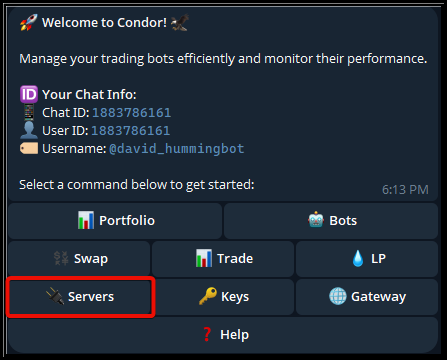
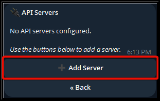
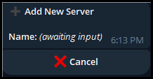
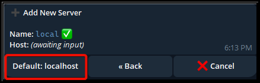
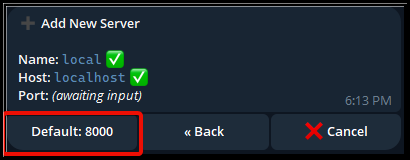
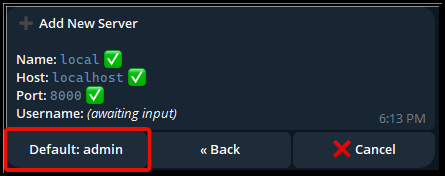
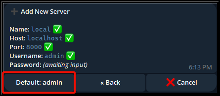
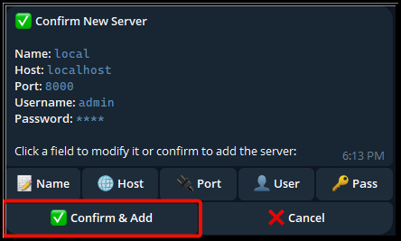

# 🚀 Adding a Hummingbot API Server in Condor

Condor allows you to manage multiple Hummingbot API servers directly through Telegram.
Follow this guide to register a new server so Condor can connect, monitor, and control your Hummingbot instances.

## 📋 Overview

This setup wizard guides you through:

1. Opening the **Servers** menu
2. Adding a new API server entry
3. Entering connection details (host, port, username, password)
4. Confirming and saving the server

Each step below includes a screenshot and explanation.

## 1️⃣ Open the **Servers** Menu

Tap **Servers** from Condor’s main menu.

## 2️⃣ Tap **Add Server**

This brings up the server creation wizard.

## 3️⃣ Enter a Server Name

Choose a friendly identifier — for example: `local` or `vps-1`.

## 4️⃣ Set the Host

Enter the hostname or IP address where the Hummingbot API is running, or tap the suggested default.

Common examples:

* `localhost` (local machine)
* `192.168.x.x` (LAN server)
* `your-vps-ip` (cloud server)

## 5️⃣ Enter the Port

The default Hummingbot API port is **8000**, unless you configured a different port.

## 6️⃣ Provide the Username

The default API username is **admin**, unless you have changed it.

## 7️⃣ Enter the Password

Enter the password for the Hummingbot API user.

## 8️⃣ Confirm and Save the Server

Review the details:

* **Name**
* **Host**
* **Port**
* **Username**
* **Password**

If everything is correct, tap **Confirm & Add**.

## 🎉 Server Added Successfully

Your server is now saved and Condor can:

* Connect to the Hummingbot API
* Deploy and manage instances
* Show portfolio, balances, and bot status
* Switch between multiple servers easily

You can add as many servers as needed — local, on a LAN, or remote cloud nodes.

