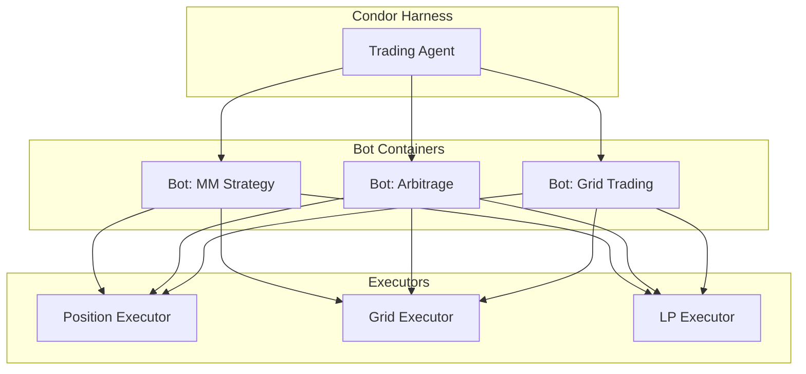

# Bots

**Bots** are Docker containers running Hummingbot instances for long-running automation tasks. They execute scripts for simpler tasks or controllers for algorithmic trading and market making strategies.

## Overview

While [Executors](executors.md) are short-lived, single-purpose operations, Bots are persistent containers that can:

- Run continuously for days or weeks
- Orchestrate multiple executors over time
- Execute complex multi-step strategies
- React to market conditions autonomously



## Scripts vs Controllers

### Scripts

Python scripts for simpler automation tasks:

- Single-file implementation
- Direct access to Hummingbot connectors
- Good for custom indicators, alerts, and simple strategies

```python
# Example: Simple price alert script
from hummingbot.strategy.script_strategy_base import ScriptStrategyBase

class PriceAlertScript(ScriptStrategyBase):
    markets = {"binance": {"BTC-USDT"}}

    def on_tick(self):
        price = self.connectors["binance"].get_mid_price("BTC-USDT")
        if price > 70000:
            self.notify("BTC above $70,000!")
```

See [Scripts documentation](/scripts) for more examples.

### Controllers

Multi-component strategies for algorithmic trading:

- Modular architecture with separate components
- Built-in executor orchestration
- Designed for market making and complex strategies

```python
# Example: Market making controller structure
from hummingbot.strategy_v2.controllers import ControllerBase

class MarketMakingController(ControllerBase):
    def __init__(self, config):
        self.config = config

    def determine_actions(self) -> List[ExecutorAction]:
        # Analyze market conditions
        # Return list of executor actions
        pass
```

See [Controllers documentation](/strategies/v2-strategies/controllers) for detailed examples.

## Bot Lifecycle

### Creation

Bots are created via the `/bots` command or API:

```bash
# Via Condor Telegram
/bots → Create New Bot → Select Script/Controller
```

### Deployment

Each bot runs as an isolated Docker container:

- Separate filesystem and network
- Independent of other bots
- Can be started/stopped individually

### Management

Bots can be managed via:

- **Telegram**: `/bots` command shows status, start/stop controls
- **API**: REST endpoints for programmatic control
- **Web Dashboard**: Visual monitoring and management

## When to Use Bots vs Executors

| Scenario | Use | Reason |
|----------|-----|--------|
| Single directional trade | Executor | Short-lived, defined outcome |
| Continuous market making | Bot | Long-running, complex logic |
| One-time swap | Executor | Simple, immediate |
| Multi-leg arbitrage | Bot | Requires coordination |
| LP position management | Executor | Self-contained lifecycle |
| 24/7 grid trading | Bot | Persistent, adaptive |

### Executors

Best for:

- Single-purpose operations
- Standardized P&L tracking
- Agent-controlled lifecycle
- Defined entry/exit conditions

### Bots

Best for:

- Long-running strategies
- Complex orchestration logic
- Continuous market making
- Strategies that span multiple executors

## Bot Configuration

Bots are configured via YAML files:

```yaml
# config/mm_strategy.yml
exchange: binance
trading_pair: BTC-USDT

# Market making parameters
bid_spread: 0.001
ask_spread: 0.001
order_amount: 0.01
order_refresh_time: 15

# Risk management
max_order_age: 300
inventory_target_base_pct: 50
```

## Integration with Agents

Agents can create and manage bots programmatically:

```python
# Agent creates a bot via MCP tools
result = await mcp_tools.manage_bots(
    action="create",
    bot_type="controller",
    controller_name="market_making_v2",
    config={
        "exchange": "binance",
        "trading_pair": "ETH-USDT",
        "bid_spread": 0.002,
        "ask_spread": 0.002,
    }
)

# Agent monitors bot status
status = await mcp_tools.get_bot_status(bot_id="bot_001")
```

## Examples

See the Hummingbot documentation for detailed examples:

- [Pure Market Making](/strategies/pure-market-making)
- [Cross-Exchange Market Making](/strategies/cross-exchange-market-making)
- [Arbitrage Strategies](/strategies/arbitrage)
- [Custom Scripts](/scripts)
- [V2 Controllers](/strategies/v2-strategies/controllers)
