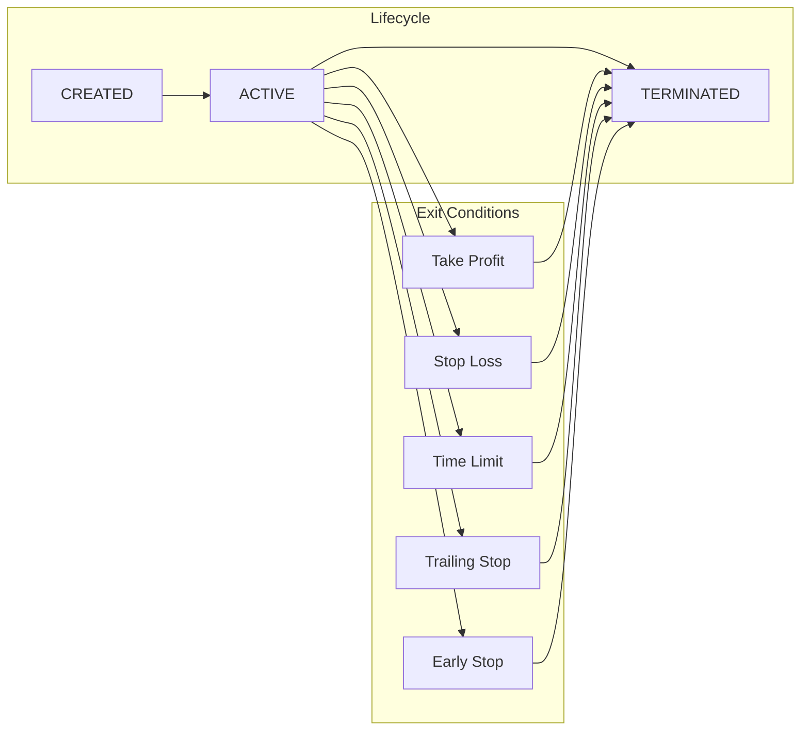
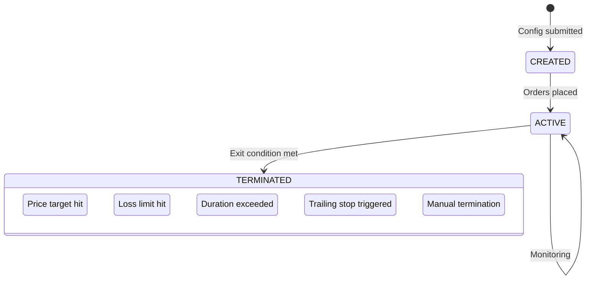

# Executors

**Executors** are self-contained trading operations that manage their complete lifecycle—from entry to exit—with standardized P&L and fee reporting. Each executor is tagged with a `controller_id` linking it to the agent that created it.

The executor framework is implemented in `hummingbot/strategy_v2/executors/`. Each executor type has its own subdirectory with `data_types.py` (config) and the executor implementation.

## Overview

Executors provide:

- **Self-management**: Handle order placement, monitoring, and exit conditions
- **Standardized reporting**: P&L, fees, and volume in quote currency
- **Agent attribution**: `controller_id` links activity to specific agents
- **Configurable lifecycle**: `keep_position` controls what happens on termination



## Executor Types

### SwapExecutor

Token swaps on decentralized exchanges. See `hummingbot/strategy_v2/executors/swap_executor/data_types.py:SwapExecutorConfig`.

| Property | Value |
|----------|-------|
| Position Type | Spot |
| keep_position | `true` (baked in) |
| P&L Calculation | None - just token swap |

```python
swap_config = SwapExecutorConfig(
    controller_id="my-agent",
    connector_name="jupiter/router",      # Gateway AMM connector
    trading_pair="SOL-USDC",              # BASE-QUOTE format
    side=TradeType.BUY,                   # BUY or SELL
    amount=Decimal("1.0"),                # Amount in base token
    slippage_pct=Decimal("0.01"),         # Optional slippage override
    swap_providers=["meteora/clmm"],      # Optional: compare quotes
)
```

**Use cases**: Rebalancing portfolio, acquiring tokens for LP, converting profits.

### OrderExecutor

Limit and market orders on CEX or DEX. See `hummingbot/strategy_v2/executors/order_executor/data_types.py:OrderExecutorConfig`.

| Property | Value |
|----------|-------|
| Position Type | Spot |
| keep_position | `true` (default) |
| P&L Calculation | None - just order fill |

```python
order_config = OrderExecutorConfig(
    controller_id="my-agent",
    connector_name="binance",
    trading_pair="BTC-USDT",
    side=TradeType.BUY,
    amount=Decimal("0.01"),
    position_action=PositionAction.OPEN,
    execution_strategy=ExecutionStrategy(
        order_type=OrderType.LIMIT,
        price=Decimal("65000.0"),
    ),
)
```

**Use cases**: Limit order entries, DCA purchases, building positions at specific prices.

### LPExecutor

Liquidity provision on AMM and CLMM DEXs. See `hummingbot/strategy_v2/executors/lp_executor/data_types.py:LPExecutorConfig`.

| Property | Value |
|----------|-------|
| Position Type | LP |
| keep_position | Configurable (default: `false`) |
| P&L Calculation | Fees earned - impermanent loss - tx fees |

```python
lp_config = LPExecutorConfig(
    controller_id="my-agent",
    connector_name="meteora",
    pool_address="5Q544fK...",            # On-chain pool address
    trading_pair="SOL-USDC",              # Optional if pool resolves it
    lower_price=Decimal("140.0"),         # Price range lower bound
    upper_price=Decimal("160.0"),         # Price range upper bound
    base_amount=Decimal("1.0"),           # Base token to deposit
    quote_amount=Decimal("150.0"),        # Quote token to deposit
    side=0,                               # 0=BOTH, 1=BUY, 2=SELL
    auto_close_above_range_seconds=3600,  # Close if above range for 1 hour
    auto_close_below_range_seconds=3600,  # Close if below range for 1 hour
    keep_position=True,                   # Leave LP position on stop
)
```

**States** (see `LPExecutorStates` enum): `NOT_ACTIVE`, `OPENING`, `IN_RANGE`, `OUT_OF_RANGE`, `CLOSING`, `COMPLETE`, `FAILED`

**Tracks**: `base_fee`, `quote_fee`, `position_rent` (Solana), `tx_fee`.

**Use cases**: Earning LP fees, concentrated liquidity strategies, range-bound market making.

### PositionExecutor

Perp and spot positions with Triple Barrier exit conditions. See `hummingbot/strategy_v2/executors/position_executor/data_types.py:PositionExecutorConfig`.

| Property | Value |
|----------|-------|
| Position Type | Perp or Spot (determined by connector) |
| keep_position | Controlled via stop action |
| P&L Calculation | Entry vs exit price ± fees ± funding |

```python
position_config = PositionExecutorConfig(
    controller_id="my-agent",
    connector_name="binance_perpetual",
    trading_pair="SOL-USDT",
    side=TradeType.BUY,
    amount=Decimal("10.0"),
    entry_price=Decimal("150.0"),  # Optional limit entry
    leverage=5,
    triple_barrier_config=TripleBarrierConfig(
        take_profit=Decimal("0.02"),     # 2% take profit
        stop_loss=Decimal("0.01"),       # 1% stop loss
        time_limit=3600,                 # 1 hour max
        trailing_stop=TrailingStop(
            activation_price=Decimal("0.01"),
            trailing_delta=Decimal("0.005"),
        ),
    ),
)
```

**Exit conditions**: Take profit, stop loss, time limit, trailing stop, or early stop (manual).

**Use cases**: Directional trades, momentum strategies, hedging, scalping.

### GridExecutor

Multi-level grid trading with inventory tracking. See `hummingbot/strategy_v2/executors/grid_executor/data_types.py:GridExecutorConfig`.

| Property | Value |
|----------|-------|
| Position Type | Spot or Perp |
| keep_position | Configurable |
| P&L Calculation | Sum of filled grid trades |

```python
grid_config = GridExecutorConfig(
    controller_id="my-agent",
    connector_name="binance",
    trading_pair="ETH-USDT",
    side=TradeType.BUY,           # Grid direction
    start_price=Decimal("3000"),  # Grid start price
    end_price=Decimal("4000"),    # Grid end price
    limit_price=Decimal("2900"),  # Stop if price goes below
    total_amount_quote=Decimal("1000"),
    keep_position=True,           # Keep inventory on termination
)
```

**Tracks**: Filled levels, inventory delta, grid P&L.

**Use cases**: Range-bound markets, accumulating on dips, market making.

## Executor Comparison

| Executor | Position Type | keep_position | P&L Reported | Primary Use |
|----------|--------------|---------------|--------------|-------------|
| SwapExecutor | Spot | `true` (baked) | No | Token swaps |
| OrderExecutor | Spot | `true` (baked) | No | Limit/market orders |
| LPExecutor | LP | Configurable | Yes (if closed) | Liquidity provision |
| PositionExecutor | Perp/Spot | Configurable | Yes (if closed) | Directional trades |
| GridExecutor | Spot | Configurable | Yes (if closed) | Grid trading |

## Standardized Metrics

All executors report metrics in a standardized format. See `hummingbot/strategy_v2/models/executors_info.py:ExecutorInfo` for the data structure:

| Metric | Description |
|--------|-------------|
| `net_pnl_quote` | Realized P&L in quote currency |
| `fees_paid_quote` | Trading fees, gas costs |
| `fees_earned_quote` | LP fees, funding payments received |
| `value_quote` | Current position value |
| `volume_quote` | Total trading volume |
| `close_type` | How executor terminated |
| `duration_seconds` | Time from creation to termination |

```python
# Individual executor report
executor_report = {
    "executor_id": "exe_001",
    "controller_id": "grid-trader",
    "type": "position_executor",
    "status": "closed",
    "close_type": "TAKE_PROFIT",
    "net_pnl_quote": 12.50,
    "fees_paid_quote": 0.25,
    "fees_earned_quote": 0.00,
    "value_quote": 0.00,
    "volume_quote": 250.00,
    "duration_seconds": 3600,
}
```

## keep_position Behavior

The `keep_position` parameter controls what happens when an executor terminates:

### keep_position: true

Position is left in the [Positions bucket](positions.md):

- Spot tokens remain in portfolio
- LP position stays active on DEX
- Perp position remains open

**No P&L is attributed** because the position is still open.

**Use cases**:

- Building inventory over time
- Placing limit orders that should persist
- LP positions intended to run indefinitely
- Scalping where you want to hold the resulting position

### keep_position: false

Position is fully closed on termination:

- Spot tokens sold back to quote currency
- LP position withdrawn from DEX
- Perp position closed at market

**P&L is calculated and reported** for learning and analysis.

**Use cases**:

- Structured experiments comparing strategies
- Time-limited trades with defined outcomes
- Performance measurement and backtesting
- Agent learning from win/loss patterns

## Lifecycle States



| Close Type | Description |
|------------|-------------|
| `TAKE_PROFIT` | Price reached take profit target |
| `STOP_LOSS` | Price reached stop loss limit |
| `TIME_LIMIT` | Maximum duration exceeded |
| `TRAILING_STOP` | Trailing stop triggered after activation |
| `EARLY_STOP` | Manually stopped by user or agent |

## Integration with Agents

Agents create executors via MCP tools. The Risk Engine (`condor/trading_agent/risk.py`) validates each request:

```python
# Agent requests executor creation
result = await mcp_tools.manage_executors(
    action="create",
    executor_type="position_executor",
    config={
        "controller_id": agent_id,  # Automatically set
        "connector_name": "binance_perpetual",
        "trading_pair": "SOL-USDT",
        "side": "BUY",
        "amount": 10.0,
        "triple_barrier_config": {
            "take_profit": 0.02,
            "stop_loss": 0.01,
        }
    }
)
```

The Risk Engine validates before creation (see `check_executor_action` in `risk.py`):

1. **Executor count**: `executor_count < max_open_executors`
2. **Single order size**: `order_amount < max_single_order_quote`
3. **Total exposure**: `total_exposure + new_amount < max_position_size_quote`
4. **Controller ID**: Must match the agent's ID

If validation fails, the agent receives an error message explaining which limit would be violated, enabling it to adjust its strategy.
