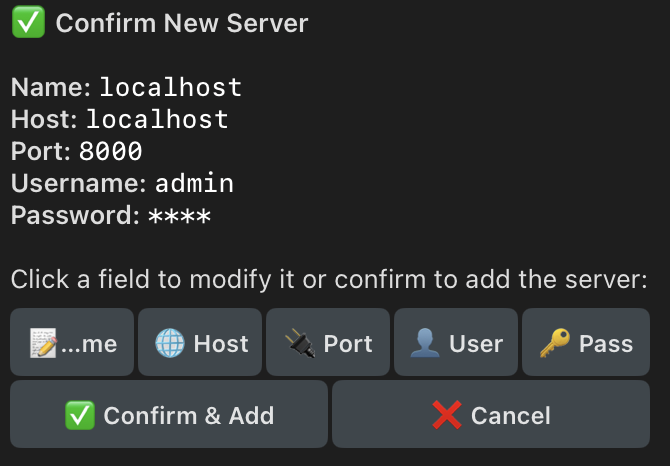

Condor is a powerful Telegram bot that provides a mobile-friendly interface to interact with [Hummingbot API](../hummingbot-api/index.md). It allows you to monitor portfolios, manage trading bots, execute trades on both centralized (CEX) and decentralized (DEX) exchanges, and configure your entire trading setup—all from Telegram.

!!! tip "Condor Dashboard Coming Soon"
    A browser-based version of Condor is in development and will replace the current [Dashboard](../dashboard/index.md).

<iframe style="width:100%; min-height:400px;" src="https://www.youtube.com/embed/SVBdmJTZB2M?si=H15J1_Sk4ec3M7D8" frameborder="0" allow="accelerometer; autoplay; encrypted-media; gyroscope; picture-in-picture" allowfullscreen></iframe>

## Why Use Condor?

*   **Accessibility**: Manage your bots on the go without needing SSH access or complex terminal commands.
*   **Optimized for AI**: Chat-based, simple interface will evolve toward natural language.
*   **Team Usage**: Manage multiple API servers and control access with view-only mode.

## Core Components

1.  **Telegram Interface**: The user-facing component running on Telegram clients, handling user input and displaying interactive menus.
2.  **Command Handlers**: The logic layer that processes specific commands (e.g., `/portfolio`, `/bots`) and determines the appropriate action.
3.  **API Integration Layer**: A secure communication module that interacts with the Hummingbot Backend API using standard REST protocols.
4.  **Data Processing Utilities**: Helper functions that format raw data from Hummingbot into clear, readable messages and visualizations (charts/graphs).

## Installation

Condor is installed automatically when you run the [Hummingbot API Quickstart](../installation/hummingbot-api.md). During installation, you'll need to provide:

**Create a Telegram Bot:**

[BotFather](https://t.me/botfather) is Telegram's official bot for creating and managing bots.

1. Open the link above or search for `@BotFather` in Telegram
2. Send `/newbot` and follow the prompts to name your bot (e.g., `@my_condor_bot`)
3. Copy the **bot token** (looks like `123456789:ABCdefGHIjklMNOpqrsTUVwxyz`)

**Get Your Telegram User ID:**

[UserInfoBot](https://telegram.me/userinfobot) is a bot that tells you your Telegram user ID.

1. Open the link above or search for `@userinfobot` in Telegram
2. Send `/start` - it will reply with your User ID (a number like `123456789`)

## Connect To Hummingbot API Server

1. Open `@my_condor_bot` (or whatever you named it) in Telegram and send `/start`
2. Use `/servers` to add your Hummingbot API server:
    - **Name**: Enter a name (e.g., `localhost` or `my-server`)
    - **Host**: Enter `localhost` (local) or your server IP (cloud)
    - **Port**: Enter `8000` (default)
    - **Username**: Enter your API username (default: `admin`)
    - **Password**: Enter your API password (default: `admin`)
3. Click **Confirm & Add** to save the server

Once connected, you can use these commands:

| Command | Description |
|---------|-------------|
| `/start` | Welcome message and server status |
| `/portfolio` | View detailed portfolio breakdown |
| `/bots` | Check status of all trading bots |
| `/trade` | Unified trading - CEX orders and DEX swaps |
| `/lp` | Liquidity pool management |
| `/routines` | Run configurable Python scripts |
| `/servers` | Manage Hummingbot API servers |
| `/keys` | Configure exchange API credentials |
| `/gateway` | Deploy Gateway for DEX trading |
| `/admin` | Admin panel - manage users and access |