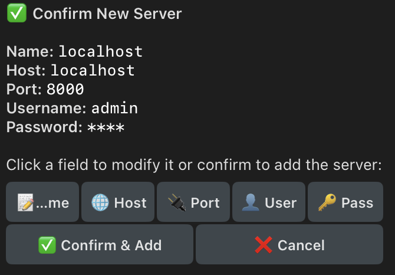
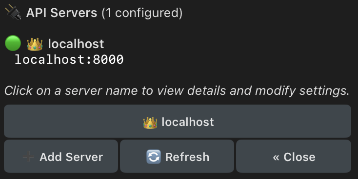
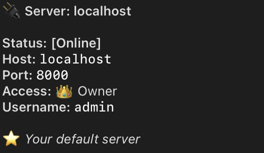
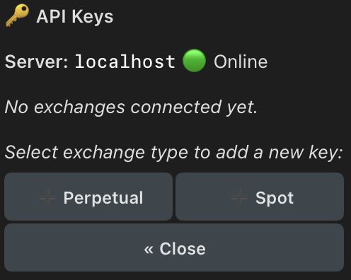
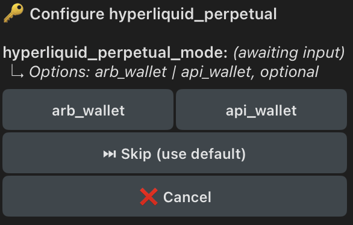
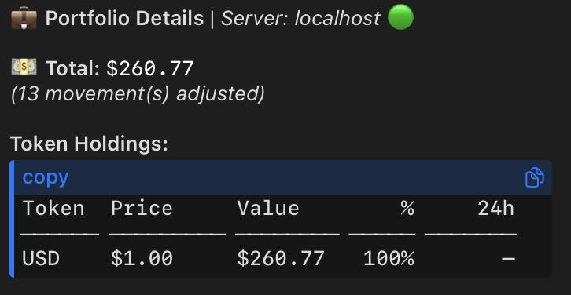

**Condor** is an open source harness for building and running autonomous **Trading Agents**. It connects LLM-powered decision-making to deterministic trade execution via the [Hummingbot API](../hummingbot-api/index.md), enabling traders to deploy AI agents that can observe markets, reason about strategy, and execute trades across 50+ exchanges and blockchains.

!!! note "Active Development"
    Condor is in active development. Join the [#condor-feedback](https://discord.gg/hummingbot) channel in Discord to share feedback and help shape the future of autonomous trading.

<iframe style="width:100%; min-height:400px;" src="https://www.youtube.com/embed/SVBdmJTZB2M?si=H15J1_Sk4ec3M7D8" frameborder="0" allow="accelerometer; autoplay; encrypted-media; gyroscope; picture-in-picture" allowfullscreen></iframe>

## Why Use Condor?

Where Hummingbot lets one person do the work of a team, Condor lets one person manage a *swarm* of autonomous agents—each observing markets, adapting to conditions, and executing strategies independently.

*   **Accessibility**: Manage your bots on the go without needing SSH access or complex terminal commands
*   **AI-Powered Trading**: Connect to LLMs like Claude, Gemini, or Codex to build autonomous Trading Agents
*   **Team Usage**: Manage multiple API servers and control access with view-only mode
*   **Cross-device Continuity**: Seamlessly switch between mobile and desktop while managing your agents

## Trading Agent Architecture

A Trading Agent implements a two-layer architecture that cleanly separates probabilistic reasoning from deterministic execution:

### The Agentic Loop (Probabilistic)

Trading Agents follow the [**OODA loop**](https://en.wikipedia.org/wiki/OODA_loop), a decision-making framework developed by military strategist John Boyd for fighter pilots. Each tick:

1. **Observe**: Fetch portfolio state, active positions, and market data via Hummingbot API
2. **Orient**: Load the journal (learnings, current state, recent actions) and build context
3. **Decide**: The LLM reasons about strategy and determines what actions to take
4. **Act**: Execute decisions via MCP tools, then record results to journal

The loop is **probabilistic** because the LLM powers the Orient and Decide phases. Given the same market conditions, the agent might reason differently and make different decisions.

### The Execution Layer (Deterministic)

The [Hummingbot API](../hummingbot-api/index.md) handles the Observe and Act phases:

- **Data collection**: Standardized access to order books, candles, balances, and positions across 50+ exchanges
- **Market access**: Connectors to spot, perp, and AMM exchanges, along with Solana and EVM networks
- **Trade execution**: Run configurable executors that abstract common trading workflows and track performance
- **Bot management**: Deploy and manage containerized bots for long-running strategies

The execution layer is **deterministic**—the same instruction always produces the same result.

## Agent Design

Each Trading Agent follows a standard structure stored in the `~/condor/agents/` directory:

- **agent.md**: Defines what the agent does. YAML frontmatter sets configuration (tick interval, risk limits, connectors); Markdown instructions guide the LLM on goals and rules.

- **sessions/**: Each time you start an agent, it creates a new session containing:
    - **journal.md**: The agent's working memory—learnings accumulated over time, current state, recent actions, and quantitative history for analysis
    - **snapshots/**: Point-in-time captures of agent state for debugging and replay

This architecture enables **session continuity across interfaces**. The `~/condor` directory stores all agent state, and Condor uses [ACP (Agent Client Protocol)](https://agentclientprotocol.com/get-started/introduction) to connect to your LLM. This means you can start a conversation on Telegram and continue it in Claude Code—same session, same agent state, same conversation history.

## Core Components

1.  **Telegram Interface**: The user-facing component running on Telegram clients, handling user input and displaying interactive menus.
2.  **Command Handlers**: The logic layer that processes specific commands (e.g., `/portfolio`, `/bots`) and determines the appropriate action.
3.  **API Integration Layer**: A secure communication module that interacts with the Hummingbot Backend API using standard REST protocols.
4.  **Data Processing Utilities**: Helper functions that format raw data from Hummingbot into clear, readable messages and visualizations (charts/graphs).

## Installation

To install Condor, run the following command. This script handles the source installation and deploys Condor in a detached `tmux` session.

```bash
curl -fsSL https://raw.githubusercontent.com/hummingbot/deploy/refs/heads/main/setup.sh | bash
```

### What the Installation Script Does

The `setup.sh` script performs the following actions:

- Clones the Condor repository from source.
- Runs Condor's internal `setup-environment.sh` script, which installs necessary Python dependencies (including `uv`) and interactively prompts you for your Telegram Bot Token and User ID.
- Launches Condor within a detached `tmux` session.
- Optionally installs AI CLI tools such as Gemini CLI and Claude Code for seamless Agent Client Protocol (ACP) integration.

During installation, you'll need to provide:

**Create a Telegram Bot:**

[BotFather](https://t.me/botfather) is Telegram's official bot for creating and managing bots.

1. Open the link above or search for `@BotFather` in Telegram
2. Send `/newbot` and follow the prompts to name your bot (e.g., `@my_condor_bot`)
3. Copy the **bot token** (looks like `123456789:ABCdefGHIjklMNOpqrsTUVwxyz`)

**Get Your Telegram User ID:**

[UserInfoBot](https://telegram.me/userinfobot) is a bot that tells you your Telegram user ID.

1. Open the link above or search for `@userinfobot` in Telegram
2. Send `/start` - it will reply with your User ID (a number like `123456789`)

### Managing Your Condor Session

Once installed and running, you can manage your Condor session using `tmux`:

- **Attach to session**: `tmux attach -t condor`
- **Detach from session**: Press `Ctrl+B` then `D`
- **Stop Condor**: `tmux kill-session -t condor`
- **Restart Condor**: Navigate to the Condor directory (e.g., `cd condor`) and run `source setup-environment.sh`

## Connect To Hummingbot API Server

1. Open `@my_condor_bot` (or whatever you named it) in Telegram and send `/start`
2. Use `/servers` to add your Hummingbot API server:
    - **Name**: Enter a name (e.g., `localhost` or `my-server`)
    - **Host**: Enter `localhost` (local) or your server IP (cloud)
    - **Port**: Enter `8000` (default)
    - **Username**: Enter your API username (default: `admin`)
    - **Password**: Enter your API password (default: `admin`)
3. Click **Confirm & Add** to save the server



## Setting Default Server

After adding a server, you need to set it as your default server. Click on the server name in the `/servers` list to view its details and set it as default.



Once set as default, the server will show a crown icon in the list and display "Your default server" in the details view.



## Adding Keys

Use `/keys` to add your exchange API credentials. This allows Condor to access your exchange accounts for trading and portfolio monitoring.



1. Run `/keys` to open the credentials menu
2. Select **Perpetual** or **Spot** depending on the exchange type
3. Choose the exchange you want to configure
4. Enter the required credentials (API key, secret, and any exchange-specific options)



See [Connecting to Exchanges](../client/connect.md) for details on creating API keys for each exchange.

!!! warning "Only enable Read and Trade access"
    For security reasons, we recommend using only **read + trade** enabled API keys. Do not enable withdraw or transfer permissions.

After adding your keys, run `/portfolio` to view your balances across all connected exchanges.



## Commands

Once connected, you can use these commands:

| Command | Description |
|---------|-------------|
| `/start` | Welcome message and server status |
| `/agent` | Connect to LLMs and build Trading Agents via ACP |
| `/portfolio` | View detailed portfolio breakdown |
| `/bots` | Check status of all trading bots |
| `/executors` | Create and manage Position, Grid, DCA, TWAP, XEMM, and LP executors — includes guided Position Executor wizard with stop-loss, take-profit, and trailing stops *(enhanced in v2.13.0)* |
| `/trade` | Unified trading - CEX limit/market orders and DEX swaps |
| `/lp` | Liquidity pool management - view positions, pools, and explorer |
| `/routines` | Run configurable Python scripts |
| `/servers` | Manage Hummingbot API servers |
| `/keys` | Configure exchange API credentials |
| `/gateway` | Deploy and configure Gateway for DEX trading |
| `/admin` | Admin panel - manage users and access |

## Building Trading Agents with /agent

The `/agent` command lets you connect to LLMs and build autonomous Trading Agents. It uses [ACP (Agent Client Protocol)](https://agentclientprotocol.com/get-started/introduction), a standardized protocol for agent-editor communication that enables interoperability between clients and AI agents.

### Supported LLMs

Condor supports connecting to multiple LLM providers via ACP:

| Provider | Models |
|----------|--------|
| **Anthropic** | Claude Opus, Sonnet, Haiku |
| **Google** | Gemini Pro, Gemini Flash |
| **OpenAI** | Codex, GPT-4, GPT-4o |

### How ACP Works

ACP provides a standardized protocol for agent-editor communication, similar to how the Language Server Protocol (LSP) standardized language server integration. Key features:

- **Local deployment**: Agents operate as sub-processes, exchanging data via JSON-RPC over standard input/output
- **Remote deployment**: Agents can be cloud-hosted, communicating through HTTP or WebSocket connections
- **Interoperability**: Any LLM implementing ACP can power the reasoning layer for Trading Agents

### Agent Portability

Agents are defined as structured Markdown files, enabling:

- **Version control**: Track changes with git
- **Sharing**: Share agent configurations with your team
- **Auditing**: Every session logs each turn as a structured snapshot
- **Cross-platform**: Start a conversation on Telegram, continue in Claude Code
