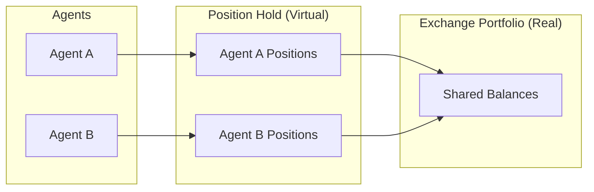
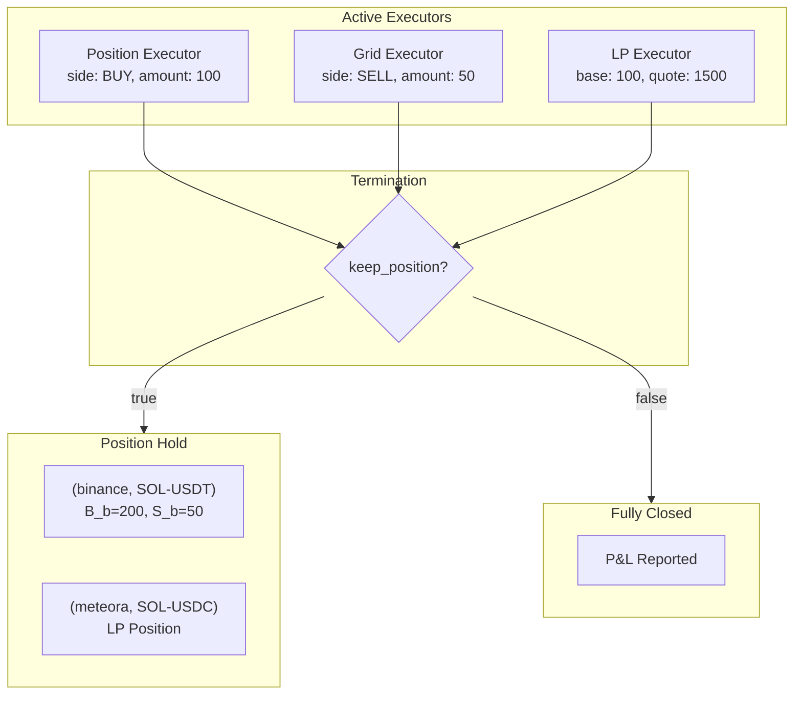

# Positions

**Positions** is a position-based accounting standard for autonomous trading agents. It defines how agents track their trading impact through a virtual portfolio, enabling standardized measurement of realized and unrealized P&L across different markets and asset types.

---

## Core Framework

### Shared Identity

Positions and Executors share the same required attributes:

| Attribute | Type | Description |
|-----------|------|-------------|
| `connector_name` | string | Exchange or connector (e.g., `binance`, `binance_perpetual`) |
| `trading_pair` | string | Market formatted as `BASE-QUOTE` (e.g., `SOL-USDT`) |
| `side` | TradeType | `BUY` (long base) or `SELL` (short base) |
| `amount` | decimal | Size in base asset |

This shared identity enables seamless flow from executor activity to position accounting.

### Trading Pair Structure

```
trading_pair = "SOL-USDT"
                 │    │
                 │    └── Quote Asset (USDT)
                 │        - P&L measured in this currency
                 │        - All monetary values use this unit
                 │
                 └── Base Asset (SOL)
                     - The asset being traded
                     - amount is always in this unit
```

**Key principle**: `amount` is always in base asset. All P&L is in quote asset.

### Side Semantics

| Side | Meaning | Profit When |
|------|---------|-------------|
| `BUY` | Long the base asset | Price increases |
| `SELL` | Short the base asset | Price decreases |

---

## The Position Hold

The **Position Hold** is the virtual portfolio that tracks an agent's cumulative trading impact. It's a set of positions, each uniquely keyed by `(connector_name, trading_pair)`:

$$
\text{Position Hold} = \{ P_1, P_2, \ldots, P_n \}
$$

$$
\text{key}(P_i) = (\text{connector\_name}, \text{trading\_pair})
$$



When multiple agents share exchange accounts, the Position Hold isolates each agent's activity for accurate performance attribution.

---

## Position Types

The Position Hold contains three position types:

| Type | Structure | Connector Examples |
|------|-----------|-------------------|
| **Spot** | Standard | `binance`, `jupiter`, `uniswap` |
| **Perp** | Standard | `binance_perpetual`, `hyperliquid_perpetual` |
| **LP** | Extended | `meteora`, `uniswap_v3` |

Spot and perp positions share the same data structure—the type is determined by the connector name. LP positions have additional fields for AMM/CLMM mechanics.

---

## Position State

The position tracking implementation is in `hummingbot/strategy_v2/executors/executor_orchestrator.py:PositionHold` (lines 36-134).

### Internal Tracking

Each position maintains internal state tracking all trading activity:

| Variable | Symbol | Description |
|----------|--------|-------------|
| `buy_amount_base` | $B_b$ | Total base bought |
| `buy_amount_quote` | $B_q$ | Total quote spent on buys |
| `sell_amount_base` | $S_b$ | Total base sold |
| `sell_amount_quote` | $S_q$ | Total quote received from sells |
| `cum_fees_quote` | $F$ | Cumulative fees (in quote) |

### Derived Properties

**Net Amount** (base asset):
$$\text{net} = B_b - S_b$$

**Side**:
$$
\text{side} = \begin{cases}
\text{BUY} & \text{if } \text{net} > 0 \\
\text{SELL} & \text{if } \text{net} < 0 \\
\text{CLOSED} & \text{if } \text{net} = 0
\end{cases}
$$

**Amount** (always positive):
$$\text{amount} = |\text{net}|$$

**Breakeven Price** (quote per base):
$$
p_{\text{be}} = \begin{cases}
\dfrac{B_q}{B_b} & \text{if side = BUY} \\[1em]
\dfrac{S_q}{S_b} & \text{if side = SELL}
\end{cases}
$$

The breakeven price is the volume-weighted average entry price.

---

## Executor → Position Flow

Executors are the source of all position changes. When an executor terminates, its trading activity flows into the Position Hold.



### Executor Types and Position Flow

| Executor | Position Type | keep_position | Flow Behavior |
|----------|--------------|---------------|---------------|
| SwapExecutor | Spot | `true` (baked) | Always adds to Position Hold |
| OrderExecutor | Spot | `true` (baked) | Always adds to Position Hold |
| PositionExecutor | Spot/Perp | Configurable | Adds or closes |
| GridExecutor | Spot/Perp | Configurable | Adds net inventory or closes |
| LPExecutor | LP | Configurable | Keeps LP position or withdraws |
| XEMMExecutor | Spot (×2) | Configurable | Creates positions on both exchanges |

### Position Aggregation

When an executor adds to an existing position (same `connector_name`, `trading_pair`), the internal state accumulates:

```
Existing position:
  B_b = 100, B_q = 15000  (100 SOL at avg 150)

OrderExecutor terminates: BUY 50 SOL at 145

Aggregation:
  B_b = 150  (100 + 50)
  B_q = 22250  (15000 + 7250)

New breakeven:
  p_be = 22250 / 150 = 148.33
```

The Position Hold maintains **at most one position** per `(connector_name, trading_pair)` key.

---

## P&L Calculation

All P&L values are denominated in the **quote asset**.

### Unrealized P&L

Mark-to-market value of open positions at current price $p_c$:

**Long position (side = BUY)**:
$$\text{PnL}_{\text{unrealized}} = (p_c - p_{\text{be}}) \times \text{amount}$$

**Short position (side = SELL)**:
$$\text{PnL}_{\text{unrealized}} = (p_{\text{be}} - p_c) \times \text{amount}$$

**General form** with side multiplier $\sigma = +1$ (BUY) or $-1$ (SELL):
$$\text{PnL}_{\text{unrealized}} = \sigma \times (p_c - p_{\text{be}}) \times \text{amount}$$

### Realized P&L

Calculated when positions are reduced (buys matched against sells):

**Matched amount**:
$$\text{matched} = \min(B_b, S_b)$$

**Average prices**:
$$p_{\text{buy}} = \frac{B_q}{B_b}, \quad p_{\text{sell}} = \frac{S_q}{S_b}$$

**Realized P&L**:
$$\text{PnL}_{\text{realized}} = (p_{\text{sell}} - p_{\text{buy}}) \times \text{matched}$$

This formula works for both directions:
- Bought low, sold high → positive P&L
- Bought high, sold low → negative P&L

### Global P&L

Total P&L combines unrealized, realized, and fees:
$$\text{PnL}_{\text{global}} = \text{PnL}_{\text{unrealized}} + \text{PnL}_{\text{realized}} - F$$

### Volume Traded

$$V = B_q + S_q$$

---

## Active vs Terminated Executors

### Active Executor State

While an executor is running, it tracks its own position:

| Field | Description |
|-------|-------------|
| `connector_name` | Exchange |
| `trading_pair` | Market |
| `side` | BUY or SELL |
| `amount` | Current position size (base) |
| `entry_price` | Average entry price |
| `unrealized_pnl` | Mark-to-market P&L |
| `fees_paid` | Trading fees so far |

The executor's position is **active**—it's being managed with entry/exit logic (take profit, stop loss, time limit, etc.).

### Executor Termination

When an executor terminates:

**If `keep_position: false`** (position closed):
1. Position is fully closed (sells match buys)
2. Realized P&L calculated
3. P&L reported for learning/analysis
4. No position added to Position Hold

**If `keep_position: true`** (position kept):
1. Executor's trading activity ($B_b$, $B_q$, $S_b$, $S_q$, $F$) added to Position Hold
2. Aggregates with existing position if same `(connector_name, trading_pair)`
3. Position continues to accumulate unrealized P&L
4. Can be closed by future executors

### P&L Attribution

| State | Unrealized P&L | Realized P&L |
|-------|----------------|--------------|
| Active Executor | ✓ (tracked live) | Partial (if scaled out) |
| Position Hold | ✓ (mark-to-market) | ✓ (from matched trades) |
| Closed (keep_position: false) | — | ✓ (final) |

---

## Position Arithmetic

### Adding to Position (Same Side)

```
Before: Long 100 SOL at p_be = 150
  B_b = 100, B_q = 15000

Action: BUY 50 SOL at 145

After:
  B_b = 150, B_q = 22250
  p_be = 22250/150 = 148.33 (weighted average)
```

### Reducing Position (Opposite Side)

```
Before: Long 200 SOL at p_be = 90
  B_b = 200, B_q = 18000
  S_b = 0, S_q = 0

Action: SELL 100 SOL at 120

After:
  B_b = 200, B_q = 18000
  S_b = 100, S_q = 12000

Matching:
  matched = min(200, 100) = 100
  PnL_realized = (120 - 90) × 100 = +3000

Remaining:
  net = 100 (still long)
  p_be = 90 (unchanged)
```

### Flipping Position

```
Before: Long 100 SOL at p_be = 100
  B_b = 100, B_q = 10000

Action: SELL 150 SOL at 110

After:
  S_b = 150, S_q = 16500

Matching:
  matched = 100
  PnL_realized = (110 - 100) × 100 = +1000

New position:
  net = -50 (now SHORT)
  amount = 50
  p_be = 16500/150 = 110 (sell avg)
```

### Closing Position

```
When B_b = S_b:
  net = 0
  amount = 0
  side = CLOSED
  PnL_unrealized = 0
  PnL_realized = (p_sell - p_buy) × matched
```

---

## LP Position Accounting

LP positions have additional fields and different P&L mechanics:

### LP Position State

| Field | Description |
|-------|-------------|
| `connector_name` | DEX connector |
| `pool_address` | On-chain pool |
| `position_address` | Position NFT (CLMM) |
| `trading_pair` | Pool market |
| `lower_price` | Range lower bound (CLMM) |
| `upper_price` | Range upper bound (CLMM) |
| `base_amount` | Current base in position |
| `quote_amount` | Current quote in position |
| `initial_base_amount` | Base at open |
| `initial_quote_amount` | Quote at open |
| `add_mid_price` | Market price at open |
| `base_fee` | Accumulated base fees |
| `quote_fee` | Accumulated quote fees |

### LP P&L Calculation

**Initial value** (at position open):
$$V_{\text{init}} = (\text{initial\_base} \times p_{\text{add}}) + \text{initial\_quote}$$

**Current value**:
$$V_{\text{curr}} = (\text{base\_amount} \times p_c) + \text{quote\_amount}$$

**Fees earned**:
$$\text{fees} = (\text{base\_fee} \times p_c) + \text{quote\_fee}$$

**LP P&L**:
$$\text{PnL}_{\text{LP}} = (V_{\text{curr}} - V_{\text{init}}) + \text{fees} - \text{tx\_fees}$$

This captures:
- Price movement impact (can be negative = impermanent loss)
- Fee accumulation (positive)
- Transaction costs (negative)

---

## Cross-Exchange Positions

For XEMM and arbitrage, separate positions are created per connector:

```
XEMM Trade:
  Buy 100 SOL on Binance at 150.00
  Sell 100 SOL on KuCoin at 150.50

Creates two positions:

Position 1: (binance, SOL-USDT)
  side: BUY, amount: 100, p_be: 150.00
  PnL_unrealized = (p_binance - 150.00) × 100

Position 2: (kucoin, SOL-USDT)
  side: SELL, amount: 100, p_be: 150.50
  PnL_unrealized = (150.50 - p_kucoin) × 100

Spread captured: (150.50 - 150.00) × 100 = 50 USDT
```

Each position independently tracks exposure. The inventory on each exchange is real and subject to price movements.

---

## Risk Limits

The Risk Engine enforces limits before executor creation. See `condor/trading_agent/config.py:RiskLimitsConfig` for the implementation.

| Limit | Default | Description |
|-------|---------|-------------|
| `max_position_size_quote` | 500 | Maximum total position size in quote currency |
| `max_single_order_quote` | 100 | Maximum size per executor |
| `max_open_executors` | 5 | Maximum simultaneous executors |
| `max_daily_loss_quote` | 50 | Maximum daily loss before blocking |
| `max_drawdown_pct` | 10 | Maximum drawdown percentage |
| `max_cost_per_day_usd` | 5 | Maximum daily LLM cost |

**Exposure calculation**:
$$\text{exposure}_{\text{total}} = \sum_{P_i} \text{amount}_i \times p_{c,i}$$

**Configuration** (in `config.yml`):
```yaml
risk_limits:
  max_position_size_quote: 500.0
  max_single_order_quote: 100.0
  max_open_executors: 5
  max_daily_loss_quote: 50.0
  max_drawdown_pct: 10.0
  max_cost_per_day_usd: 5.0
```

The Risk Engine (`condor/trading_agent/risk.py`) validates:

1. **Pre-tick**: Blocks if `daily_loss > max_daily_loss_quote` or `drawdown > max_drawdown_pct`
2. **Per-executor**: Checks `executor_count < max_open_executors` and `order_amount < max_single_order_quote`
3. **Position check**: Validates `total_exposure + new_amount < max_position_size_quote`

---

## Standardized Reporting

The data structures are defined in `hummingbot/strategy_v2/executors/data_types.py`.

### PositionSummary

See `PositionSummary` class (lines 57-74):

```python
{
    # Identity (same as executor)
    "connector_name": "binance",
    "trading_pair": "SOL-USDT",
    "side": "BUY",
    "amount": Decimal("150"),  # base asset

    # Pricing
    "breakeven_price": Decimal("148.33"),
    "amount_quote": Decimal("22249.50"),  # amount × p_be

    # P&L (all quote asset)
    "unrealized_pnl_quote": Decimal("250.50"),
    "realized_pnl_quote": Decimal("100.00"),
    "cum_fees_quote": Decimal("15.25"),
    "global_pnl_quote": Decimal("335.25"),

    # Volume
    "volume_traded_quote": Decimal("22250.00"),
}
```

### ExecutorReport

When executor terminates (keep_position: false):

```python
{
    "executor_id": "exec_001",
    "controller_id": "grid-trader",
    "connector_name": "binance",
    "trading_pair": "SOL-USDT",
    "side": "BUY",
    "amount": Decimal("100"),

    # Outcome
    "close_type": "TAKE_PROFIT",  # or STOP_LOSS, TIME_LIMIT, etc.
    "entry_price": Decimal("148.00"),
    "exit_price": Decimal("151.00"),

    # P&L (position was closed)
    "realized_pnl_quote": Decimal("300.00"),
    "fees_paid_quote": Decimal("3.00"),
    "net_pnl_quote": Decimal("297.00"),

    "duration_seconds": 3600,
}
```

### PerformanceReport

Aggregated across all positions and closed executors:

```python
{
    "realized_pnl_quote": Decimal("500.00"),
    "unrealized_pnl_quote": Decimal("250.50"),
    "global_pnl_quote": Decimal("750.50"),
    "global_pnl_pct": Decimal("3.37"),
    "volume_traded": Decimal("45000.00"),
    "positions_summary": [...],  # Current Position Hold
    "executor_reports": [...],   # Closed executor history
}
```

---

## Worked Example

**Scenario**: Agent trades SOL-USDT on Binance.

### Trade 1: Buy 100 SOL at 10.00

```
OrderExecutor terminates (keep_position: true)
Action: BUY 100 SOL @ 10.00

Position Hold updated:
  (binance, SOL-USDT):
    B_b = 100, B_q = 1000, S_b = 0, S_q = 0

At p_c = 10.00:
  side = BUY, amount = 100
  p_be = 10.00
  PnL_unrealized = 0
```

### Trade 2: Buy 50 more at 8.00

```
OrderExecutor terminates (keep_position: true)
Action: BUY 50 SOL @ 8.00

Position Hold updated:
  (binance, SOL-USDT):
    B_b = 150, B_q = 1400

At p_c = 8.00:
  p_be = 1400/150 = 9.33
  PnL_unrealized = (8.00 - 9.33) × 150 = -200
```

### Trade 3: Sell 100 at 12.00

```
OrderExecutor terminates (keep_position: true)
Action: SELL 100 SOL @ 12.00

Position Hold updated:
  (binance, SOL-USDT):
    B_b = 150, B_q = 1400
    S_b = 100, S_q = 1200

Matching:
  matched = 100
  PnL_realized = (12.00 - 9.33) × 100 = +267

At p_c = 12.00:
  net = 50 (long)
  PnL_unrealized = (12.00 - 9.33) × 50 = +133.50
  PnL_global = 267 + 133.50 = +400.50
```

### Trade 4: Close remaining 50 at 11.00

```
OrderExecutor terminates (keep_position: true)
Action: SELL 50 SOL @ 11.00

Position Hold updated:
  S_b = 150, S_q = 1750

Matching:
  matched = 150
  PnL_realized = (11.67 - 9.33) × 150 = +350

Final:
  net = 0 (closed)
  PnL_realized = +350

Wallet: 1000 - 1400 + 1750 = 1350 USDT (+350 profit) ✓
```

---

## Summary

| Concept | Definition |
|---------|------------|
| **Position** | Agent's exposure to a market, keyed by `(connector_name, trading_pair)` |
| **Position Hold** | Set of all positions for an agent (virtual portfolio) |
| **Executor** | Trading operation that creates/modifies positions |
| **Breakeven** | Volume-weighted average entry price |
| **Unrealized P&L** | Mark-to-market value of open positions |
| **Realized P&L** | Locked-in P&L from matched buys/sells |
| **keep_position** | Whether executor adds to Position Hold or closes out |

The framework ensures consistent accounting across spot, perp, and LP positions, with clear flow from executor activity to position state to P&L measurement.
