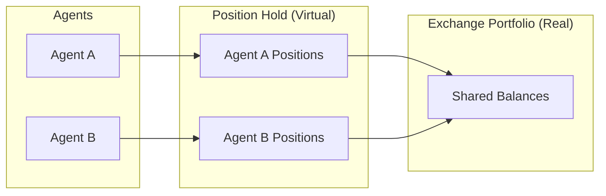
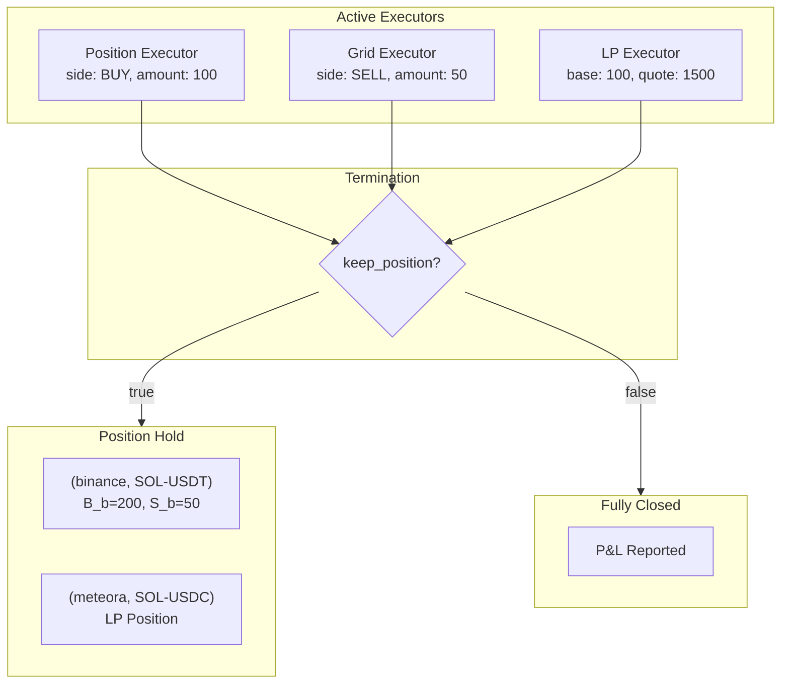

# Positions

**Positions** is a position-based accounting standard for autonomous trading agents. It defines how agents track their trading impact through a virtual portfolio, enabling standardized measurement of realized and unrealized P&L across different markets and asset types.

---

## Core Framework

### Shared Identity

Positions and Executors share the same required attributes:

| Attribute | Type | Description |
|-----------|------|-------------|
| `connector_name` | string | Exchange or connector (e.g., `binance`, `binance_perpetual`) |
| `trading_pair` | string | Market formatted as `BASE-QUOTE` (e.g., `SOL-USDT`) |
| `side` | TradeType | `BUY` (long base) or `SELL` (short base) |
| `amount` | decimal | Size in base asset |

This shared identity enables seamless flow from executor activity to position accounting.

### Trading Pair Structure

```
trading_pair = "SOL-USDT"
                 │    │
                 │    └── Quote Asset (USDT)
                 │        - P&L measured in this currency
                 │        - All monetary values use this unit
                 │
                 └── Base Asset (SOL)
                     - The asset being traded
                     - amount is always in this unit
```

**Key principle**: `amount` is always in base asset. All P&L is in quote asset.

### Side Semantics

| Side | Meaning | Profit When |
|------|---------|-------------|
| `BUY` | Long the base asset | Price increases |
| `SELL` | Short the base asset | Price decreases |
| `RANGE` | LP position (two-token) | Fees earned > impermanent loss |

`TradeType.RANGE` (value 3) is used for LP positions. Combined with the `lp_position: true` flag, it triggers LP-specific two-token P&L calculation within `PositionHold`.

---

## The Position Hold

The **Position Hold** is the virtual portfolio that tracks an agent's cumulative trading impact. It's a set of positions, each uniquely keyed by `(connector_name, trading_pair)`:

$$
\text{Position Hold} = \{ P_1, P_2, \ldots, P_n \}
$$

$$
\text{key}(P_i) = (\text{connector\_name}, \text{trading\_pair})
$$



When multiple agents share exchange accounts, the Position Hold isolates each agent's activity for accurate performance attribution.

---

## Position Types

The Position Hold contains three position types:

| Type | Structure | Connector Examples |
|------|-----------|-------------------|
| **Spot** | Standard | `binance`, `jupiter`, `uniswap` |
| **Perp** | Standard | `binance_perpetual`, `hyperliquid_perpetual` |
| **LP** | Extended | `meteora`, `uniswap_v3` |

Spot and perp positions share the same data structure—the type is determined by the connector name. LP positions have additional fields for AMM/CLMM mechanics.

### Perpetual Position Modes

Perpetual connectors support different position modes that affect tracking:

| Mode | Description | Position Tracking |
|------|-------------|-------------------|
| `ONEWAY` | Single position per trading pair | BUY and SELL orders net against each other |
| `HEDGE` | Separate long and short positions | Positions tracked separately by side |

**How position side is determined** (see `executor_orchestrator.py:_determine_position_side()`):

```python
def _determine_position_side(self, executor_info: ExecutorInfo) -> Optional[TradeType]:
    is_perpetual = "_perpetual" in executor_info.connector_name
    if not is_perpetual:
        return None  # Spot markets don't have position sides

    position_mode = market.position_mode
    if position_mode == PositionMode.HEDGE:
        # In hedge mode, CLOSE action uses opposite side
        if executor_info.config.position_action == PositionAction.CLOSE:
            return TradeType.BUY if executor_info.config.side == TradeType.SELL else TradeType.SELL
        return executor_info.config.side

    return executor_info.config.side  # ONEWAY mode
```

**Perp-specific config fields**:

| Field | Type | Description |
|-------|------|-------------|
| `side` | TradeType | BUY or SELL |
| `position_action` | PositionAction | `OPEN` or `CLOSE` (default: OPEN) |
| `leverage` | int | Position leverage (default: 1) |

---

## Position State

The position tracking implementation is in `hummingbot/strategy_v2/executors/executor_orchestrator.py:PositionHold` (lines 36-134).

### Internal Tracking

Each position maintains internal state tracking all trading activity:

| Variable | Symbol | Description |
|----------|--------|-------------|
| `buy_amount_base` | $B_b$ | Total base bought |
| `buy_amount_quote` | $B_q$ | Total quote spent on buys |
| `sell_amount_base` | $S_b$ | Total base sold |
| `sell_amount_quote` | $S_q$ | Total quote received from sells |
| `cum_fees_quote` | $F$ | Cumulative fees (in quote) |

### Derived Properties

**Net Amount** (base asset):
$$\text{net} = B_b - S_b$$

**Side**:
$$
\text{side} = \begin{cases}
\text{BUY} & \text{if } \text{net} > 0 \\
\text{SELL} & \text{if } \text{net} < 0 \\
\text{CLOSED} & \text{if } \text{net} = 0
\end{cases}
$$

**Amount** (always positive):
$$\text{amount} = |\text{net}|$$

**Breakeven Price** (quote per base):
$$
p_{\text{be}} = \begin{cases}
\dfrac{B_q}{B_b} & \text{if side = BUY} \\[1em]
\dfrac{S_q}{S_b} & \text{if side = SELL}
\end{cases}
$$

The breakeven price is the volume-weighted average entry price.

---

## Executor → Position Flow

Executors are the source of all position changes. When an executor terminates with `keep_position=True`, it uses `CloseType.POSITION_HOLD` and populates `held_position_orders` in its custom info. The executor orchestrator aggregates these into `PositionHold` objects.



### Executor Types and Position Flow

| Executor | Position Type | keep_position | Flow Behavior |
|----------|--------------|---------------|---------------|
| SwapExecutor | Spot | `true` (baked) | Always adds to Position Hold |
| OrderExecutor | Spot | `true` (baked) | Always adds to Position Hold |
| PositionExecutor | Spot/Perp | Configurable | Adds or closes |
| GridExecutor | Spot/Perp | Configurable | Adds net inventory or closes |
| LPExecutor | LP | Configurable | Keeps LP position or withdraws |
| XEMMExecutor | Spot (×2) | Configurable | Creates positions on both exchanges |

### Position Aggregation

When an executor adds to an existing position (same `connector_name`, `trading_pair`), the internal state accumulates:

```
Existing position:
  B_b = 100, B_q = 15000  (100 SOL at avg 150)

OrderExecutor terminates: BUY 50 SOL at 145

Aggregation:
  B_b = 150  (100 + 50)
  B_q = 22250  (15000 + 7250)

New breakeven:
  p_be = 22250 / 150 = 148.33
```

The Position Hold maintains **at most one position** per `(connector_name, trading_pair)` key.

### Position Data Structure

When executors complete with `keep_position=True`, they populate `held_position_orders` in `get_custom_info()`. The aggregation logic uses these fields:

**Common fields (all position types)**:

| Field | Type | Description |
|-------|------|-------------|
| `trade_type` | string | `"BUY"`, `"SELL"`, or `"RANGE"` (LP positions) |
| `executed_amount_base` | float | Base token amount (or total VALUE in base for LP) |
| `executed_amount_quote` | float | Quote value (or total VALUE in quote for LP) |
| `cumulative_fee_paid_quote` | float | Fees paid in quote currency |
| `client_order_id` | string | Unique ID for deduplication |

**LP-specific fields** (when `trade_type="RANGE"`):

| Field | Type | Description |
|-------|------|-------------|
| `lp_position` | bool | `True` for LP positions |
| `lp_type` | int | `1`=ADD, `2`=REMOVE, `3`=COLLECT |
| `position_address` | string | On-chain position address (deduplication key) |
| `initial_amount_base` | float | Original base tokens deposited |
| `initial_amount_quote` | float | Original quote tokens deposited |
| `current_amount_base` | float | Current base tokens after price drift |
| `current_amount_quote` | float | Current quote tokens after price drift |
| `base_fee` | float | Accumulated base fees earned |
| `quote_fee` | float | Accumulated quote fees earned |

For LP positions: `executed_amount_quote / executed_amount_base = add_price`

### How Amounts Are Calculated Per Executor

**OrderExecutor** (spot/perp orders):
```python
# From order fills via TradeUpdate events
executed_amount_base = sum(fill_base_amount)
executed_amount_quote = sum(fill_quote_amount)
```

**SwapExecutor** (Gateway AMM swaps):
```python
# From completed order
executed_amount_base = order.executed_amount_base
executed_amount_quote = executed_amount_base * executed_price
```

**LPExecutor** (concentrated liquidity):
```python
# From LP position state at close
executed_amount_base = lp_position_state.base_amount
executed_amount_quote = base_amount * current_price  # VALUE for aggregation
# Actual quote tokens available via:
current_amount_quote = lp_position_state.quote_amount
```

**Note**: For LP positions, `executed_amount_quote` is the **value** of the base position in quote terms (for aggregation consistency), not the actual quote tokens.

---

## P&L Calculation

All P&L values are denominated in the **quote asset**.

### Unrealized P&L

Mark-to-market value of open positions at current price $p_c$:

**Long position (side = BUY)**:
$$\text{PnL}_{\text{unrealized}} = (p_c - p_{\text{be}}) \times \text{amount}$$

**Short position (side = SELL)**:
$$\text{PnL}_{\text{unrealized}} = (p_{\text{be}} - p_c) \times \text{amount}$$

**General form** with side multiplier $\sigma = +1$ (BUY) or $-1$ (SELL):
$$\text{PnL}_{\text{unrealized}} = \sigma \times (p_c - p_{\text{be}}) \times \text{amount}$$

### Realized P&L

Calculated when positions are reduced (buys matched against sells):

**Matched amount**:
$$\text{matched} = \min(B_b, S_b)$$

**Average prices**:
$$p_{\text{buy}} = \frac{B_q}{B_b}, \quad p_{\text{sell}} = \frac{S_q}{S_b}$$

**Realized P&L**:
$$\text{PnL}_{\text{realized}} = (p_{\text{sell}} - p_{\text{buy}}) \times \text{matched}$$

This formula works for both directions:
- Bought low, sold high → positive P&L
- Bought high, sold low → negative P&L

### Global P&L

Total P&L combines unrealized, realized, and fees:
$$\text{PnL}_{\text{global}} = \text{PnL}_{\text{unrealized}} + \text{PnL}_{\text{realized}} - F$$

### Volume Traded

$$V = B_q + S_q$$

---

## Active vs Terminated Executors

### Active Executor State

While an executor is running, it tracks its own position:

| Field | Description |
|-------|-------------|
| `connector_name` | Exchange |
| `trading_pair` | Market |
| `side` | BUY or SELL |
| `amount` | Current position size (base) |
| `entry_price` | Average entry price |
| `unrealized_pnl` | Mark-to-market P&L |
| `fees_paid` | Trading fees so far |

The executor's position is **active**—it's being managed with entry/exit logic (take profit, stop loss, time limit, etc.).

### Executor Termination

When an executor terminates:

**If `keep_position: false`** (position closed):
1. Position is fully closed (sells match buys)
2. Realized P&L calculated
3. P&L reported for learning/analysis
4. No position added to Position Hold

**If `keep_position: true`** (position kept):
1. Executor's trading activity ($B_b$, $B_q$, $S_b$, $S_q$, $F$) added to Position Hold
2. Aggregates with existing position if same `(connector_name, trading_pair)`
3. Position continues to accumulate unrealized P&L
4. Can be closed by future executors

### P&L Attribution

| State | Unrealized P&L | Realized P&L |
|-------|----------------|--------------|
| Active Executor | ✓ (tracked live) | Partial (if scaled out) |
| Position Hold | ✓ (mark-to-market) | ✓ (from matched trades) |
| Closed (keep_position: false) | — | ✓ (final) |

### Close Types

Executors terminate with one of these close types:

| CloseType | Description |
|-----------|-------------|
| `COMPLETED` | Executor finished normally, no position held |
| `POSITION_HOLD` | Executor finished with position kept open (`keep_position: true`) |
| `TAKE_PROFIT` | Price reached take profit target |
| `STOP_LOSS` | Price reached stop loss limit |
| `TIME_LIMIT` | Maximum duration exceeded |
| `TRAILING_STOP` | Trailing stop triggered after activation |
| `EARLY_STOP` | Manually stopped (may or may not hold position) |
| `FAILED` | Executor failed after max retries |

---

## Position Arithmetic

### Adding to Position (Same Side)

```
Before: Long 100 SOL at p_be = 150
  B_b = 100, B_q = 15000

Action: BUY 50 SOL at 145

After:
  B_b = 150, B_q = 22250
  p_be = 22250/150 = 148.33 (weighted average)
```

### Reducing Position (Opposite Side)

```
Before: Long 200 SOL at p_be = 90
  B_b = 200, B_q = 18000
  S_b = 0, S_q = 0

Action: SELL 100 SOL at 120

After:
  B_b = 200, B_q = 18000
  S_b = 100, S_q = 12000

Matching:
  matched = min(200, 100) = 100
  PnL_realized = (120 - 90) × 100 = +3000

Remaining:
  net = 100 (still long)
  p_be = 90 (unchanged)
```

### Flipping Position

```
Before: Long 100 SOL at p_be = 100
  B_b = 100, B_q = 10000

Action: SELL 150 SOL at 110

After:
  S_b = 150, S_q = 16500

Matching:
  matched = 100
  PnL_realized = (110 - 100) × 100 = +1000

New position:
  net = -50 (now SHORT)
  amount = 50
  p_be = 16500/150 = 110 (sell avg)
```

### Closing Position

```
When B_b = S_b:
  net = 0
  amount = 0
  side = CLOSED
  PnL_unrealized = 0
  PnL_realized = (p_sell - p_buy) × matched
```

---

## LP Position Accounting

LP positions have additional fields and different P&L mechanics. Unlike spot/perp positions that use BUY/SELL tracking, LP positions use a **snapshot-based approach** with two-token accounting.

### LP Position State

| Field | Description |
|-------|-------------|
| `connector_name` | DEX connector |
| `pool_address` | On-chain pool |
| `position_address` | Position NFT (CLMM) - also used as deduplication key |
| `trading_pair` | Pool market |
| `lower_price` | Range lower bound (CLMM) |
| `upper_price` | Range upper bound (CLMM) |
| `base_amount` | Current base in position (drifted) |
| `quote_amount` | Current quote in position (drifted) |
| `initial_base_amount` | Base at open |
| `initial_quote_amount` | Quote at open |
| `add_mid_price` | Market price at open |
| `base_fee` | Accumulated base fees |
| `quote_fee` | Accumulated quote fees |

### LP P&L Calculation

**Initial value** (at position open):
$$V_{\text{init}} = (\text{initial\_base} \times p_{\text{add}}) + \text{initial\_quote}$$

**Current value** (accounts for price drift):
$$V_{\text{curr}} = (\text{current\_base} \times p_c) + \text{current\_quote}$$

**Fees earned**:
$$\text{fees} = (\text{base\_fee} \times p_c) + \text{quote\_fee}$$

**LP P&L**:
$$\text{PnL}_{\text{LP}} = (V_{\text{curr}} - V_{\text{init}}) + \text{fees} - \text{tx\_fees}$$

This captures:
- Price movement impact (can be negative = impermanent loss)
- Fee accumulation (positive)
- Transaction costs (negative)

### LP Position Snapshot

When an LP executor terminates with `keep_position=True`, it stores a **single snapshot** of the position state. This differs from spot/perp positions which track individual BUY/SELL trades.

**Key design decisions**:

1. **`position_address` as deduplication key**: LP positions use the on-chain position address (e.g., NFT mint for CLMM) as `client_order_id` for deduplication
2. **`lp_position: true`**: Flag that triggers LP-specific P&L calculation in `PositionHold`
3. **Total value fields**: `executed_amount_base/quote` represent total position VALUE (not just token amounts)
4. **Token breakdown**: `initial_amount_base/quote` store the original deposited token amounts
5. **`LPType` enum**: Uses `lp_type` field with values ADD=1, REMOVE=2, COLLECT=3

**Key relationship**: `executed_amount_quote / executed_amount_base = add_price`

**Implementation** (see `lp_executor._store_held_position()`):
```python
# Total position value in both denominations
executed_amount_quote = initial_base * add_price + initial_quote  # Value in quote
executed_amount_base = initial_base + initial_quote / add_price   # Value in base

self._held_position_orders.append({
    # position_address as deduplication key
    "client_order_id": self.lp_position_state.position_address,
    "trading_pair": self.config.trading_pair,
    "trade_type": TradeType.RANGE.name,  # Treated as BUY for value tracking
    "price": float(add_price),

    # Total position value at inception
    "executed_amount_base": executed_amount_base,
    "executed_amount_quote": executed_amount_quote,
    "cumulative_fee_paid_quote": tx_fee_quote,

    # LP-specific fields
    "lp_position": True,
    "lp_type": LPType.ADD.value,
    "position_address": self.lp_position_state.position_address,

    # Original token breakdown
    "initial_amount_base": float(initial_base),
    "initial_amount_quote": float(initial_quote),

    # Current drifted amounts (for P&L: current_value calculation)
    "current_amount_base": float(self.lp_position_state.base_amount),
    "current_amount_quote": float(self.lp_position_state.quote_amount),

    # Fees earned
    "base_fee": float(self.lp_position_state.base_fee),
    "quote_fee": float(self.lp_position_state.quote_fee),
})
```

### LPType Enum

| Value | Name | Description |
|-------|------|-------------|
| 1 | `ADD` | Liquidity added to position (snapshot at close) |
| 2 | `REMOVE` | Liquidity removed from position |
| 3 | `COLLECT` | Fees collected without position change |

### RangePositionUpdate Database Table

LP positions are stored in the `RangePositionUpdate` database table via connector events. See `hummingbot/model/range_position_update.py`:

| Field | Type | Description |
|-------|------|-------------|
| `hb_id` | Text | Order ID (e.g., `"range-SOL-USDC-..."`) |
| `tx_hash` | Text | Transaction signature |
| `position_address` | Text | LP position NFT address (deduplication key) |
| `order_action` | Text | `"ADD"`, `"REMOVE"`, or `"COLLECT"` |
| `trading_pair` | Text | e.g., `"SOL-USDC"` |
| `market` | Text | Connector name (e.g., `"meteora/clmm"`) |
| `lower_price` | Float | Position lower bound |
| `upper_price` | Float | Position upper bound |
| `mid_price` | Float | Current price at time of event |
| `base_amount` | Float | Base token amount added/removed |
| `quote_amount` | Float | Quote token amount added/removed |
| `base_fee` | Float | Base fee collected |
| `quote_fee` | Float | Quote fee collected |
| `trade_fee_in_quote` | Float | Transaction fee in quote |
| `position_rent` | Float | SOL rent paid (ADD only) |
| `position_rent_refunded` | Float | SOL rent refunded (REMOVE only) |

---

## Cross-Exchange Positions

For XEMM and arbitrage, separate positions are created per connector:

```
XEMM Trade:
  Buy 100 SOL on Binance at 150.00
  Sell 100 SOL on KuCoin at 150.50

Creates two positions:

Position 1: (binance, SOL-USDT)
  side: BUY, amount: 100, p_be: 150.00
  PnL_unrealized = (p_binance - 150.00) × 100

Position 2: (kucoin, SOL-USDT)
  side: SELL, amount: 100, p_be: 150.50
  PnL_unrealized = (150.50 - p_kucoin) × 100

Spread captured: (150.50 - 150.00) × 100 = 50 USDT
```

Each position independently tracks exposure. The inventory on each exchange is real and subject to price movements.

---

## Risk Limits

The Risk Engine enforces limits before executor creation. See `condor/trading_agent/config.py:RiskLimitsConfig` for the implementation.

| Limit | Default | Description |
|-------|---------|-------------|
| `max_position_size_quote` | 500 | Maximum total position size in quote currency |
| `max_single_order_quote` | 100 | Maximum size per executor |
| `max_open_executors` | 5 | Maximum simultaneous executors |
| `max_daily_loss_quote` | 50 | Maximum daily loss before blocking |
| `max_drawdown_pct` | 10 | Maximum drawdown percentage |
| `max_cost_per_day_usd` | 5 | Maximum daily LLM cost |

**Exposure calculation**:
$$\text{exposure}_{\text{total}} = \sum_{P_i} \text{amount}_i \times p_{c,i}$$

**Configuration** (in `config.yml`):
```yaml
risk_limits:
  max_position_size_quote: 500.0
  max_single_order_quote: 100.0
  max_open_executors: 5
  max_daily_loss_quote: 50.0
  max_drawdown_pct: 10.0
  max_cost_per_day_usd: 5.0
```

The Risk Engine (`condor/trading_agent/risk.py`) validates:

1. **Pre-tick**: Blocks if `daily_loss > max_daily_loss_quote` or `drawdown > max_drawdown_pct`
2. **Per-executor**: Checks `executor_count < max_open_executors` and `order_amount < max_single_order_quote`
3. **Position check**: Validates `total_exposure + new_amount < max_position_size_quote`

---

## PositionSummary Calculation

The `PositionHold.get_position_summary(mid_price)` method (lines 87-134 in `executor_orchestrator.py`) converts internal state to a standardized `PositionSummary`. Understanding this calculation is key to understanding how all position types—spot, perp, and LP—are normalized for reporting.

### The Calculation Flow

```python
def get_position_summary(self, mid_price: Decimal) -> PositionSummary:
    # Step 1: Calculate breakeven prices for each side
    buy_breakeven = buy_amount_quote / buy_amount_base  # avg buy price
    sell_breakeven = sell_amount_quote / sell_amount_base  # avg sell price

    # Step 2: Calculate matched volume (trades that offset each other)
    matched_amount_base = min(buy_amount_base, sell_amount_base)

    # Step 3: Calculate realized P&L from matched trades
    realized_pnl = (sell_breakeven - buy_breakeven) × matched_amount_base

    # Step 4: Calculate net position
    net_amount_base = buy_amount_base - sell_amount_base
    is_net_long = net_amount_base >= 0

    # Step 5: Calculate unrealized P&L for remaining position
    if is_net_long:
        remaining_quote = buy_amount_quote - (matched × buy_breakeven)
        breakeven = remaining_quote / net_amount_base
        unrealized_pnl = (mid_price - breakeven) × net_amount_base
    else:
        remaining_quote = sell_amount_quote - (matched × sell_breakeven)
        breakeven = remaining_quote / abs(net_amount_base)
        unrealized_pnl = (breakeven - mid_price) × abs(net_amount_base)
```

### How Spot/Perp Orders Are Normalized

Spot and perp executors (OrderExecutor, PositionExecutor) use `InFlightOrder.to_json()` to populate `held_position_orders`:

```python
# From InFlightOrder.to_json() (lines 257-280)
{
    "client_order_id": "abc123",          # Deduplication key
    "trade_type": "BUY",                  # Determines position side
    "executed_amount_base": "10.5",       # Actual base traded
    "executed_amount_quote": "1575.00",   # Actual quote traded
    "cumulative_fee_paid_quote": "1.58",  # Fees in quote
    "leverage": "5",                      # For perps
    "position": 1,                        # OPEN=1, CLOSE=2 for perps
}
```

These values map directly to the PositionHold tracking:
- `trade_type="BUY"` → accumulates to `buy_amount_base/quote`
- `trade_type="SELL"` → accumulates to `sell_amount_base/quote`

### How LP Positions Are Normalized

LP positions work differently—they provide **liquidity** rather than making **trades**. LP positions are detected by the `lp_position: true` flag and trigger LP-specific P&L calculation within `PositionHold`.

**Key differences from spot/perp positions**:

| Aspect | Spot/Perp | LP |
|--------|-----------|-----|
| `trade_type` | `"BUY"` or `"SELL"` | `"RANGE"` (treated as BUY) |
| Deduplication key | `client_order_id` | `position_address` |
| Detection | Default | `lp_position: true` flag |
| P&L calculation | `(price - breakeven) × amount` | `current_value - add_value + fees` |

```python
# From lp_executor._store_held_position()
{
    "client_order_id": position_address,  # Deduplication: position NFT address
    "trade_type": "RANGE",                # Treated as BUY for value tracking
    "lp_position": True,                  # Triggers LP P&L calculation
    "lp_type": 1,                         # LPType.ADD.value

    # Total position value at inception
    "executed_amount_base": 20.0,         # VALUE in base: initial_base + initial_quote/price
    "executed_amount_quote": 3000.0,      # VALUE in quote: initial_base × price + initial_quote
    "cumulative_fee_paid_quote": 0.5,     # Transaction fees

    # Original token breakdown
    "initial_amount_base": 10.0,          # Actual base deposited
    "initial_amount_quote": 1500.0,       # Actual quote deposited
    "position_address": "...",

    # Current drifted amounts (for current_value calculation)
    "current_amount_base": 8.5,           # Current base after drift
    "current_amount_quote": 1800.0,       # Current quote after drift

    # Fees earned
    "base_fee": 0.1,
    "quote_fee": 15.0,
}
```

**LP P&L calculation** (within `PositionHold._get_lp_position_summary()`):

```
Initial deposit: 10 SOL + 1500 USDC @ price 150
  add_value = buy_amount_quote = 3000

Price moves to 180, position drifts to 8.5 SOL + 1800 USDC
Fees earned: 0.1 SOL + 15 USDC

current_value = 8.5 × 180 + 1800 = 3330
fees_earned = 0.1 × 180 + 15 = 33
TX fees paid: 2 USDC

P&L Calculation:
  unrealized_pnl = current_value - add_value + fees_earned - tx_fees
  unrealized_pnl = 3330 - 3000 + 33 - 2 = +361 USDC
```

This approach correctly handles:
- **Price drift**: LP positions shift between base and quote as price moves
- **Two-token accounting**: Tracks base and quote amounts independently
- **Fee accumulation**: Fees in both tokens converted to quote at current price

### How Perp HEDGE Mode Is Handled

Perpetual markets in HEDGE mode track long and short positions separately. The `_determine_position_side()` method (lines 480-497) handles this:

```python
def _determine_position_side(self, executor_info: ExecutorInfo):
    is_perpetual = "_perpetual" in executor_info.connector_name

    if position_mode == PositionMode.HEDGE:
        # CLOSE actions use opposite side for proper tracking
        if position_action == PositionAction.CLOSE:
            return opposite_side(config.side)
        return config.side

    return config.side  # ONEWAY mode: everything nets together
```

**Example in HEDGE mode**:

```
Executor 1: SELL (short) 100 SOL, position_action=OPEN
  → Tracked as SELL position: sell_amount_base += 100

Executor 2: BUY 100 SOL, position_action=CLOSE (closing the short)
  → position_side flips to SELL (opposite of BUY)
  → Tracked in same SELL bucket: sell reductions accounted

Result: The short position is properly closed in the SELL bucket
```

In **ONEWAY mode**, buys and sells net against each other regardless of position_action, matching how the exchange handles it.

### PositionSummary for Each Position Type

**Spot Position**:
```
PositionHold: binance, SOL-USDT
  buy_amount_base=100, buy_amount_quote=15000
  sell_amount_base=0, sell_amount_quote=0

PositionSummary (at mid_price=152):
  side=BUY, amount=100
  breakeven_price=150.00
  unrealized_pnl_quote=200.00  # (152-150)×100
  realized_pnl_quote=0
```

**Perp Position** (ONEWAY mode with partial close):
```
PositionHold: binance_perpetual, SOL-USDT
  buy_amount_base=100, buy_amount_quote=15000  # Long 100 @ 150
  sell_amount_base=50, sell_amount_quote=8000   # Closed 50 @ 160

PositionSummary (at mid_price=155):
  matched=50, realized_pnl=(160-150)×50=500
  remaining=50 (long), breakeven=140 (remaining cost basis)
  unrealized_pnl_quote=(155-140)×50=750
```

**LP Position** (using `PositionHold` with LP-specific two-token accounting):
```
PositionHold: meteora, SOL-USDC (is_lp_position=True)

Snapshot stored when executor closes with keep_position=True:
  Initial deposit: 10 SOL + 1500 USDC @ price 150
    add_value_quote = 10 × 150 + 1500 = 3000

  Current state (after price drift to 180): 8.5 SOL + 1800 USDC
    current_base = 8.5, current_quote = 1800

  Fees earned: 0.1 SOL + 15 USDC
    fees_base = 0.1, fees_quote = 15

  TX fees paid: 2 USDC (gas costs)

PositionSummary (at mid_price=180):
  current_value = 8.5 × 180 + 1800 = 3330
  fees_value = 0.1 × 180 + 15 = 33
  unrealized_pnl = 3330 - 3000 + 33 - 2 = +361 USDC
```

LP positions use `PositionHold` with LP-specific fields (see `executor_orchestrator.py`) which provides proper two-token accounting:
- Detects LP via `lp_position: true` flag
- Stores both initial amounts and current drifted amounts (`current_amount_base/quote`)
- Handles single-sided positions (zero base or zero quote)
- Converts fees to quote at current price for P&L calculation

---

## Standardized Reporting

The data structures are defined in `hummingbot/strategy_v2/executors/data_types.py`.

### PositionSummary

See `PositionSummary` class (lines 57-74):

```python
{
    # Identity (same as executor)
    "connector_name": "binance",
    "trading_pair": "SOL-USDT",
    "side": "BUY",
    "amount": Decimal("150"),  # base asset

    # Pricing
    "breakeven_price": Decimal("148.33"),
    "amount_quote": Decimal("22249.50"),  # amount × p_be

    # P&L (all quote asset)
    "unrealized_pnl_quote": Decimal("250.50"),
    "realized_pnl_quote": Decimal("100.00"),
    "cum_fees_quote": Decimal("15.25"),
    "global_pnl_quote": Decimal("335.25"),

    # Volume
    "volume_traded_quote": Decimal("22250.00"),
}
```

### ExecutorReport

When executor terminates (keep_position: false):

```python
{
    "executor_id": "exec_001",
    "controller_id": "grid-trader",
    "connector_name": "binance",
    "trading_pair": "SOL-USDT",
    "side": "BUY",
    "amount": Decimal("100"),

    # Outcome
    "close_type": "TAKE_PROFIT",  # or STOP_LOSS, TIME_LIMIT, etc.
    "entry_price": Decimal("148.00"),
    "exit_price": Decimal("151.00"),

    # P&L (position was closed)
    "realized_pnl_quote": Decimal("300.00"),
    "fees_paid_quote": Decimal("3.00"),
    "net_pnl_quote": Decimal("297.00"),

    "duration_seconds": 3600,
}
```

### PerformanceReport

Aggregated across all positions and closed executors:

```python
{
    "realized_pnl_quote": Decimal("500.00"),
    "unrealized_pnl_quote": Decimal("250.50"),
    "global_pnl_quote": Decimal("750.50"),
    "global_pnl_pct": Decimal("3.37"),
    "volume_traded": Decimal("45000.00"),
    "positions_summary": [...],  # Current Position Hold
    "executor_reports": [...],   # Closed executor history
}
```

---

## Worked Example

**Scenario**: Agent trades SOL-USDT on Binance.

### Trade 1: Buy 100 SOL at 10.00

```
OrderExecutor terminates (keep_position: true)
Action: BUY 100 SOL @ 10.00

Position Hold updated:
  (binance, SOL-USDT):
    B_b = 100, B_q = 1000, S_b = 0, S_q = 0

At p_c = 10.00:
  side = BUY, amount = 100
  p_be = 10.00
  PnL_unrealized = 0
```

### Trade 2: Buy 50 more at 8.00

```
OrderExecutor terminates (keep_position: true)
Action: BUY 50 SOL @ 8.00

Position Hold updated:
  (binance, SOL-USDT):
    B_b = 150, B_q = 1400

At p_c = 8.00:
  p_be = 1400/150 = 9.33
  PnL_unrealized = (8.00 - 9.33) × 150 = -200
```

### Trade 3: Sell 100 at 12.00

```
OrderExecutor terminates (keep_position: true)
Action: SELL 100 SOL @ 12.00

Position Hold updated:
  (binance, SOL-USDT):
    B_b = 150, B_q = 1400
    S_b = 100, S_q = 1200

Matching:
  matched = 100
  PnL_realized = (12.00 - 9.33) × 100 = +267

At p_c = 12.00:
  net = 50 (long)
  PnL_unrealized = (12.00 - 9.33) × 50 = +133.50
  PnL_global = 267 + 133.50 = +400.50
```

### Trade 4: Close remaining 50 at 11.00

```
OrderExecutor terminates (keep_position: true)
Action: SELL 50 SOL @ 11.00

Position Hold updated:
  S_b = 150, S_q = 1750

Matching:
  matched = 150
  PnL_realized = (11.67 - 9.33) × 150 = +350

Final:
  net = 0 (closed)
  PnL_realized = +350

Wallet: 1000 - 1400 + 1750 = 1350 USDT (+350 profit) ✓
```

---

## State Machines

### Swap Executor States

```
NOT_STARTED → EXECUTING → COMPLETED/FAILED
```

The swap executor has a simple linear lifecycle—it submits the swap and waits for completion.

### LP Executor States

```
NOT_ACTIVE → OPENING → IN_RANGE → CLOSING → COMPLETE
                ↓
          OUT_OF_RANGE (rebalancing)
```

LP executor states reflect the position lifecycle:
- `NOT_ACTIVE`: Initial state before position opened
- `OPENING`: Transaction submitted to add liquidity
- `IN_RANGE`: Position active, price within range
- `OUT_OF_RANGE`: Price moved outside position range (may trigger rebalance)
- `CLOSING`: Transaction submitted to remove liquidity
- `COMPLETE`: Position fully closed

---

## Implementation Notes

1. **Snapshot on close**: Position data is captured at executor completion, not tracked in real-time. The `held_position_orders` array is populated when the executor terminates with `keep_position=True`.

2. **LP position snapshot**: LP executors store a single snapshot with both initial amounts (`executed_amount_base/quote`) and current drifted amounts (`current_amount_base/quote`). This enables accurate P&L calculation: `add_value` from initial amounts, `current_value` from drifted amounts.

3. **No ongoing fee tracking**: Neither perp funding rates nor LP fee earnings are tracked continuously in `positions_held`. Fees are captured at position close.

4. **Gateway validation**: Swap and LP executors skip connector validation when `GATEWAY_CONNECTORS` is empty (API context), deferring validation to Gateway at execution time.

5. **Deduplication by position type**:
   - **Spot/Perp**: Uses `client_order_id` to prevent duplicate aggregation
   - **LP positions**: Uses `position_address` (on-chain position NFT) as the deduplication key

6. **LP detection by flag**:
   - `lp_position: false` (default) → Standard BUY/SELL P&L calculation
   - `lp_position: true` → LP-specific two-token P&L calculation

---

## Summary

| Concept | Definition |
|---------|------------|
| **Position** | Agent's exposure to a market, keyed by `(connector_name, trading_pair)` |
| **Position Hold** | Set of all positions for an agent (virtual portfolio) |
| **PositionHold** | Unified accounting class for all position types (spot, perp, LP) |
| **Executor** | Trading operation that creates/modifies positions |
| **Breakeven** | Volume-weighted average entry price |
| **Unrealized P&L** | Mark-to-market value of open positions |
| **Realized P&L** | Locked-in P&L from matched buys/sells |
| **keep_position** | Whether executor adds to Position Hold or closes out |
| **lp_position flag** | Triggers LP-specific two-token P&L calculation in PositionHold |

The framework ensures consistent accounting across spot, perp, and LP positions, with clear flow from executor activity to position state to P&L measurement. `PositionHold` handles all position types—LP positions are detected via the `lp_position` flag and use two-token P&L calculation (`current_value - add_value + fees`).
