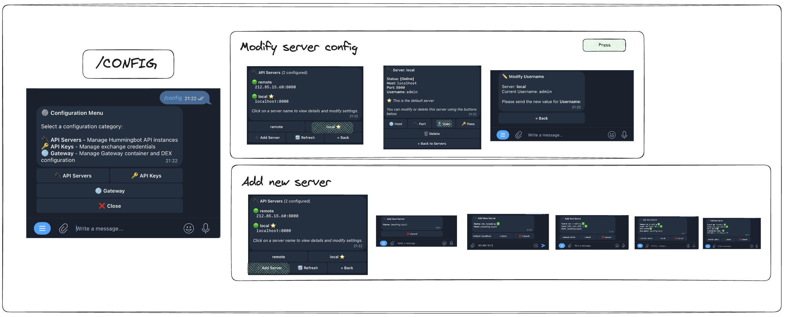

# User Guide

This guide details the core features, commands, and advanced usage of Condor.

## 🏁 Getting Started

Once you have installed Condor and connected it to your Hummingbot instance, you can start interacting with it via Telegram.

### Command Reference

| Command | Description |
| :--- | :--- |
| `/start` | Open the main dashboard and access all menus. |
| `/portfolio` | View detailed portfolio dashboard with PnL, holdings, and graphs. |
| `/bots` | Monitor all active bots and manage their controllers. |
| `/clob_trading` | Trade on centralized exchanges (Spot & Perp). |
| `/dex_trading` | Swap tokens and manage liquidity on DEXs via Gateway. |
| `/config` | Manage API servers, exchange keys, and Gateway settings. |
| `/help` | View an interactive help guide. |

---

## 📊 Portfolio Management

Access your portfolio overview by sending `/portfolio`.

### Key Features
*   **PnL Tracking**: View 24h, 7d, and 30d performance indicators with automatic deposit/withdrawal detection.
*   **Visual Dashboard**: Interactive graphs showing value history and token distribution.
*   **User Preferences**: Your graph settings (e.g., time range `1d`, `7d`) are saved automatically and persist between sessions.

---

## 🤖 Bot Management

Monitor and control your trading bots by sending `/bots`.

*   **Real-time Status**: View CPU, Memory, and Uptime for every connected bot.
*   **Controller Operations**: Stop/Start specific strategy controllers and view detailed performance metrics (Volume, PnL).

---

## 💱 CLOB Trading (CEX)

Trade on centralized exchanges using `/clob_trading`.

### Powerful Input Options
*   **Smart Amounts**: You can enter amounts in USD (e.g., `$100`), and Condor will automatically convert it to the equivalent token amount based on current prices.
*   **Dual Input**: Use interactive buttons for quick selections or type details directly.
*   **Positions**: Full management of perpetual positions, including leverage adjustment and one-click closing.

---

## 💧 DEX Trading & Liquidity

Manage your DeFi operations using `/dex_trading`.

### Features
*   **Gateway Integration**: Seamlessly connects to Hummingbot Gateway.
*   **Pool Discovery**: Search for liquidity pools by connector and token pair.
*   **Liquidity Provision**: Manage CLMM positions—add liquidity, collect fees, or close positions directly from Telegram.
*   **Quick Swap**: Easily repeat your last swap with minimal input.

---

## ⚙️ Configuration

Manage your Condor settings by sending `/config`.

*   [**🔌 API Servers**](api.md): Add multiple Hummingbot API instances. Condor checks their status in real-time (Online/Offline).
*   **🔑 API Keys**: Securely manage exchange credentials. Keys are stored encrypted on the Hummingbot instance, not in Telegram.
*   **🌐 Gateway**: Deploy and configure the Gateway Docker container.

---

## 🔧 Troubleshooting

| Issue | Potential Cause | Solution |
| :--- | :--- | :--- |
| **Bot not responding** | Invalid Token or User IDs | Check `TELEGRAM_TOKEN` and `TELEGRAM_ALLOWED_IDS` in your `.env` file. |
| **"Server Offline"** | Connectivity Issue | Check the host/port in `/config`. Ensure the API container is running. |
| **DEX features disabled** | Gateway not running | Ensure Gateway is configured and running via the `/config` menu. |
| **Auth Error** | Wrong credentials | Verify the username and password for your Hummingbot API instance. |
