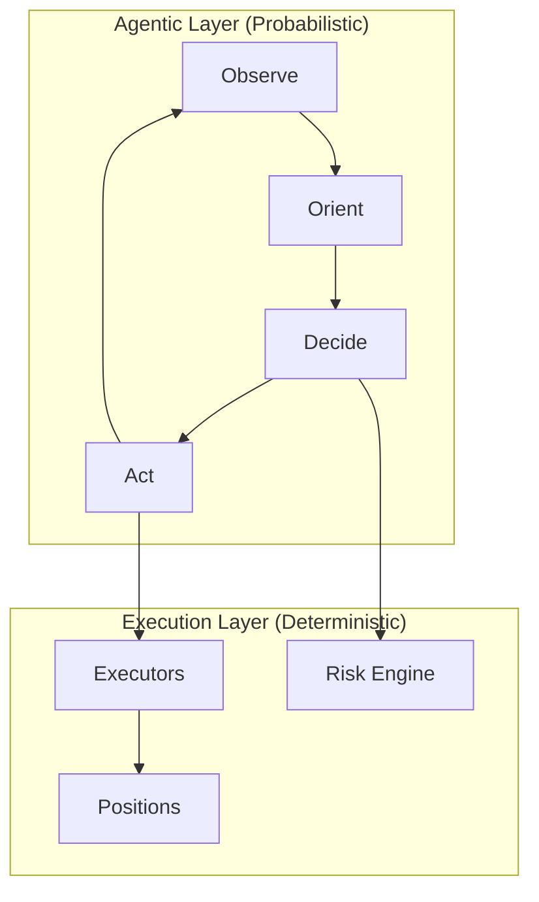

# Trading Agents Standard

The **Trading Agents Standard** is an open specification for building autonomous trading systems. It defines how agents structure state, manage positions, enforce risk limits, and interact with execution infrastructure.

[Condor](index.md) is the reference implementation—an open source harness that implements this standard using Hummingbot API as the execution layer.

## Design Philosophy

The standard separates what LLMs do well—reasoning under uncertainty—from what traditional software does well—reliable, repeatable execution.



- **Agentic Layer**: LLM-powered reasoning using the OODA loop (Observe → Orient → Decide → Act)
- **Execution Layer**: Deterministic infrastructure for positions, executors, and risk enforcement

## Core Components

The standard defines five core components:

| Component | Purpose | Documentation |
|-----------|---------|---------------|
| [Positions](positions.md) | Virtual portfolio tracking spot, LP, and perp positions | Position types, active vs closed |
| [Executors](executors.md) | Self-contained trading operations with standardized P&L | Types, lifecycle, keep_position |
| [Bots](bots.md) | Docker containers for long-running automation | Scripts, controllers |
| [Routines](routines.md) | Deterministic workflows shared across agents | Indicators, webhooks, alerts |
| Risk Engine | Limit enforcement and kill switch | See below |

## The CTA File Structure

Each Condor Trading Agent (CTA) is a directory containing structured files. See `condor/trading_agent/strategy.py` for the implementation.

```
trading_agents/{strategy-slug}/
├── agent.md            # Strategy definition (YAML frontmatter + markdown)
├── config.yml          # Runtime configuration (editable)
├── learnings.md        # Cross-session insights (max 20)
└── trading_sessions/
    └── session_N/
        ├── journal.md      # Summary, Decisions, Ticks, Executors
        └── snapshots/      # Full tick snapshots (max 100)
```

### agent.md

The agent definition file uses YAML frontmatter for configuration and Markdown for instructions:

```yaml
---
name: Grid Market Maker
tick_interval: 60
connectors:
  - binance_perpetual
  - jupiter

configs:
  trading_pair: SOL-USDC
  grid_levels: 5
  spread_percentage: 0.3

limits:
  max_position_size_quote: 500
  max_single_order_quote: 100
  max_daily_loss_quote: 50
  max_open_executors: 10
  max_drawdown_pct: 10
---

## Goal
Provide liquidity around the mid-price while managing inventory risk.

## Strategy Rules
1. Maintain symmetric grid unless inventory exceeds threshold
2. Widen spreads during high volatility (ATR > 2%)
3. Pause trading if funding rate exceeds 0.1% against position
```

### Configs vs Limits

**Configs** are agent-suggestible parameters:

- Trading parameters the agent operates with
- Agent can *suggest* changes based on learnings
- User must approve changes before they take effect
- Examples: `trading_pair`, `spread_percentage`, `tick_interval`, `grid_levels`

**Limits** are user-only guardrails (see `condor/trading_agent/config.py:RiskLimitsConfig`):

- Safety boundaries the agent cannot exceed
- Only modifiable by the user, never by the agent
- Enforced by the Risk Engine before every action
- Examples: `max_position_size_quote`, `max_single_order_quote`, `max_daily_loss_quote`, `max_drawdown_pct`, `max_open_executors`

### learnings.md

Persists across sessions, accumulating insights the agent develops over time:

```markdown
# Learnings

## Active Insights
- [2026-03-27 14:30] Wider spreads (0.5% vs 0.3%) reduced adverse selection during Asian session volatility
- [2026-03-26 09:15] Grid rebalancing at 5% threshold outperforms 10% threshold for SOL-USDC
- [2026-03-25 16:45] Funding rate spikes above 0.05% correlate with 2-hour price reversals
```

Maximum 20 entries to prevent context bloat. New insights replace older ones based on relevance.

### sessions/

Each session contains:

- **journal.md**: Working memory for the session—key actions each tick, current state, quantitative history
- **snapshots/**: Full tick snapshots (max 100) for debugging and replay

## Risk Engine

The Risk Engine (`condor/trading_agent/risk.py`) tracks position state and enforces limits:

```python
# RiskState computed from journal data
class RiskState:
    daily_pnl: float          # Today's realized P&L
    total_exposure: float     # Current open position value
    executor_count: int       # Number of active executors
    drawdown_pct: float       # Current drawdown percentage
    daily_cost: float         # LLM costs today
    is_blocked: bool          # Kill switch status
    block_reason: str         # Why blocked (if applicable)
```

**Pre-tick validation** (`get_state`): Blocks the entire tick if:

- `daily_pnl < -max_daily_loss_quote`
- `drawdown_pct > max_drawdown_pct`
- `daily_cost > max_cost_per_day_usd`

**Per-executor validation** (`check_executor_action`): Blocks executor creation if:

- `executor_count >= max_open_executors`
- `order_amount > max_single_order_quote`
- `total_exposure + new_amount > max_position_size_quote`

If any limit is exceeded, `is_blocked` is set to `true` with a descriptive `block_reason`.

## Session Continuity

The standard enables session continuity across interfaces. The `~/condor` directory stores all CTA state, and Condor uses ACP (Agent Communication Protocol) to connect to your LLM.

This means you can:

- Start a conversation on Telegram
- Continue it in Claude Code
- Switch to the web dashboard

Same session, same agent state, same conversation history.

## Extensibility

The Trading Agents Standard defines interfaces, not implementations:

| Standard Component | Condor Implementation | Alternative Implementations |
|-------------------|----------------------|---------------------------|
| Positions | Executor `controller_id` tagging | Separate ledger system |
| Executors | Hummingbot V2 Executors | ccxt-based, custom engines |
| Risk Engine | `risk.py` validation | External risk systems |
| Session Management | File-based journal | Database, cloud storage |
| LLM Integration | ACP protocol | Direct API, local models |

To implement the standard with a different execution layer, you must provide:

1. Executor creation with `controller_id` tagging
2. Position tracking (spot, LP, perp)
3. Standardized P&L reporting in quote currency
4. Risk state tracking and limit enforcement
5. Session state persistence (journal, learnings)
