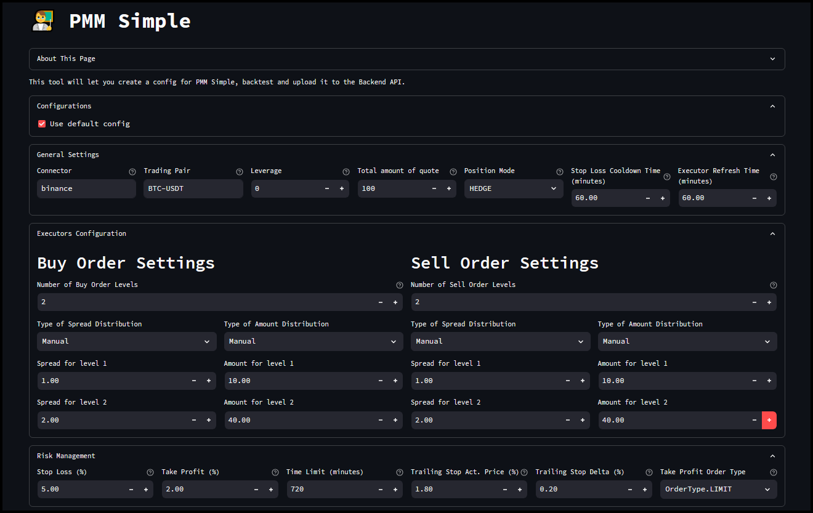
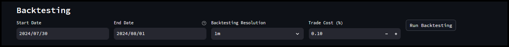
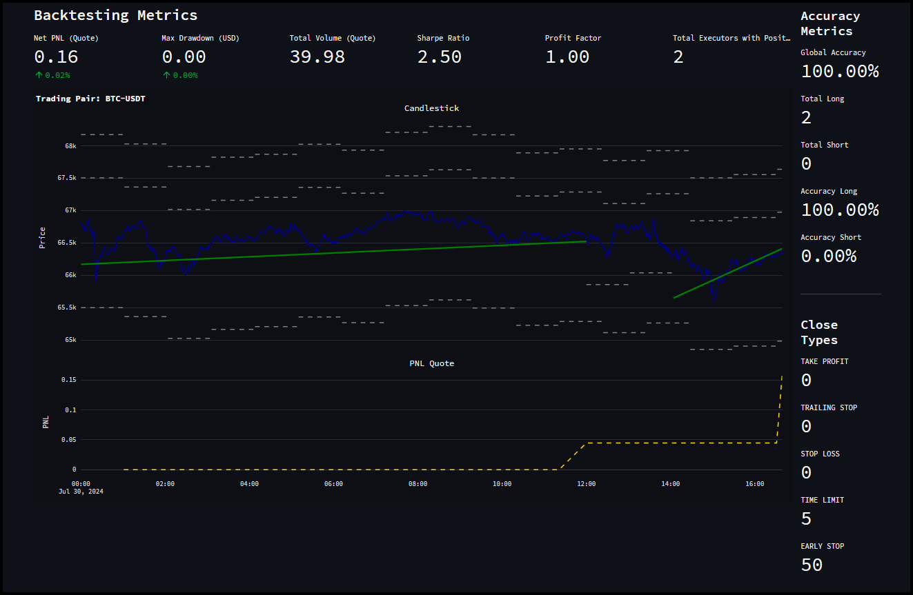
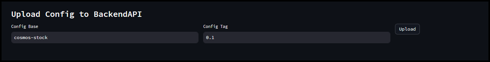

# Backtesting Strategies

The **Backtesting** section in the Hummingbot Dashboard is a powerful tool available on all controller pages, allowing users to evaluate the performance of their trading strategies using historical market data. 

This feature provides crucial insights into how a strategy would have performed in the past, helping users refine and optimize their configurations before deploying them in a live trading environment.

## Strategy Configuration

- Before backtesting a strategy, you need to configure it. In this example, we'll use the **PMM Simple** controller with the **Binance** connector, trading the **BTC-USDT** pair.

- **Select Connector:** Choose the exchange (e.g., Binance).

- **Select Trading Pair:** Specify the pair to trade (e.g., BTC-USDT).

- **Set Parameters:** Configure leverage, total quote amount, position mode, and other relevant parameters.

- **Order Settings:** Define buy and sell order levels, spread, and amount distribution.

## Run Backtesting

- With your configuration set, navigate to the backtesting section. Specify the **Start Date** and **End Date** for the historical data, the time interval for the **Backtesting Resolution**, and the **Trade Cost** percentage. Click the **Run Backtesting** button to initiate the process.

- The backtesting results will generate in a few seconds, providing you with a comprehensive overview. Here's an example of what you might see: 

**Backtesting Metrics**:

  - **Net PNL (Quote)**: The net profit and loss in the quote currency.
  - **Max Drawdown (USD)**: The maximum loss from the peak during the backtesting period.
  - **Total Volume (Quote)**: The total trading volume in the quote currency.
  - **Sharpe Ratio**: A measure of risk-adjusted return.
  - **Profit Factor**: The ratio of gross profit to gross loss.
  - **Total Executors with Position**: Number of executors that had open positions during the backtest.

**Accuracy Metrics**:

  - **Global Accuracy**: The overall accuracy of the strategy.
  - **Total Long & Short**: Number of long and short positions taken.
  - **Accuracy Long & Short**: Accuracy percentages for long and short positions.

**Close Types**:

  - Metrics for different types of order closures such as `TAKE PROFIT`, `TRAILING STOP`, `STOP LOSS`, `TIME LIMIT`, and `EARLY STOP`.

**Graphical Representation**:

  - **Candlestick Chart**: Visualizes price movements of the trading pair over time.
  - **PNL Quote Chart**: Shows the profit and loss over time.

- You can return to the configuration page to make adjustments and re-run the backtesting as needed. Once satisfied with the results, you can upload the configuration for deployment. 

## Upload Config to Backend API

- Create a name for the current config

- The Config Tag is similar to a version number which allows you to track changes made to the strategy config later on. 

- Click the **Upload** button to save the configuration. This makes it available on the **Deploy V2** page, where you can create instances based on the saved configuration. 