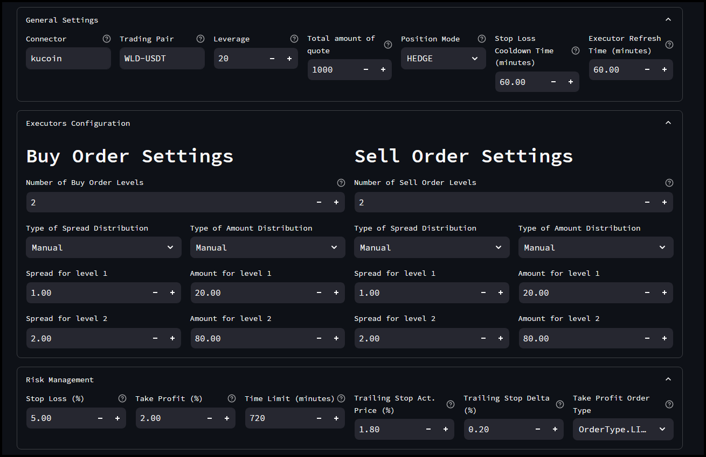
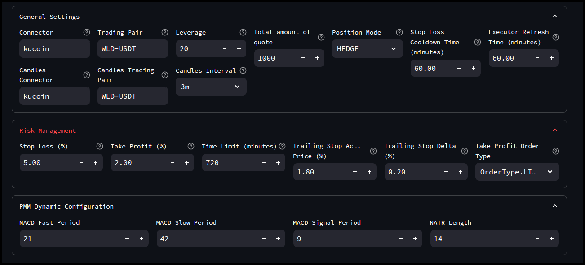
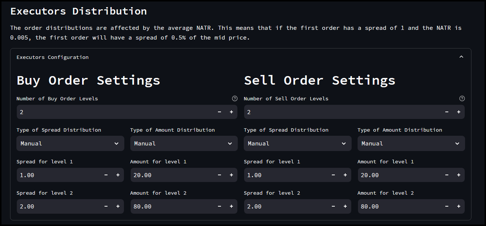
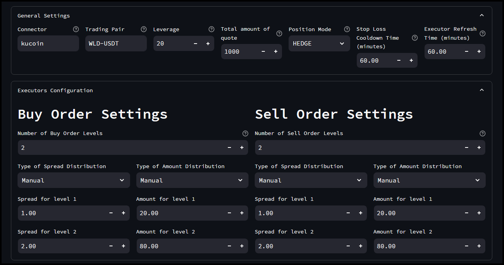
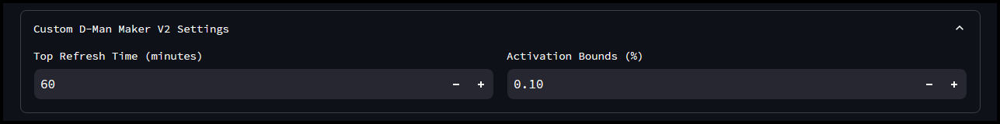
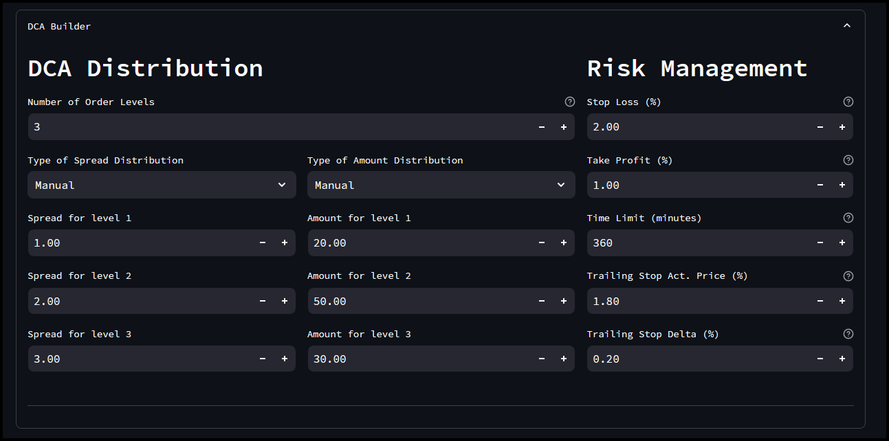
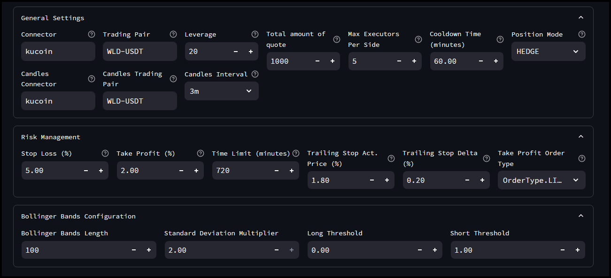
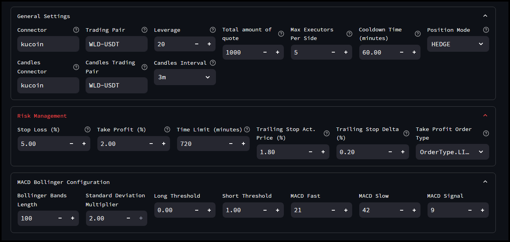
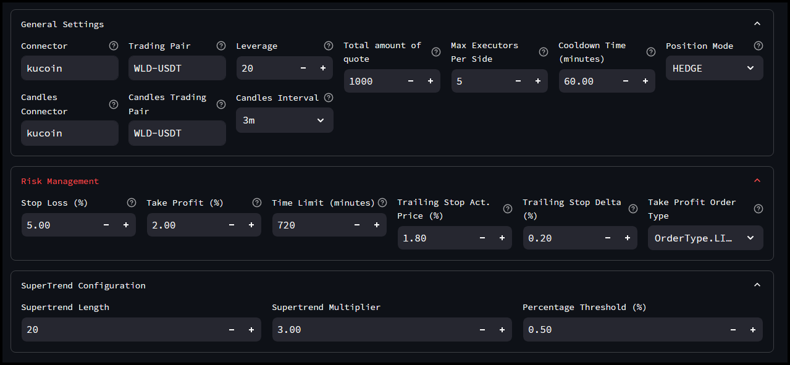
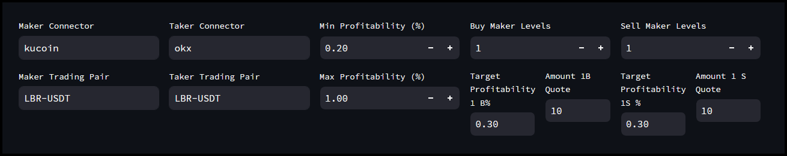

# Config Generator

Here's a detailed explanation of the different controllers available for configuration in the Hummingbot Dashboard:

## PMM Simple

The **PMM Simple** controller in Hummingbot Dashboard implements a basic Pure Market Making strategy. It allows users to provide liquidity by placing both buy and sell orders around the mid-market price. Key features include:

- Simple configuration for quick setup.
- Customizable order spreads and sizes.
- Basic risk management settings like stop loss and take profit.

## PMM Dynamic

The **PMM Dynamic** controller in Hummingbot Dashboard implements a superset of the A+S strategy. Features include:

- Using candle data from one exchange to trade on another.
- Shifting mid price based on market trends.
- Adjusting spread dynamically using the NATR (Normalized Average True Range) indicator for more responsive market making.

## D-Man Maker V2

The **D-Man Maker V2** controller is designed for more advanced market making strategies, integrating various technical indicators and risk management tools. Key features include:

- Advanced spread and order size adjustments based on market conditions.
- Integration with multiple technical analysis indicators.
- Enhanced risk management options.

## Bollinger V1

The **Bollinger V1** controller utilizes Bollinger Bands for its trading strategy. Bollinger Bands are a type of statistical chart characterizing the prices and volatility over time of a financial instrument. Key features include:

- Using Bollinger Bands to determine optimal entry and exit points.
- Configurable band parameters to suit different market conditions.
- Automated trading signals based on band interactions.

## MACD BB V1

The **MACD BB V1** controller combines the Moving Average Convergence Divergence (MACD) indicator with Bollinger Bands. This strategy aims to leverage the strengths of both indicators for more robust trading signals. Key features include:

- Using MACD to identify trend direction and strength.
- Employing Bollinger Bands to spot volatility and potential reversal points.
- Automated buy and sell signals based on combined indicator analysis.

## SuperTrend V1

The **SuperTrend V1** controller uses the SuperTrend indicator to guide its trading decisions. The SuperTrend indicator is a trend-following tool that helps identify the prevailing direction of the market. Key features include:

- Utilizing SuperTrend for dynamic support and resistance levels.
- Adjusting trading strategies based on trend signals.
- Configurable parameters for sensitivity and responsiveness to market changes.

## XEMM Controller

The **XEMM Controller** (Cross-Exchange Market Making) in Hummingbot Dashboard is designed to exploit price discrepancies across different exchanges. Key features include:

- Simultaneously placing buy orders on one exchange and sell orders on another.
- Taking advantage of arbitrage opportunities between exchanges.
- Advanced configuration for managing multiple exchange accounts and trades.

