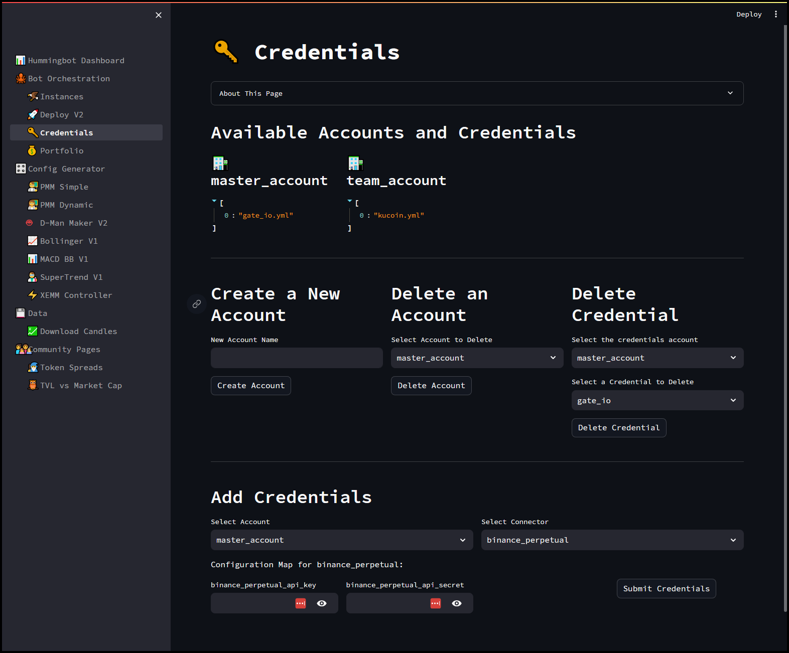
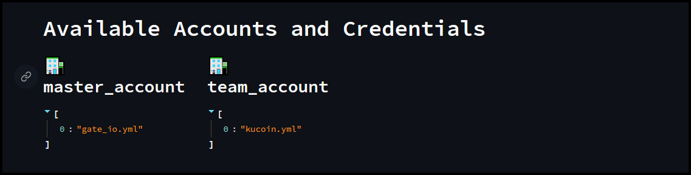
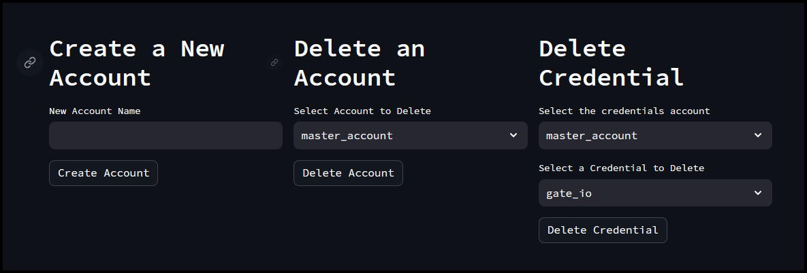
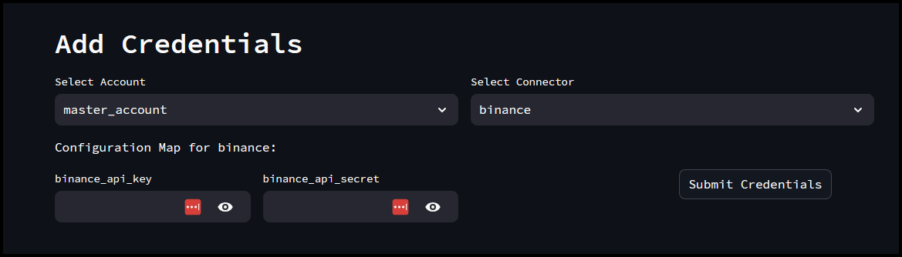
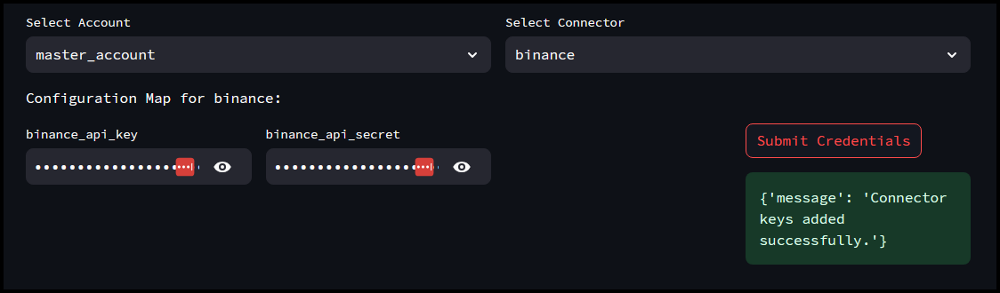
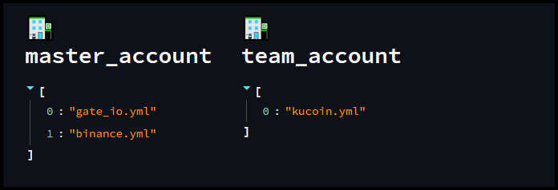
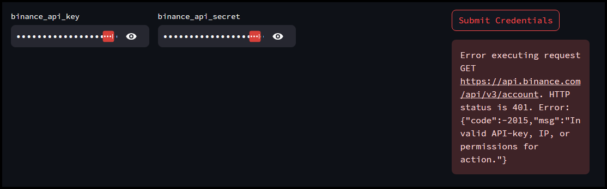
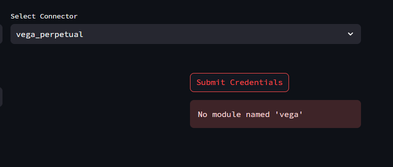

The **Credentials** page in the Hummingbot Dashboard is a comprehensive interface for managing your API keys and related credentials. It offers several functionalities to streamline the process of handling multiple accounts and their respective credentials.

[](credentials.png)

## Available Accounts and Credentials

- Displays a list of all the accounts and their associated credentials.
- Each account can store multiple credentials for different exchanges or services, making it easy to switch between them.

[](credentials-1.png)

In the example above we have two accounts currently setup, the `master account` with `gate_io` API keys and a `team_account` with `Kucoin` API keys. 

## Manage Accounts

In this section we can create & delete an account or delete a credential from the existing accounts.

[](credentials-2.png)

**Create a New Account**

Allows you to create a new account by providing a name. This is useful for organizing credentials under different categories or user profiles.

- Fill in the **New Account Name** field with your preferred account name
- Click **Create Account**
- The newly created account should show in the **Available Accounts and Credentials Section**

**Delete an Account**

Provides an option to delete an existing account along with all its associated credentials, helping you keep your credential management clean and up-to-date.

- Select the Account you want to delete from the drop down.
- Once the desired account is selected, click **Delete Account**

**Delete Credential**

Enables you to remove specific credentials from an account without deleting the entire account. This is useful when you need to update or revoke access to a particular exchange.

- In the first drop down, select the account you want to delete a credential from
- In the next drop down, select the credential you want to delete. 
- Verify the account and credential selected is correct then click the **Delete Credential** button


## Add Credentials (API Keys)

In this section we can add new credentials to an account by selecting the account and connector (e.g., exchange). You can enter the required API key and secret, which will be securely stored and used by Hummingbot for trading activities.

[](credentials-3.png)

- Select the account you want to add credentials for
- Choose the connector (exchange), for example **Binance**
- Copy - Paste your **API Key** and **Secret key**
- Click the **Submit Credentials** button, it should take a few seconds to load then you should get the success message below:

[](credentials-5.png)

- In the **Available Accounts and Credentials** we now have Binance showing up under the **master_account**

[](credentials-7.png)

- If there is an issue with the API keys, or for example it doesn't have the necessary IP permissions you may get the message below: 

[](credentials-6.png)

## Known Issues

- Credentials / Portfolio page may take some time to load due to encrypting / decrypting of API credentials. Users may need to wait at least 30 - 60 secs for it to load completely. 

### Manually adding credentials for DEXes

Some exchanges, like DEXes will have issues trying to add the API credentials using Dashboard. You may get an error message similar to the one below:

[](credentials-4.png)

If you get the above message, you can try the workaround below: 

- Go to the **PMM_Simple** (or any controller) page and create a random config and **Upload Config**

- Next in the **Deploy V2** page, select the controller you just created and then under **Instance Name**, enter `credentials` and then click **Launch Bot** 

- Open your terminal and run the command 

```
docker ps -a | grep credentials
``` 

- This should filter the docker containers that have the name **credentials**. Take note of the **container ID** of that instance.

- Run the docker attach command to attach to the Hummingbot instance

```
docker attach [container_ID]
```

- Once inside the Hummingbot CLI, you’ll need to issue the **stop** command as it will display a bunch of errors in the log pane since we don’t have credentials added for our strategy. 

```
stop
```

- Run the connect command and follow the prompts to enter the API keys for your exchange.  

```
connect [exchange_name]

```

- Once the API keys are successfully added for your exchange the encrypted details will be stored in a YAML file which we will then need to copy over to the **master_account** To do this, run the **exit** command first to exit out of Hummingbot and back to the terminal. 

```
exit
```

- Make sure you are in the **/deploy** folder where you cloned the Hummigbot deploy repo then run the following command to copy the credentials 

```
cp bots/instances/hummingbot-credentials*/conf/connectors/*.yml bots/credentials/master_account/connectors/
```

- Go back to the Dashboard and you should be able to trade with your newly added DEX credential under **master_account**
