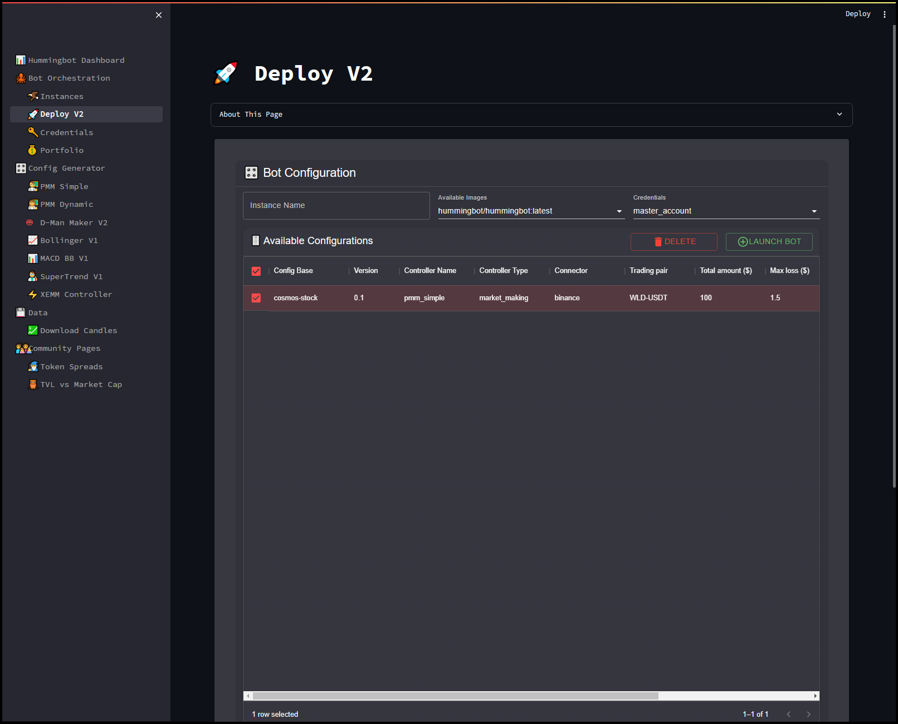
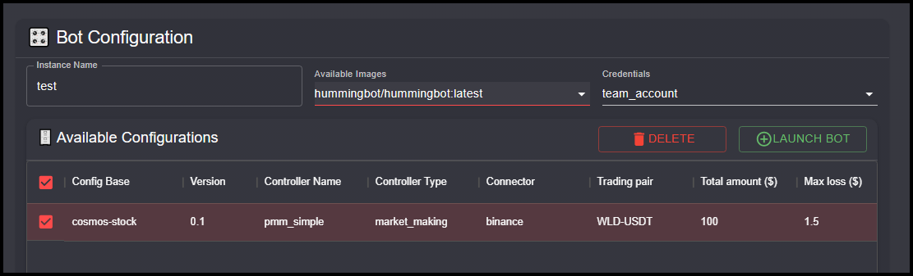

# Deploying Instances

The **Deploy V2** page in the Hummingbot Dashboard is designed for launching and managing Hummingbot trading instances. This page offers a streamlined interface to select configurations, set up instances, and deploy bots for automated trading.

## Bot Configuration

- **Instance Name**: A unique name for the bot instance you are about to deploy.

- **Available Images**: Select the Docker image version of Hummingbot to use for the deployment. You can use different Hummingbot Docker versions like `development` or `latest`

- **Credentials**: Select the account credentials that the bot will use for trading. This ensures that the bot has the necessary API keys and permissions to operate on the selected exchanges.

- **Configuration List**: Displays all the available controller configurations that you have created and uploaded. 

## Launch an Instance

- Choose one of the available configurations from the list by checking the box next to it.
- Provide the instance name, select the appropriate Docker image, and choose the credentials.
- Click on the **Launch Bot** button to start the bot with the selected configuration. The bot will begin trading based on the parameters and strategy defined in the configuration.

## Delete a Controller Config

- Choose one of the available configurations from the list by checking the box next to it.

- Click the **DELETE** button to delete the config