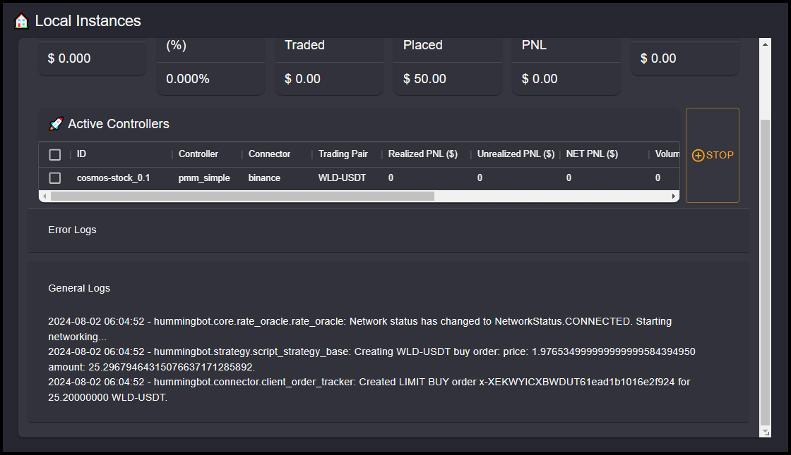

# Managing Instances

The **Instances** page in the Hummingbot Dashboard is designed to monitor and manage your active trading bot instances. It provides a real-time overview of the performance and status of each running instance, offering valuable metrics and logs to help you keep track of your bots’ activities.

## Local Instances

**Instance Information**: Displays details about the currently running instance, including the instance name and the time it started.

!!! note
    If you need to manually connect to the Docker container in the terminal, you can copy the full instance name in the top left corner and then in the terminal do `docker attach [instance name]`

**Metrics Overview**: 

  - **Net PNL (Quote)**: The net profit and loss in the quote currency.
  - **Net PNL (%)**: The net profit and loss as a percentage.
  - **Volume Traded**: The total trading volume executed by the bot.
  - **Liquidity Placed**: The amount of liquidity provided by the bot.
  - **Unrealized PNL**: The profit and loss from open positions that have not yet been realized.
  - **Imbalance**: Any imbalance in the portfolio caused by trading activities.

**Active Controllers**:

A table listing all active controllers (trading strategies) within the instance. Each row in the table provides detailed information about a specific controller, including:

  - **ID**: The unique identifier for the controller.
  - **Controller**: The name of the controller (e.g., `pmm_simple`).
  - **Connector**: The exchange connector used (e.g., `binance`).
  - **Trading Pair**: The trading pair the controller is operating on (e.g., `WLD/USDT`).
  - **Realized PNL ($)**: The profit and loss from closed positions.
  - **Unrealized PNL ($)**: The profit and loss from open positions.
  - **Net PNL ($)**: The total net profit and loss.
  - **Volume ($)**: The total trading volume.
  - **Other Metrics**: Additional metrics relevant to the controller’s performance.

**Logs**:

- **Error Logs**: A section to view any errors encountered by the bot during its operation. This helps in diagnosing issues and ensuring smooth functioning. 

- **General Logs**: A log of general activities and events related to the bot’s operation. This provides a detailed record of the bot’s actions for review and analysis.

## Stopping an Instance

- There are two ways to stop an instance, first is clicking the **STOP** (1) button next to the **Active Controller** section and second is the small square **stop icon** (2) at the top right of the screen

- Using the **STOP** button (1) is recommended because it gracefully closes out any positions that are open and also allows you to restart the instance if you wish to resume it

- Clicking the small square **stop icon** in the top right of the screen will force stop the instance, cancelling all open orders and stopping the Docker container. 

## Restarting an Instance

- If an instance was stopped using the **STOP** button, the instance will move from the **Active Controllers** section to the **Stopped Controllers** section. 

- Check the box next to the instance you want to resume and then click the **START** button

