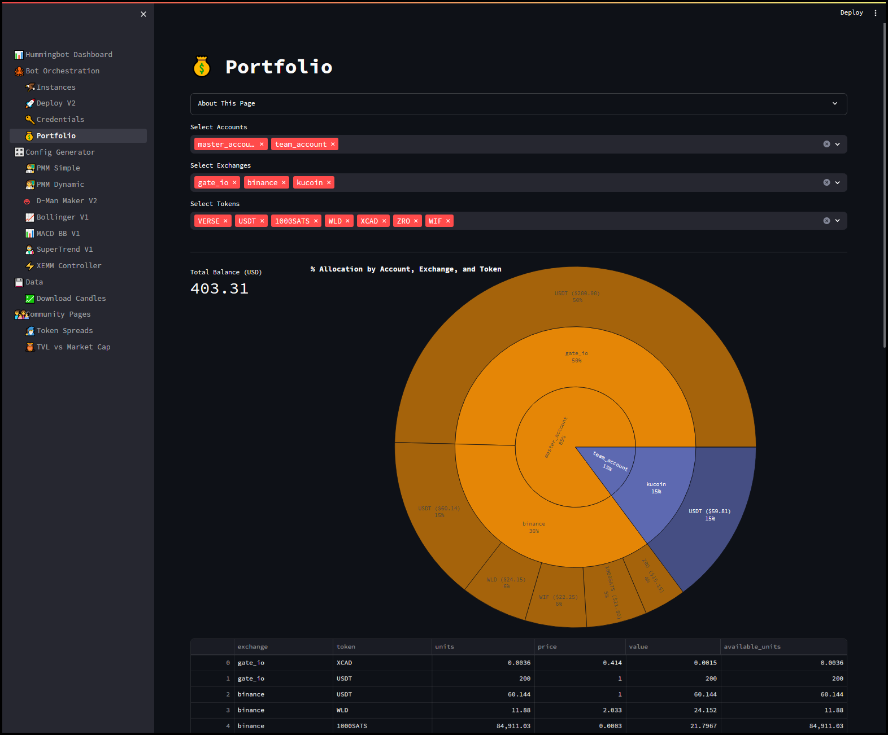
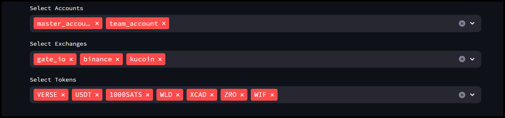
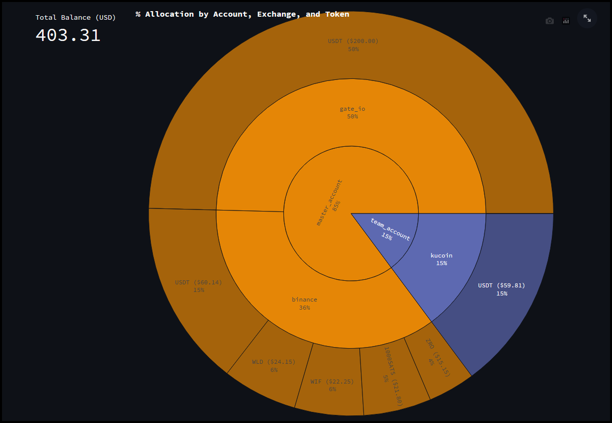
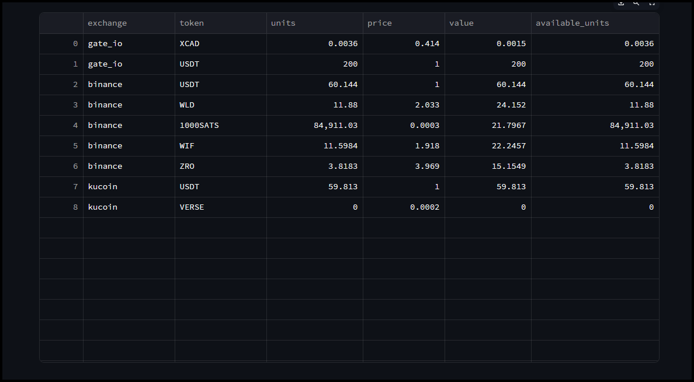
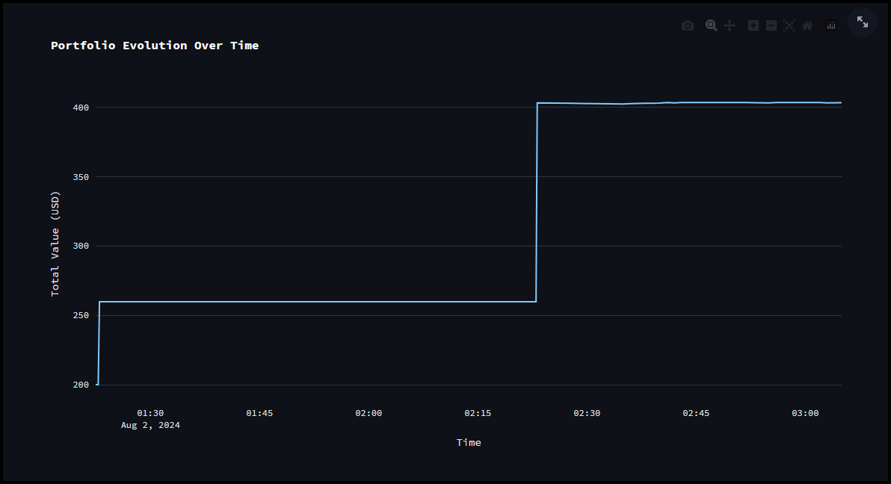
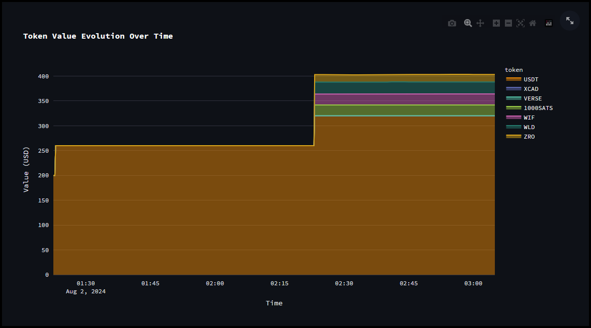

The **Portfolio** page in the Hummingbot Dashboard provides a detailed overview and management interface for your cryptocurrency holdings across different accounts and exchanges. It provides a holistic view of your cryptocurrency assets, allowing for better portfolio management and decision-making.

## Account, Exchange & Token Selection

- **Select Accounts:** Allows you to choose individual or multiple accounts to view their combined portfolio. In the **Credentials** page we added two accounts, the **master_account** and **team_account** and both can be selected here.

- **Select Exchanges:** Lets you filter and view the portfolio for specific exchanges you've added API keys for. In this example we have **gate_io**, **binance**, and **kucoin**.

- **Select Tokens:** Enables you to focus on specific tokens within your selected accounts and exchanges. In this example we can select multiple tokens like **VERSE**, **USDT**, **1000SATS**, etc., to get a detailed view of their distribution and value.

## Portfolio Overview

- **Total Balance (USD):** Displays the aggregated value of all selected tokens across the chosen accounts and exchanges in USD.

- **Allocation Visualization:** A sunburst chart visualizes the percentage allocation of your portfolio by account, exchange, and token. This helps in understanding the distribution and weight of each token in your overall portfolio.

## Tabular Data

- Provides a detailed table listing the exchange, token, units, price, value, and available units for each token. This tabular format allows for a clear and precise understanding of your holding

## Portfolio Evolution over Time

- A line graph that shows the evolution of your portfolio’s total value over time. This helps in tracking the performance and growth of your portfolio.

## Token Value Evolution over Time

- Another line graph that illustrates the value changes of individual tokens over time, offering insights into the volatility and performance of each asset.