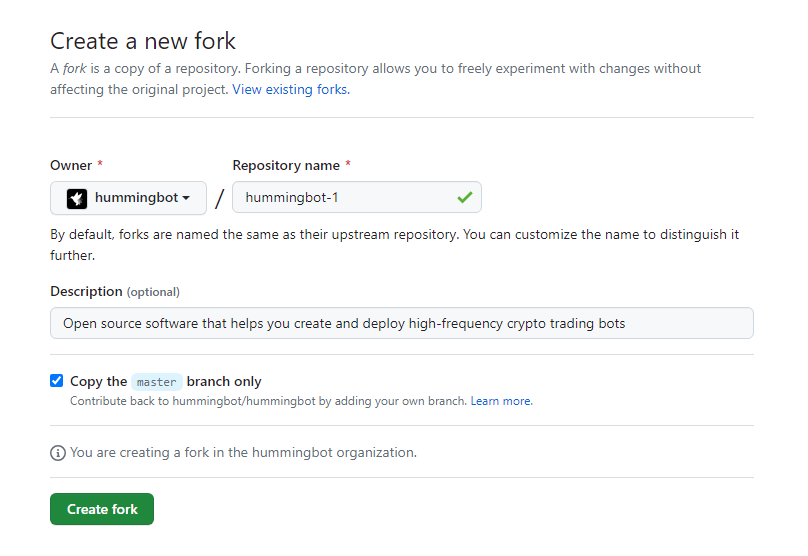
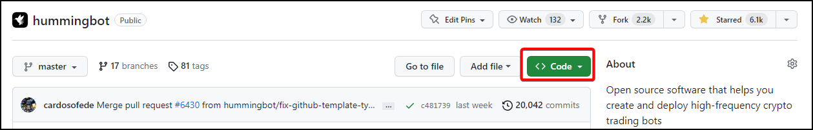
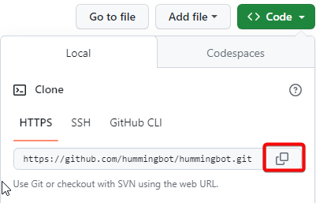
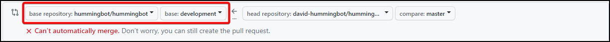
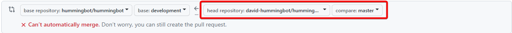

# Forking the Hummingbot Repository on GitHub

Forking a repository is a simple process that allows you to propose changes to the original repository. In this guide, we will walk you through the process of forking the [Hummingbot repository](https://github.com/hummingbot/hummingbot) on GitHub.

## About Forks

A fork is a new repository that shares code and visibility settings with the original `upstream` repository. Forks are often used to iterate on ideas or changes before they are proposed back to the upstream repository, such as in open source projects or when a user does not have write access to the upstream repository.

You can use forks to propose changes related to fixing a bug. Rather than logging an issue for a bug you have found, you can:

1. Fork the repository.
2. Make the fix.
3. Submit a pull request 

## Prerequisites

If you haven't yet, first set up Git and authentication with GitHub.com from Git. For more information, see "[Set up Git](https://docs.github.com/en/get-started/quickstart/set-up-git)."

## Forking the Hummingbot Repository

1. On GitHub.com, navigate to the [Hummingbot repository](https://github.com/hummingbot/hummingbot).
2. In the top-right corner of the page, click **Fork**.

   

3. Under **Owner**," select the dropdown menu and click an owner for the forked repository.

    

4. By default, forks are named the same as their upstream repositories. Optionally, to further distinguish your fork, in the **Repository name** field, type a name.
5. Optionally, in the **Description** field, type a description of your fork.
6. Optionally, select **Copy the DEFAULT branch only**. For many forking scenarios, such as contributing to open-source projects, you only need to copy the default branch. If you do not select this option, all branches will be copied into the new fork.
7. Click **Create fork**

Note: If you want to copy additional branches from the upstream repository, you can do so from the Branches page. For more information, see "[Creating and deleting branches within your repository](https://docs.github.com/en/pull-requests/collaborating-with-pull-requests/proposing-changes-to-your-work-with-pull-requests/creating-and-deleting-branches-within-your-repository)."

## Cloning Your Forked Repository

Now, you have a fork of the Hummingbot repository, but you do not have the files in that repository locally on your computer.

1. On GitHub.com, navigate to your fork of the Hummingbot repository.
2. Above the list of files, click Code.

   

3. Copy the URL for the repository.
4. Under "HTTPS", click the copy icon

   

5. Open Terminal.
6. Change the current working directory to the location where you want the cloned directory.
7. Type `git clone`, and then paste the URL you copied earlier. It will look like this, with your GitHub username instead of `YOUR-USERNAME`:

   ```
   git clone https://github.com/YOUR-USERNAME/hummingbot
   ```

8. Press Enter. Your local clone will be created.

   ```
   $ git clone https://github.com/YOUR-USERNAME/hummingbot
   > Cloning into `hummingbot`...
   > remote: Counting objects: 10, done.
   > remote: Compressing objects: 100% (8/8), done.
   > remote: Total 10 (delta 1), reused 10 (delta 1)
   > Unpacking objects: 100% (10/10), done.
   ```


## Making Changes to the Local Branch

1. Navigate to the local directory of the cloned repository.
2. Create a new branch using the following command:

    ```
    git branch BRANCH-NAME
    ```

3. Switch to your new branch:

    ```
    git checkout BRANCH-NAME
    ```

4. Make changes to the project coe using your preferred IDE editor (**VSCode** / **Pycharm** etc).

5. After making changes to the code you'll need to stage your changes:
    
    ```
    git add .
    ```

6. Commit your changes:

    ```
    git commit -m "a short description of the change"

    ```

7. Push your changes to your fork:

    ```
    git push

    ```

## Opening a Pull Request

1. Navigate to the Github link where you created your fork.
2. Above the list of files, click **Compare & pull request** to create a pull request for the associated branch.

    

3. On the page to create a new pull request, click **compare across forks**.

     

4. In the "base branch" dropdown menu, select the `development branch`. We strongly recommend users point to the `development branch` for contributions

    

5. In the "head fork" dropdown menu, select your fork, then use the "compare branch" drop-down menu to select the branch you made your changes in.

    

6. Type a title and description for your pull request.
7. If you want to allow anyone with push access to the upstream repository to make changes to your pull request, select **Allow edits from maintainers**.
8. Click **Create Pull Request**.

    

Congratulations! You have now created a pull request with your changes.
