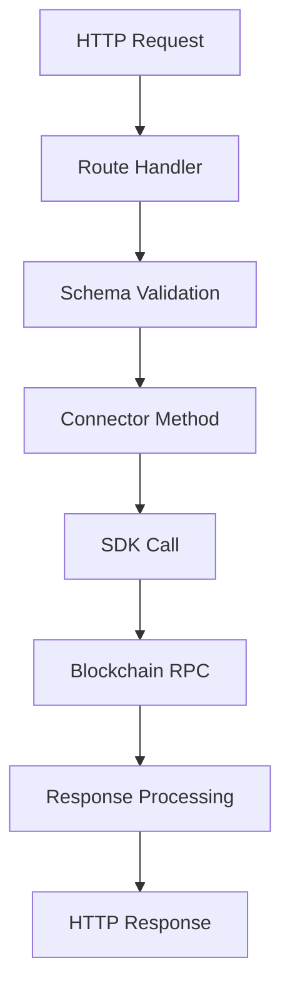

# Gateway Connector Architecture

## Overview

Gateway connectors follow a standardized architecture that ensures consistency, maintainability, and compatibility with the Hummingbot client. This page describes the architectural patterns and design principles used in Gateway connectors.

## Core Components

### 1. Connector Class

The main connector class serves as the entry point and coordinator for all DEX operations:

```typescript
export class ConnectorBase {
  protected chain: string;
  protected network: string;
  protected config: ConnectorConfig;
  protected sdk: ProtocolSDK;
  
  constructor(chain: string, network: string) {
    this.chain = chain;
    this.network = network;
    this.config = this.loadConfig();
    this.sdk = this.initializeSDK();
  }
}
```

**Responsibilities:**
- SDK initialization and management
- Configuration loading
- Method coordination
- Error handling and recovery

### 2. Route Handlers

Route handlers translate HTTP requests into connector method calls:

```typescript
interface RouteHandler {
  validateRequest(req: Request): void;
  processRequest(req: Request): Promise<any>;
  formatResponse(data: any): Response;
  handleError(error: Error): ErrorResponse;
}
```

**Key Features:**
- Request validation against schemas
- Async operation handling
- Standardized response formatting
- Comprehensive error handling

### 3. Trading Types

Each trading type defines specific interfaces and operations:

#### Router Interface
```typescript
interface RouterConnector {
  quote(params: QuoteParams): Promise<Quote>;
  trade(params: TradeParams): Promise<Transaction>;
  estimateGas(params: TradeParams): Promise<BigNumber>;
  getRoute(params: RouteParams): Promise<Route[]>;
}
```

#### AMM Interface
```typescript
interface AMMConnector {
  poolInfo(pair: TradingPair): Promise<PoolInfo>;
  poolPrice(pair: TradingPair): Promise<Price>;
  addLiquidity(params: LiquidityParams): Promise<Transaction>;
  removeLiquidity(params: RemoveLiquidityParams): Promise<Transaction>;
  positionInfo(params: PositionParams): Promise<Position>;
}
```

#### CLMM Interface
```typescript
interface CLMMConnector {
  openPosition(params: OpenPositionParams): Promise<Position>;
  closePosition(positionId: string): Promise<Transaction>;
  addLiquidity(params: AddLiquidityParams): Promise<Transaction>;
  removeLiquidity(params: RemoveLiquidityParams): Promise<Transaction>;
  collectFees(positionId: string): Promise<Transaction>;
  getPositions(owner: string): Promise<Position[]>;
}
```

## Design Patterns

### Singleton Pattern

Connectors use the singleton pattern to ensure efficient resource usage:

```typescript
class MyDex {
  private static instances: Map<string, MyDex> = new Map();
  
  public static getInstance(chain: string, network: string): MyDex {
    const key = `${chain}:${network}`;
    if (!this.instances.has(key)) {
      this.instances.set(key, new MyDex(chain, network));
    }
    return this.instances.get(key)!;
  }
}
```

**Benefits:**
- Reuses SDK connections
- Maintains state consistency
- Reduces memory footprint
- Improves performance

### Factory Pattern

Token and pool creation uses factory patterns:

```typescript
class TokenFactory {
  static createToken(
    address: string,
    chain: string,
    network: string
  ): Token {
    const chainInstance = ChainFactory.getChain(chain, network);
    return new Token(address, chainInstance);
  }
}
```

### Strategy Pattern

Different swap strategies based on protocol type:

```typescript
interface SwapStrategy {
  execute(params: SwapParams): Promise<Transaction>;
}

class UniswapV2Strategy implements SwapStrategy {
  async execute(params: SwapParams): Promise<Transaction> {
    // V2 specific logic
  }
}

class UniswapV3Strategy implements SwapStrategy {
  async execute(params: SwapParams): Promise<Transaction> {
    // V3 specific logic
  }
}
```

## Data Flow

### Request Lifecycle



1. **Request Reception**: Gateway receives HTTP request
2. **Routing**: Request routed to appropriate handler
3. **Validation**: Request validated against schema
4. **Processing**: Connector method processes request
5. **Execution**: SDK executes blockchain operations
6. **Response**: Formatted response returned to client

### State Management

Gateway connectors maintain minimal state:

```typescript
class ConnectorState {
  // Cached data with TTL
  private poolCache: Map<string, CachedPool>;
  private tokenCache: Map<string, CachedToken>;
  
  // Active operations
  private pendingTransactions: Map<string, Transaction>;
  
  // Performance metrics
  private metrics: PerformanceMetrics;
}
```

**Cached Items:**
- Token metadata
- Pool information
- Gas estimates
- Route calculations

**TTL Strategy:**
- Token info: 1 hour
- Pool data: 30 seconds
- Gas prices: 10 seconds
- Routes: Quote TTL

## Error Handling

### Error Hierarchy

```typescript
class GatewayError extends Error {
  code: number;
  details: any;
}

class ValidationError extends GatewayError {
  code = 400;
}

class InsufficientLiquidityError extends GatewayError {
  code = 422;
}

class BlockchainError extends GatewayError {
  code = 503;
}
```

### Error Recovery

Connectors implement retry logic for transient failures:

```typescript
async function withRetry<T>(
  operation: () => Promise<T>,
  maxRetries: number = 3
): Promise<T> {
  let lastError: Error;
  
  for (let i = 0; i < maxRetries; i++) {
    try {
      return await operation();
    } catch (error) {
      lastError = error;
      if (!isRetryable(error)) throw error;
      await sleep(exponentialBackoff(i));
    }
  }
  
  throw lastError;
}
```

## Performance Optimization

### Batching

Batch multiple operations when possible:

```typescript
class BatchProcessor {
  private queue: Operation[] = [];
  private timer: NodeJS.Timeout;
  
  add(operation: Operation): void {
    this.queue.push(operation);
    this.scheduleFlush();
  }
  
  private async flush(): Promise<void> {
    const batch = this.queue.splice(0);
    await this.processBatch(batch);
  }
}
```

### Caching

Implement intelligent caching strategies:

```typescript
class Cache<T> {
  private data: Map<string, CacheEntry<T>> = new Map();
  
  get(key: string): T | undefined {
    const entry = this.data.get(key);
    if (!entry || this.isExpired(entry)) {
      return undefined;
    }
    return entry.value;
  }
  
  set(key: string, value: T, ttl: number): void {
    this.data.set(key, {
      value,
      expiry: Date.now() + ttl
    });
  }
}
```

### Connection Pooling

Maintain connection pools for blockchain RPCs:

```typescript
class RPCPool {
  private connections: RPCConnection[] = [];
  private currentIndex = 0;
  
  getConnection(): RPCConnection {
    const connection = this.connections[this.currentIndex];
    this.currentIndex = (this.currentIndex + 1) % this.connections.length;
    return connection;
  }
}
```

## Security Considerations

### Input Validation

All inputs must be validated:

```typescript
function validateAddress(address: string, chain: string): void {
  if (!isValidAddress(address, chain)) {
    throw new ValidationError('Invalid address format');
  }
}

function validateAmount(amount: string): BigNumber {
  const bn = BigNumber.from(amount);
  if (bn.lte(0)) {
    throw new ValidationError('Amount must be positive');
  }
  return bn;
}
```

### Private Key Handling

Never log or expose private keys:

```typescript
class WalletManager {
  private wallets: Map<string, Wallet> = new Map();
  
  addWallet(address: string, encryptedKey: string): void {
    const wallet = this.decryptWallet(encryptedKey);
    this.wallets.set(address, wallet);
    // Never log wallet or private key
  }
}
```

### Rate Limiting

Implement rate limiting for external calls:

```typescript
class RateLimiter {
  private calls: number[] = [];
  private limit: number;
  private window: number;
  
  async throttle(): Promise<void> {
    const now = Date.now();
    this.calls = this.calls.filter(t => t > now - this.window);
    
    if (this.calls.length >= this.limit) {
      const waitTime = this.calls[0] + this.window - now;
      await sleep(waitTime);
    }
    
    this.calls.push(now);
  }
}
```

## Testing Architecture

### Mock Framework

Create comprehensive mocks for testing:

```typescript
class MockSDK {
  async swap(params: SwapParams): Promise<MockTransaction> {
    return {
      hash: '0xmock...',
      gasUsed: BigNumber.from('100000'),
      status: 'success'
    };
  }
}
```

### Test Fixtures

Maintain test fixtures for common scenarios:

```typescript
export const fixtures = {
  tokens: {
    USDC: { address: '0x...', decimals: 6, symbol: 'USDC' },
    WETH: { address: '0x...', decimals: 18, symbol: 'WETH' }
  },
  pools: {
    USDC_WETH: { address: '0x...', fee: 3000 }
  }
};
```

## Best Practices

### 1. Separation of Concerns
- Keep business logic in connector class
- Route handlers only handle HTTP concerns
- Utils for pure functions

### 2. Dependency Injection
```typescript
class MyDex {
  constructor(
    private sdk: ISDK,
    private cache: ICache,
    private logger: ILogger
  ) {}
}
```

### 3. Immutability
```typescript
// Good
const newState = { ...oldState, updated: true };

// Avoid
oldState.updated = true;
```

### 4. Async/Await Consistency
```typescript
// Good
async function process(): Promise<Result> {
  const data = await fetchData();
  return transform(data);
}

// Avoid mixing patterns
function process(): Promise<Result> {
  return fetchData().then(transform);
}
```

### 5. Error Context
```typescript
try {
  await operation();
} catch (error) {
  throw new ConnectorError(
    'Operation failed',
    { 
      originalError: error,
      context: { operation: 'swap', params }
    }
  );
}
```

## Resources

- [Gateway Architecture Overview](/gateway)
- [Schema Definitions](https://github.com/hummingbot/gateway/tree/development/src/schemas)
- [Example Implementations](https://github.com/hummingbot/gateway/tree/development/src/connectors)
- [Testing Guidelines](/developers/gateway-connectors/testing)