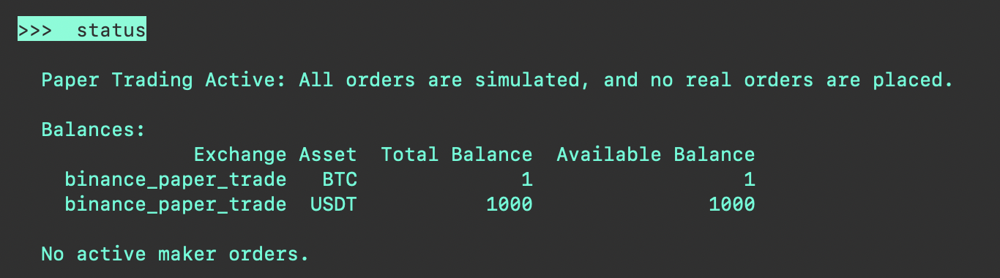
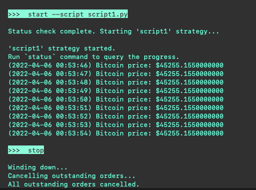

Scripts make it easier for Hummingbot users to prototype new strategies focusing only on the functionality and forgetting about configuration files and compilation

Since scripts are in Python, you can modify the script's code and re-run it to apply the changes without exiting the Hummingbot interface or re-compiling the code.

Scripts do not require configuration files, so the `create` and `import` commands do not apply when using them.

## Adding scripts

All script examples are located in the [`/scripts`](https://github.com/hummingbot/hummingbot/tree/development/scripts) folder. If you save your scripts there, they will be accessible from Hummingbot.

## Running a script

From the Hummingbot client interface, enter `start --script [filename]` to start a script. 

Run `stop` to stop a script.

## Creating your first script

Let's get started with a "Hello World" example of a script:

### 1. Create file

Create a new Python file `script1.py` in the `/scripts` folder. From the root Hummingbot directory, run:
```
touch scripts/script1.py
```

Open the file in a text editor like Visual Studio Code, add the following code to it, and save the file:

```python

from hummingbot.strategy.script_strategy_base import ScriptStrategyBase
class Script1(ScriptStrategyBase):

  # It is best to first use a paper trade exchange connector 
  # while coding your strategy, once you are happy with it
  # then switch to real one.

  markets = {"binance_paper_trade": {"BTC-USDT"}}

```

### 2. Start and stop script

Start the Hummingbot client, and run the command: `start --script script1.py`

At this point, you should see Hummingbot loading up a connector (`binance_paper_trade`) and an order book (BTC-USDT) for your script, as well messages in the log pane about your script running.


Run the `status` command to see the current status of your running script:



Stop the script by running the `stop` command.

### 3. Emit log messages

Now, lets log the Bitcoin price every tick by adding the `on_tick` function to our `Script1` class. Add the following function to the `Script1` base class in the file above, and save the file:

```python
def on_tick(self):
        price = self.connectors["binance_paper_trade"].get_mid_price("BTC-USDT")
        msg = f"Bitcoin price: ${price}"
        self.logger().info(msg)
        self.notify_hb_app_with_timestamp(msg)
```

Restart the script with `start --script script1.py`. You should see log messages appearing in the left pane:



Here is what is happening:

- `on_tick` runs for every tick the bot internal clock executes (by default a new tick is generated every 1 second).
- `self.logger().info(msg)` logs the message to your Hummingbot app log panel and to `logs/log_script1.log` file
- `self.notify_hb_app_with_timestamp(msg)` sends the message to your output panel (top left). If you have set up [Telegram bot integration](https://hummingbot.org/global-configs/telegram/), you will get the message on your Telegram chat as well.

## Notes & Tips

- You can define multiple connectors and multiple order books, e.g.

```python
markets = { "binance_paper_trade": {"BTC-USDT", "ETH-USDT"}, 
            "kucoin": {"LUNA-USDT"}
          }
```

- You will see a sqlite database (`/data/script1.sqlite`) and a log file (`/logs/log_script1.log`) created for your script
- Your script is loaded up at runtime, so you don’t have to exit Hummingbot while you are updating your script code. You will just need to `stop` (to stop the current execution) and start it again with the command `start --script script.py` again.
- If you want to use a real connector instead of a paper trade one, first you need to configure it using the `connect` command and provide all the required API credentials
- Use arrow up key in the client to cycle through the list of previous commands
- Use [DBeaver](https://dbeaver.io/) or another free database management tool) to open the sqlite database to see what the data that Hummingbot stores for you


## Debugging scripts with PyCharm

Watch this video to learn how you can debug Scripts at runtime with the PyCharm IDE:

[:fontawesome-solid-video: Script Debugging with PyCharm](https://www.loom.com/share/6612ffd03199432c94338bcd18567831)
