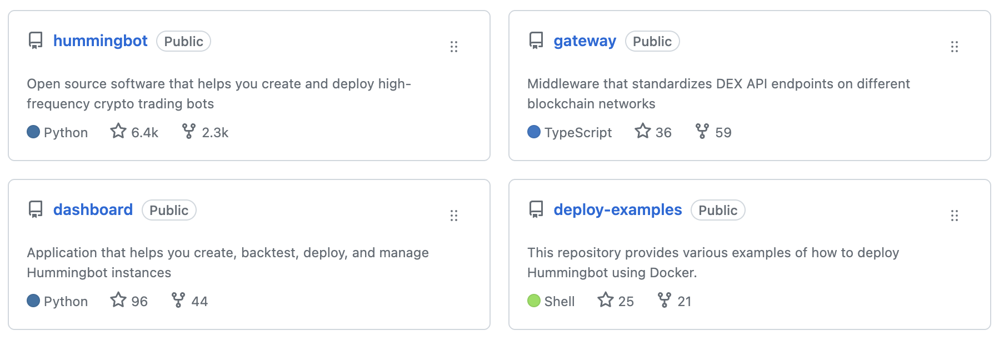

Hummingbot architecture features modular components that can be maintained and extended by individual community members.

## Core Repos

The main Hummingbot code repositories are:

- [__Hummingbot__](/client) Core trading client, strategies, and connectors
- [__Gateway__](/gateway) API middleware for DEX connectors
- [__Dashboard__](/dashboard) helps you create, backtest, deploy, and manage Hummingbot instances
- [__Deploy Examples__](https://github.com/hummingbot/deploy-examples) of various Hummingbot configurations using Docker Compose

## [Strategies](/strategies)

A Hummingbot strategy is an ongoing process that executes an algorithmic trading strategy. It is constructed as a user-defined program that uses an underlying framework to abstracts low-level operations:

- [V2 Strategies](/v2-strategies): The latest and most advanced way to create strategies in Hummingbot, V2 strategies are built using composable elements known as `Controllers` and `PositionExecutors`. These elements can be mixed and matched, offering a modular approach to strategy creation and making the development process faster and more efficient.

- [Scripts](/scripts): For those who are looking for a lightweight solution, Hummingbot provides scripting support. These are single-file strategies that are quick to implement and can be an excellent starting point for those new to algorithmic trading.

- [V1 Strategies](/v1-strategies): Templatized programs templates for various algorithmic trading strategies that expose a set of user-defined parameters, allowing you to customize the strategy's behavior. These were Hummingbot's original method of defining strategies and have been superceded by V2 Strategies and Scripts.

## [Connectors](../exchanges/index.md)

Hummingbot connectors standardize trading logic and order types across different types of exchanges and blockchain networks, so that strategies can access standardized methods that work across all connectors of that type.

Each connector's code is contained in modularized folders in the Hummingbot and/or Gateway codebases:

- [CEXs](/cex-connectors): Connectors to centralized exchanges (CEX)

- [DEX](/dex-connectors): Connectors to decentralized exchanges (DEX)

- [Chains](/chains): Connectors to Layer 1 blockchain networks
