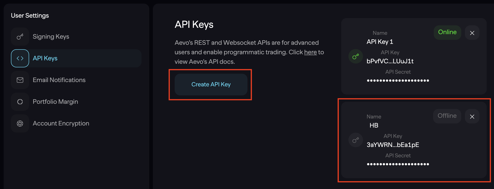
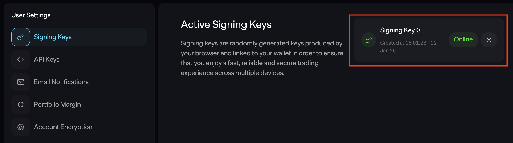
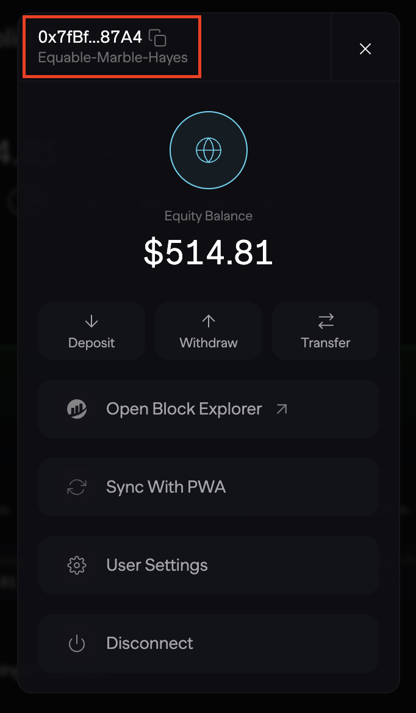

## 🛠 Connector Info

- **Exchange Type**: Decentralized Exchange (**DEX**)
- **Market Type**: Central Limit Order Book (**CLOB**)

| Component | Status | Notes | 
| --------- | ------ | ----- |
| [🔀 Spot Connector](#spot-connector) | Not available |
| [🔀 Perp Connector](#perp-connector) | ✅ | Supports testnet |
| [🕯 Spot Candles Feed](#spot-candles-feed) | Not available |
| [🕯 Perp Candles Feed](#perp-candles-feed) | ✅ |

## ℹ️ Exchange Info

- **Website**: <https://app.aevo.xyz/>
- **Aevo referral link:** <https://app.aevo.xyz/r/Dour-Darkened-Cohen>
- **CoinMarketCap**: <https://coinmarketcap.com/exchanges/aevo/?type=perpetual>
- **CoinGecko**: <https://www.coingecko.com/en/exchanges/aevo>
- **API Docs**: <https://api-docs.aevo.xyz/reference/overview>
- **Fees**: <https://docs.aevo.xyz/aevo-products/aevo-exchange/fees>
- **Supported Countries**: Not available


## 🔑 Getting Keys Ready

In order to start trading, you would need the following parts ready:

Click the "Connect Wallet" button and log in to the exchange.

**API Key and Secret Key**

1. Go to [API Keys](https://app.aevo.xyz/settings/api-keys) page and press "Create API Key" button.
2. Enter your API key name and press "Create" button.
3. Now you can copy the "Private Key" and "API Key" by clicking on the corresponding field.



**Signing Key**

1. Go to [Active Signing Keys](https://app.aevo.xyz/settings) page.
2. Here you can click on "Signing Key 0" and copy signing key.



**Address**

1. Click on button with your wallet address.
2. Click on the address in the upper left corner of the window that opens.



## 🔀 Perp Connector

*Integration to perpetual futures markets API endpoints*

- **ID**: `aevo_perpetual`
- **Connection Type**: REST / WebSocket
- **Folder**: <https://github.com/hummingbot/hummingbot/tree/master/hummingbot/connector/derivative/aevo_perpetual>


### Usage

From inside the Hummingbot client, run `connect aevo_perpetual`:

```
>>> connect aevo_perpetual
```

```
Enter your Aevo API key >>>
Enter your Aevo API secret >>>
Enter your Aevo signing key (private key) >>>
Enter your Aevo account address >>>
```

If connection is successful:

```
You are now connected to aevo_perpetual.
```

### Order Types

This connector supports the following `OrderType` constants:

- `LIMIT`
- `LIMIT_MAKER`
- `MARKET`

### Position Modes

This connector supports the following position modes:

- One-way

### Paper Trading (Aevo Testnet)

This perp exchange offers a paper trading mode: <https://testnet.aevo.xyz/>

After you create an account and create the API keys, you can enter them by using the `connect aevo_perpetual_testnet` command within the Hummingbot client. Once connected, you should be able to use the testnet with the available perpetual strategies / scripts.

```
connect aevo_perpetual_testnet
```

## 🕯 Perp Candles Feed

*OHLCV candles data collector from perpetual futures markets*

- **ID**: `aevo_perpetual`
- **Supported Intervals**: 1m | 3m | 5m | 15m | 30m | 1h | 2h | 4h | 6h | 8h | 12h | 1d | 3d | 1w | 1M
- **[Github Folder](https://github.com/hummingbot/hummingbot/tree/master/hummingbot/data_feed/candles_feed/aevo_perpetual_candles)**

### Usage

In a Hummingbot script, import `CandlesFactory` to create the candles that you want:
```python
    from hummingbot.data_feed.candles_feed.candles_factory import CandlesFactory
    candles = CandlesFactory.get_candle(connector="aevo_perpetual",
                                        trading_pair=trading_pair,
                                        interval="3m", max_records=50)
```