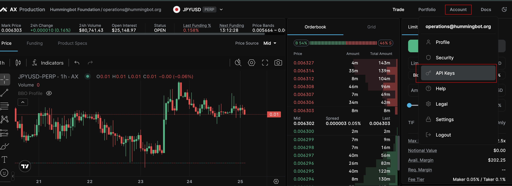
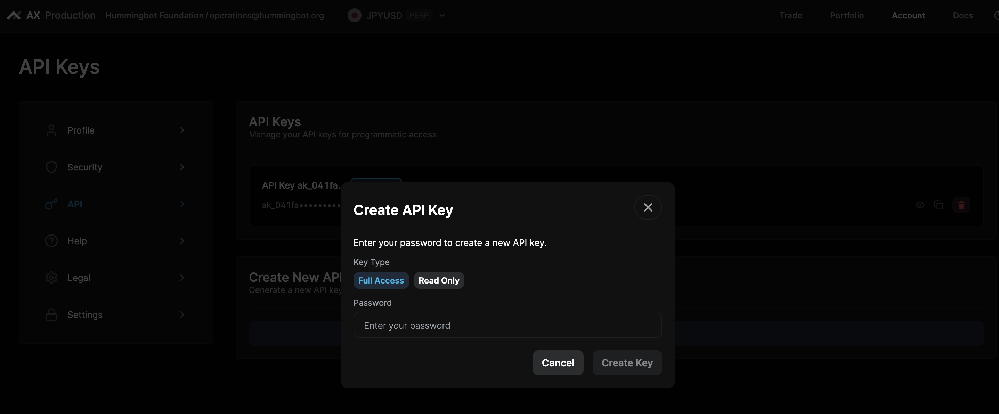

## 🛠 Connector Info

- **Exchange Type**: Centralized Exchange (**CEX**)
- **Market Type**: Central Limit Order Book (**CLOB**)

| Component | Status | Notes            | 
| --------- | ------ |------------------|
| [🔀 Spot Connector](#spot-connector) | Not available |
| [🔀 Perp Connector](#perp-connector) | ✅ | Supports sandbox |

## ℹ️ Exchange Info

- **Website**: <https://architect.co>
- **API Docs**: <https://docs.architect.exchange/api-reference/user-management/get-whoami>
- **Fees**: <https://docs.architect.exchange/guides/accounts-fees/fee-structure>

## 🔑 How to Connect

### Generate API Keys

In order to use the Architect Perpetual Hummingbot integration, you will need an API key and secret pair.

1. Log into your Architect account.
2. Access the Account menu in the top-right corner and select "API Keys".

3. On the API Keys page, select "Create New API Key".
4. Select the "Full Access" option, enter your password, and hit "Create Key".


## 🔀 Perp Connector
*Integration to perpetual futures markets API endpoints*

- **ID**: `architect_perpetual`
- **Connection Type**: WebSocket
- **[Github Folder](https://github.com/hummingbot/hummingbot/tree/master/hummingbot/connector/derivative/architect_perpetual)**

### Usage

From inside the Hummingbot client, run `connect architect_perpetual`:

```
>>> connect architect_perpetual

Enter your Architect Perpetual API key >>>
Enter your Architect Perpetual API secret >>>
```

If connection is successful:

```
You are now connected to Architect Perpetual
````

### Order Types

This connector supports the following `OrderType` constants:

- `LIMIT`
- `LIMIT_MAKER`
- `MARKET`

### Position Modes

This connector supports the following position modes:

- One-way

### Leverage

Architect Perpetual trading instruments have fixed leverages. Consult the Architect trading UI to verify the leverage
for your trading instrument. Hummingbot supports integer values only for leverage, so if the Architect instrument
leverage is 12.5, configure your Hummingbot strategy to 12.