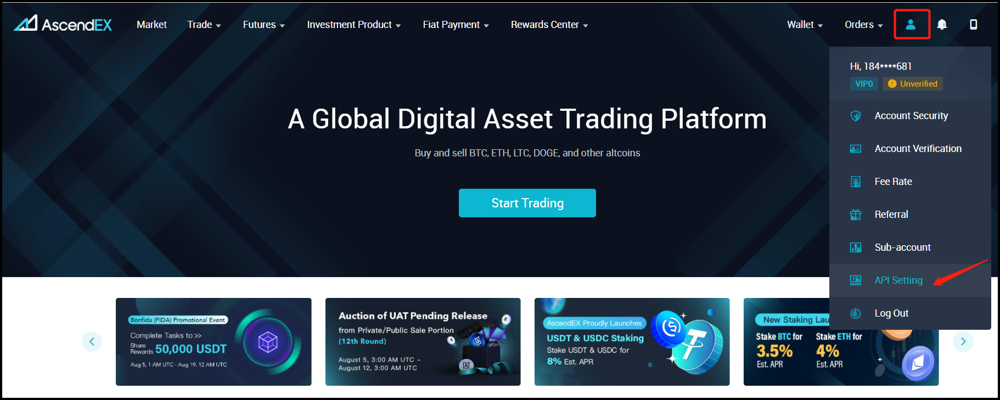
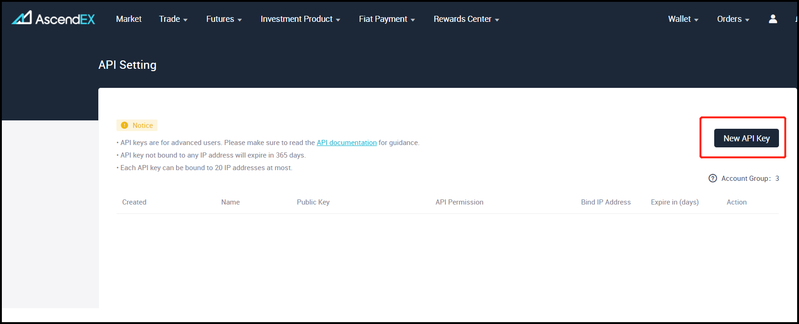
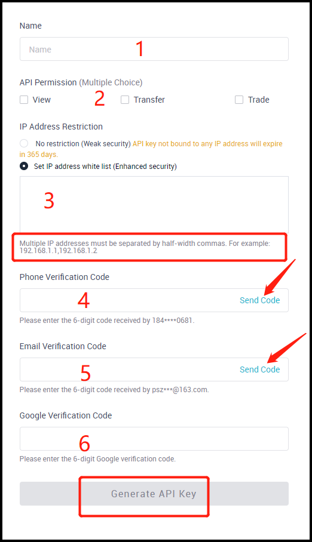
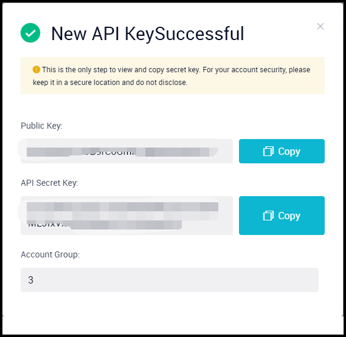
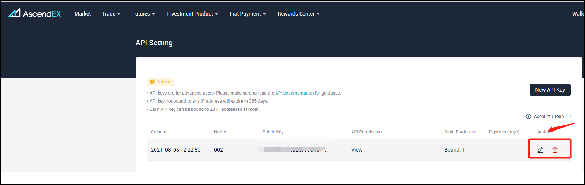

!!! tip "Support Hummingbot"
    Hummingbot Foundation has a fee share partnership with Ascendex. When you use our software to trade on Ascendex, a custom API header tells Ascendex that the trade was executed using Hummingbot, so they share a portion of your fees with us, at no cost to you. To support us, create an account using our [Ascendex referral link](https://ascendex.com/register?inviteCode=UEIXNXKW) and enter that account's API keys into Hummingbot and run bots! Thanks for your support! 🙏

## 🛠 Connector Info

- **Exchange Type**: Centralized Exchange (CEX)
- **Market Type**: Central Limit Order Book (CLOB)

| Component | Status | Connector Version | V2 Strategies | Notes | 
| --------- | ------ | ----------------- |  ------------ | ----- |
| [🔀 Spot Connector](#spot-connector) | ✅ | v2.0 | Yes | Supports `MARKET` order type
| [🔀 Perp Connector](#perp-connector) | Not built | | |API only allows institutional accounts |
| [🕯 Spot Candles Feed](#spot-candles-feed) | ✅ |
| [🕯 Perp Candles Feed](#perp-candles-feed) | Not built |

## ℹ️ Exchange Info

- **Website**: <https://www.ascendex.com>
- **CoinMarketCap**: <https://coinmarketcap.com/exchanges/ascendex/>
- **CoinGecko**: <https://www.coingecko.com/en/exchanges/ascendex>
- **API Docs**: <https://ascendex.github.io/ascendex-pro-api/>
- **Fees**: <https://ascendex.com/en/support>
- **Supported Countries**: <https://www.ascendex.com/support/10247584234521> 
- **Ascendex referral link:** <https://ascendex.com/register?inviteCode=UEIXNXKW>

## 🔑 How to Connect

### Generate API Keys

Log in to your AscendEX account using your PC and visit profile icon – [API Setting].

   [](ascendex-api1.png)

Click [New API Key] in the upper right corner of the page.

   [](ascendex-api2.png)

Create a name for the new API key and set up API permissions and IP address restrictions. Complete a three-step verification by entering your phone, email, and Google verification code. Click [Generate API Key] to complete the process.

   [](ascendex-api3.png)

A pop-up containing both public and private API keys will appear on your screen. Please keep a copy of both keys, as they will only be viewable to you during this stage of the setup. 
For account security, never share your API keys. In the case of a lost or forgotten API key, it is advised to delete the old API and create new keys immediately.

   [](ascendex-api4.png)

After creating an API key, you can Edit or Delete your API keys under the Action tab.

   [](ascendex-api5.png)

### Notes:

- API keys without an IP address will only remain valid for 365 days.
- Up to 20 IP addresses can be bound to one API key.
- For security enhancement, it is recommended that only IP addresses in users API's whitelist make API calls to users' network. An "unrestricted" setting will allow all IPs to access the network, decreasing account security.
- Multiple IP addresses must be separated by half-width commas during the setup.

### Add Keys to Hummingbot

```
>>> connect ascend_ex

Enter your ascend_ex API key >>>
Enter your ascend_ex secret key >>>
```

If connection is successful:

```
You are now connected to ascend_ex
```

## 🔀 Spot Connector
*Integration to spot markets API endpoints*

- **ID**: `ascendex`
- **Connection Type**: WebSocket
- **Folder**: <https://github.com/hummingbot/hummingbot/tree/master/hummingbot/connector/exchange/ascend_ex>

### Order Types

This connector supports the following `OrderType` constants:

- `LIMIT`
- `LIMIT_MAKER`
- `MARKET`

### Paper Trading

Access the [Paper Trade](/global-configs/paper-trade/) version of this connector by running `connect ascendex_paper_trade` instead of `connect ascendex`.

If this is not available by default, you can configure Hummingbot to add this paper trade exchange. See [Adding Exchanges](/global-configs/paper-trade/#adding-exchanges) for more information.

## 🕯 Spot Candles Feed
*Collect historical OHCLV data from this exchange's spot markets*

- **ID**: `ascendex`
- **Supported Intervals**: 1min | 5min | 15min | 30min | 1hour | 2hour | 4hour | 6hour | 12hour |  1day | 1week | 1M
- **Folder**: <https://github.com/hummingbot/hummingbot/tree/master/hummingbot/data_feed/candles_feed/ascend_ex_spot_candles>

### Usage

In a Hummingbot script, import `CandlesFactory` to create the candles that you want:
```python
    from hummingbot.data_feed.candles_feed.candles_factory import CandlesFactory
    candles = CandlesFactory.get_candle(connector="ascendex",
                                        trading_pair="ETH-USDT",
                                        interval="1m", max_records=50)
```

See [candles_example.py](https://github.com/hummingbot/hummingbot/blob/master/scripts/candles_example.py) for more details.