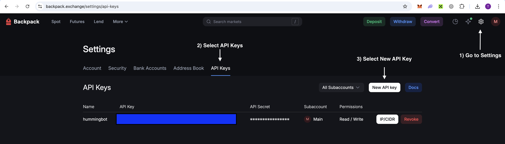

## 🛠 Connector Info

- **Exchange Type**: Centralized Exchange (**CEX**)
- **Market Type**: Central Limit Order Book (**CLOB**)

| Component                            | Status | V2 Strategies | Notes |
|--------------------------------------|--------|---------------|-------|
| [🔀 Spot Connector](#spot-connector) | ✅      | Yes           |
| [🔀 Perp Connector](#perp-connector) | ✅      | Yes           |

## ℹ️ Exchange Info

- **Website**: <https://backpack.exchange>
- **CoinMarketCap**: <https://coinmarketcap.com/exchanges/backpack-exchange/>
- **CoinGecko**: <https://www.coingecko.com/en/exchanges/backpack-exchange>
- **Fees**: <https://support.backpack.exchange/exchange/trading/trading-fees>

## 🔑 How to Connect

### Generate API Keys

    The same API keys can be used for both spot and perpetual trading on Backpack.

**Step 1**

Log in to your Backpack account and navigate to [API Settings](https://backpack.exchange/settings/api-keys).

**Step 2**

Click **Create New API Key**.

**Step 3**

Configure your API key:

- Enter a label/name for your API key
- Enable the following permissions:
  - **Trading** - Required for placing and managing orders
  - **Read** - Required for accessing account and market data

**Step 4**

Complete the security verification (2FA if enabled).

**Step 5**

Your API Key and Secret Key will be displayed. **Save both keys securely**. The Secret Key is only shown once - if you lose it, you'll need to create a new API key.

[](backpack-api.png)

### Connecting to Hummingbot

From inside the Hummingbot client, run `connect backpack`:

```
>>> connect backpack

Enter your backpack API key >>>
Enter your backpack secret key >>>
```

If connection is successful:

```
You are now connected to backpack
```

## 🔀 Spot Connector
*Integration to spot markets API endpoints*

- **ID**: `backpack`
- **Connection Type**: WebSocket
- **API Docs**: <https://docs.backpack.exchange/>
- **[Github Folder](https://github.com/hummingbot/hummingbot/tree/master/hummingbot/connector/exchange/backpack)**

### Order Types

This connector supports the following `OrderType` constants:

- `LIMIT`
- `LIMIT_MAKER`
- `MARKET`

## 🔀 Perp Connector
*Integration to perpetual futures markets API endpoints*

- **ID**: `backpack_perpetual`
- **Connection Type**: WebSocket
- **[Github Folder](https://github.com/hummingbot/hummingbot/tree/master/hummingbot/connector/derivative/backpack_perpetual)**

### Usage

From inside the Hummingbot client, run `connect backpack_perpetual`:

```
>>> connect backpack_perpetual

Enter your backpack_perpetual API key >>>
Enter your backpack_perpetual secret key >>>
```

If connection is successful:

```
You are now connected to backpack_perpetual
```

### Order Types

This connector supports the following `OrderType` constants:

- `LIMIT`
- `LIMIT_MAKER`
- `MARKET`

### Position Modes

This connector supports the following position modes:

- One-way