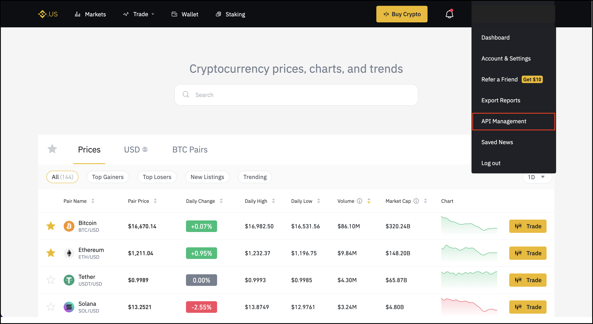
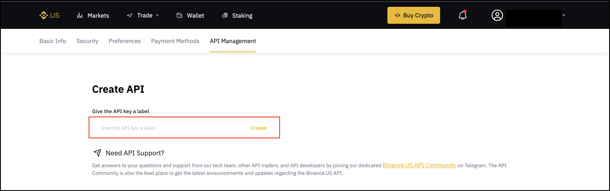
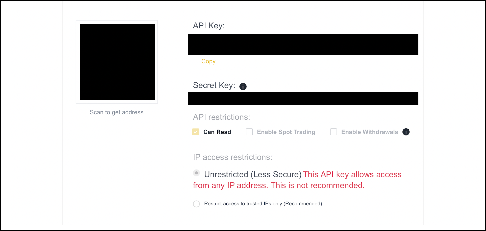

# Binance.US

!!! tip "Support Hummingbot"
    Hummingbot Foundation has a partnership with Binance.US that shares some of your fees when you trade on Binance.US using Hummingbot, at no cost to you. To support us, create an account using our [Binance.US referral link](https://www.binance.us/register). Thank you! 🙏

## ℹ️ Exchange Info

- **Type**: CLOB CEX
- **Website**: <https://www.binance.us/>
- **CoinMarketCap**: <https://coinmarketcap.com/exchanges/binance-us/>
- **CoinGecko**: <https://www.coingecko.com/en/exchanges/binance_us>
- **API docs**: <https://github.com/binance-us/binance-official-api-docs/blob/master/rest-api.md>
- **Fees**: <https://www.binance.us/en/fee/schedule>
- **Supported countries**: Primarily United States

## 🛠 Maintenance


- **Tier**: Bronze
- **Maintainer**: 

HBOT holders voted this exchange into the **Bronze** tier for the current [Epoch](/governance/epochs). They are not maintained by the Hummingbot Foundation but may be maintained by a community member.


## 🔀 Spot Connector
*Integration to exchange's spot markets API*

- [📁 Folder](https://github.com/hummingbot/hummingbot/tree/master/hummingbot/connector/exchange/binance)

### Usage

From inside the Hummingbot client, run `connect binance_us`:

```
>>> connect binance_us

Enter your binance_us API key >>>
Enter your binance_us secret key >>>
```

If connection is successful:

```
You are now connected to binance_us
```

### Order Types

This connector supports the following `OrderType` constants:

- `LIMIT`
- `LIMIT_MAKER`
- `MARKET`

### Paper Trading

Access the [Paper Trade](/global-configs/paper-trade/) version of this connector by running `connect binance_us_paper_trade` instead of `connect binance_us`.

If this is not available by default, you can configure Hummingbot to add this paper trade exchange. See [Adding Exchanges](/global-configs/paper-trade/#adding-exchanges) for more information.

## 🔀 Perp Connector
*Connector to perpetual futures markets*


### Usage


### Order Types


### Position Modes


### Testnet


## 🕯 Spot Candles Feed
*Collect historical OHCLV data from this exchange's spot markets*


### Usage


## 🕯 Perp Candles Feed
*Collect historical OHCLV data from this exchange's perp markets*


### Usage


## How to create API keys

Log in to your Binance.US account. 
   
On the upper navigation menu, click API Management on the dropdown menu that appears when you hover over your Username. 

   [](binance-us-api1.png)

Please note you must complete Basic Verification to access the API Management feature. 

Enter a label for your API Key. Your label should be as descriptive as possible, so you can return to the API Management feature and easily locate and manage your API Keys. 

   [](binance-us-api2.png)

Complete 2-Factor Authentication (2FA) to proceed. To access the Create API feature, you may need to verify both your chosen 2FA method (SMS or Google Authenticator) and email. 

   [](binance-us-api3.png)

View your API Key and click copy or scan the QR code to copy your public API Key. For your security, your API Secret Key will only be displayed at the time it is created. 

If you lose this key, you will need to delete your API and set up a new one. Please carefully review the API restrictions sections and only grant API Key access to trusted entities. By default, the API restrictions are set to Can Read, which allows trusted entities to access your transaction history.

If you enable Spot Trading or Withdrawals, then the entity that has your API Key can initiate trading or withdrawal funds without your express permission, as permission is granted the moment you share your API Key.  

Finally, you can also configure your IP access restrictions to trusted IPs that you have previously accessed Binance.US from. 

   [](binance-us-api4.png)