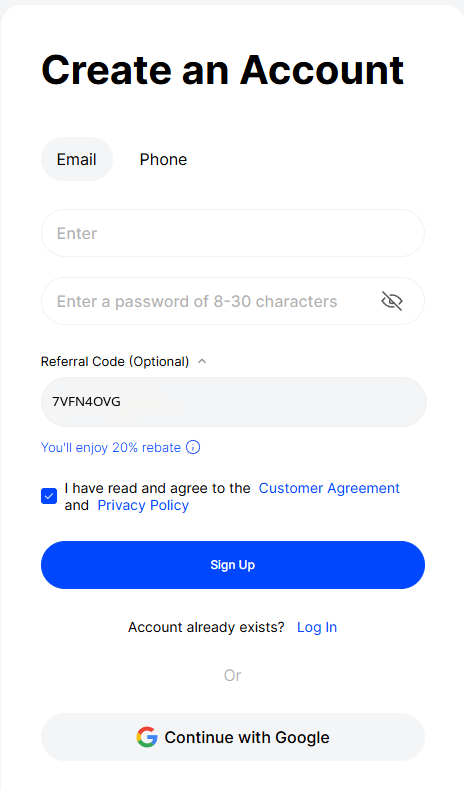
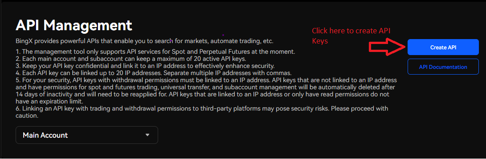
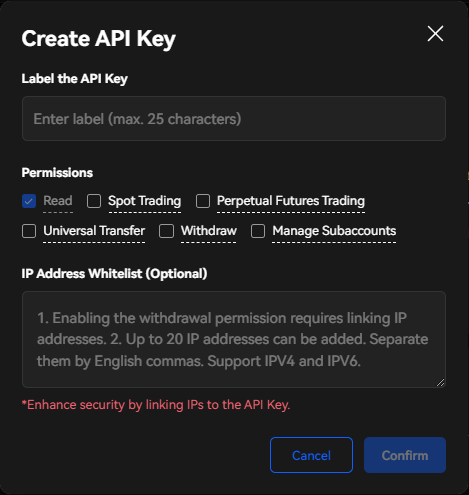
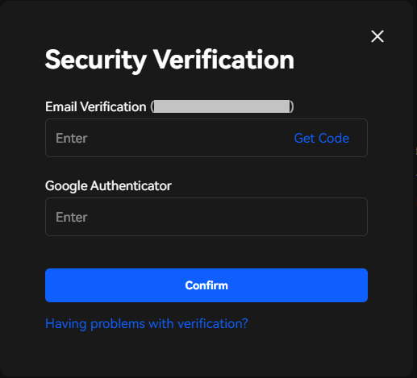
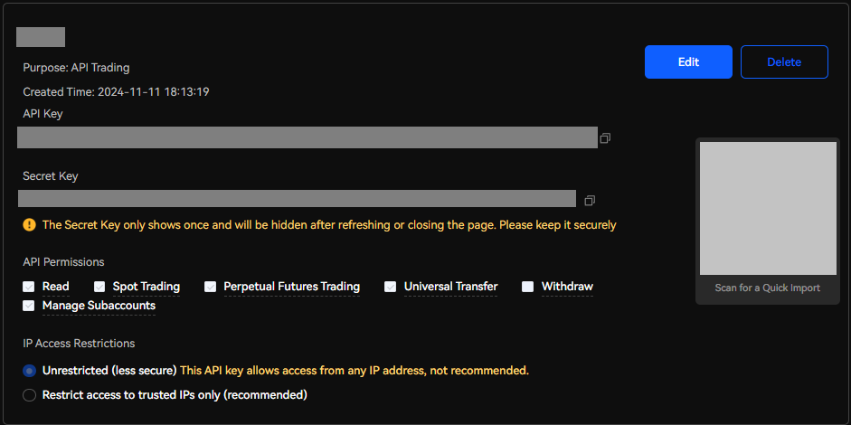

## 🛠 Connector Info

- **Exchange Type**: Centralized Exchange (CEX)
- **Market Type**: Central Limit Order Book (CLOB)

| Component | Status | Connector Version | V2 Strategies | Notes | 
| --------- | ------ | ----------------- |  ------------ | ----- |
| [🔀 Spot Connector](#spot-connector) | ✅ | v2.1 | Yes | Supports `MARKET` and `LIMIT` order types
| [🕯 Spot Candles Feed](#spot-candles-feed) | Not built |

## ℹ️ Exchange Info

- **Website**: [https://bingx.com/](https://bingx.com/invite/7VFN4OVG)
- **CoinGecko**: <https://www.coingecko.com/en/exchanges/bingx>
- **API Docs**: <https://bingx-api.github.io/docs/#/en-us/common/introduce>
- **Fees**: <https://bingx.com/support/costs/>
- **Unsupported Countries**:
   - BingX does not accept certain customers. To maintain our strong reputation in the market and ensure a robust compliant marketplace, we have decided to not seek nor accept customers from certain jurisdictions, such as Canada, Mainland China, Hong Kong SAR, Macau SAR, Netherlands, Singapore, United States (including all US territories), United Kingdom, any country that is designated as a restricted country under BingX's AML/CTF policy and any other jurisdictions where the provision of the services is prohibited or will subject us to regulatory penalty ("Restricted Jurisdictions").

## 🔑 How to Connect

### Generate API Keys

1. Go to [BingX Exchange](https://bingx.com/invite/7VFN4OVG) and log in or create a new account.

2. When creating your account you can use our Referral Code (`7VFN4OVG`) to enjoy 20% rebate.

   

3. Complete your KYC if you haven't already and then open the API Key page by clicking over the profile icon in the top right corner and go to the API Management page at https://bingx.com/account/api/.

4. Click on the ***Create API*** button

   

5. Write a label for your API Keys and then select the permission options that you want (enabling the withdrawal permission requires linking IP addresses on the box below) and click ***Confirm***

   

6. Enter your corresponding verification codes.

   

7. Copy your API keys and store them somewhere safe.

   

8. Now, you have created API keys for your BingX Exchange!

### Add Keys to Hummingbot

From inside the Hummingbot client, run `connect bing_x`:

```
>>> connect bing_x

Enter your BingX Exchange API key >>>
Enter your BingX Exchange secret key >>>
```

If connection is successful:

```
You are now connected to bing_x
```


## 🔀 Spot Connector
*Integration to spot markets API endpoints*

- **ID**: `bing_x`
- **Connection Type**: REST / WebSocket
- **Folder**: <https://github.com/hummingbot/hummingbot/tree/master/hummingbot/connector/exchange/bing_x>

### Order Types

This connector supports the following `OrderType` constants:

- `LIMIT`
- `MARKET`
