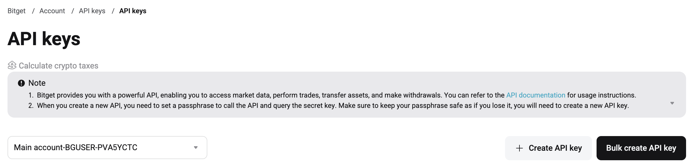
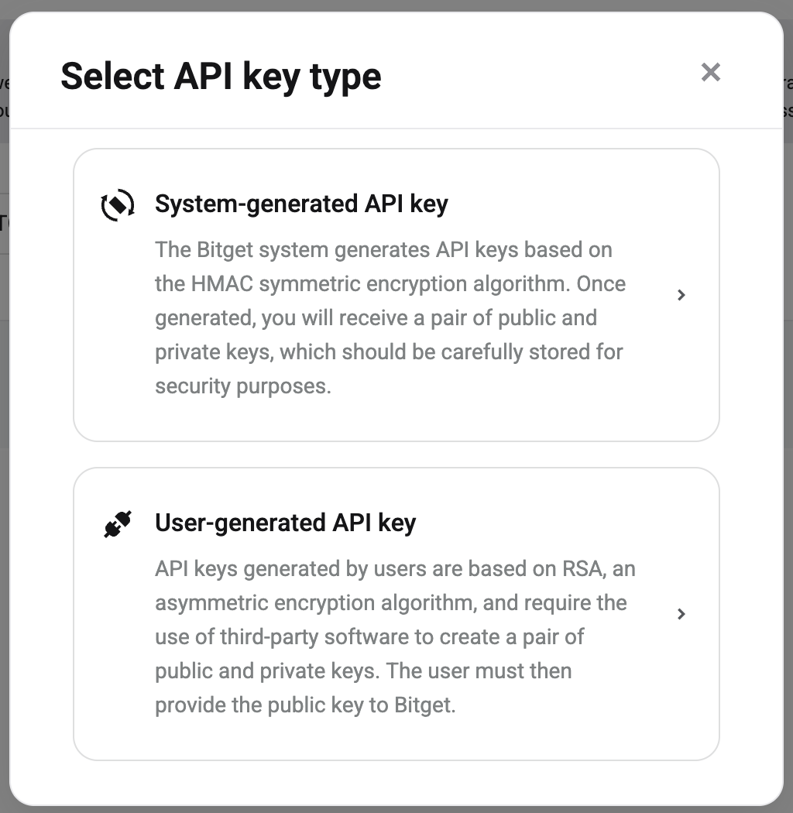
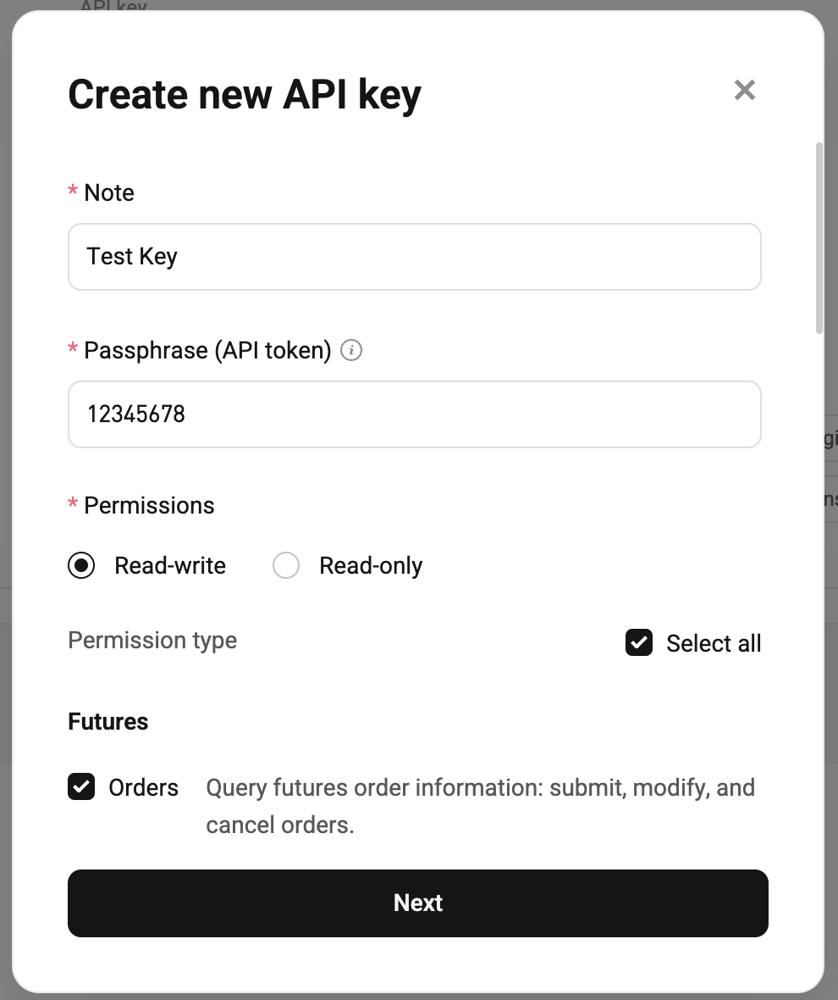

## 🛠 Connector Info

- **Exchange Type**: Centralized Exchange (**CEX**)
- **Market Type**: Central Limit Order Book (**CLOB**)

| Component | Status | Connector Version | V2 Strategies | Notes | 
| --------- | ------ | ----------------- |  ------------ | ----- |
| [🔀 Spot Connector](#spot-connector) | ✅ | v2.0 | Yes | |
| [🔀 Perp Connector](#perp-connector) | ✅ | v2.0 | Yes | |
| [🕯 Spot Candles Feed](#spot-candles-feed) | ✅ |
| [🕯 Perp Candles Feed](#perp-candles-feed) | ✅ | 

## ℹ️ Exchange Info

- **Website**: <https://www.bitget.com/>
- **CoinMarketCap**: <https://coinmarketcap.com/exchanges/bitget/>
- **CoinGecko**: <https://www.coingecko.com/en/exchanges/bitget>
- **API Docs**: <https://www.bitget.com/api-doc/common/intro>
- **Fees**: <https://www.bitget.com/academy/en/article-details/Fee-Structure-and-Fee-Calculations-on-Bitget>
- **Supported Countries**: Not available

## 🔑 How to Connect

### Generate API Keys

1. Go to [Bitget Exchange](https://www.bitget.com) and log in or create a new account.

2. Go to the API Management page at https://www.bitget.com/account/newapi.

3. Click on the ***Create API key*** button

   

4. Click on ***System-generated API key*** button
    

5. Write a label (note) and passphrase for your API key and then select the permission options that you want and click ***Next***

   

6. Enter all the keys for key creation verification and click ***Confirm***.

7. Copy your API keys and store them somewhere safe.

8. Now, you have created API keys (API, secret key, passphrase) for your Bitget Exchange!

### Generate API Keys

### Add Keys to Hummingbot

From inside the Hummingbot client, run `connect bitget`:

```
>>> connect bitget

Enter your Bitget API key >>>
Enter your Bitget secret key >>>
Enter your Bitget passphrase >>>
```

If connection is successful:

```
You are now connected to bitget
```

## 🔀 Spot Connector
*Integration to spot markets API endpoints*

- **ID**: `bitget`
- **Connection Type**: WebSocket
- **API Docs**: <https://www.bitget.com/api-doc/spot/intro>
- **[Github Folder](https://github.com/hummingbot/hummingbot/tree/master/hummingbot/connector/exchange/bitget)** 

### Order Types

This connector supports the following `OrderType` constants:

- `LIMIT`
- `MARKET`

## 🔀 Perp Connector
*Integration to perpetual futures markets API endpoints*

- **ID**: `bitget_perpetual`
- **Connection Type**: WebSocket
- **API Docs**: <https://www.bitget.com/api-doc/contract/intro>
- **[Github Folder](https://github.com/hummingbot/hummingbot/tree/master/hummingbot/connector/derivative/bitget_perpetual)** 

### Order Types

This connector supports the following `OrderType` constants:

- `LIMIT`
- `MARKET`

### Position Modes

This connector supports the following position modes:

- One-way
- Hedge

### Paper Trading


