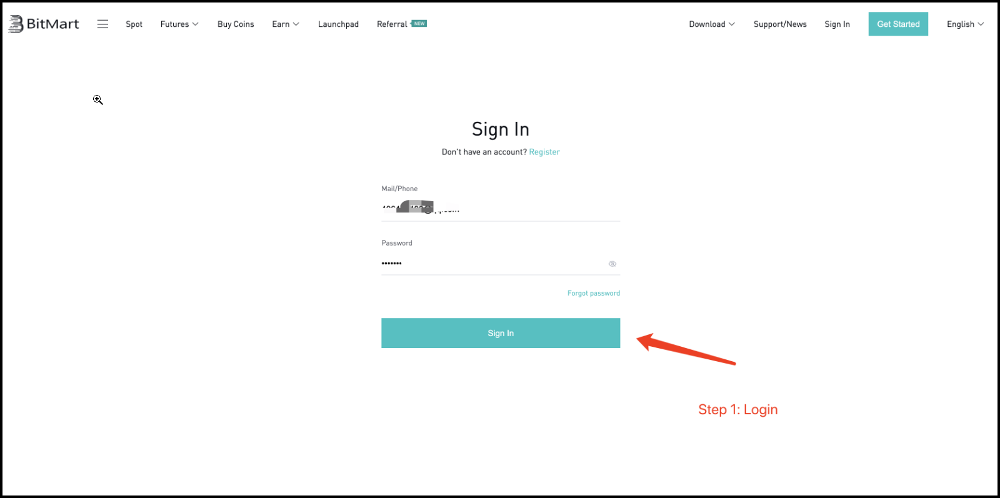
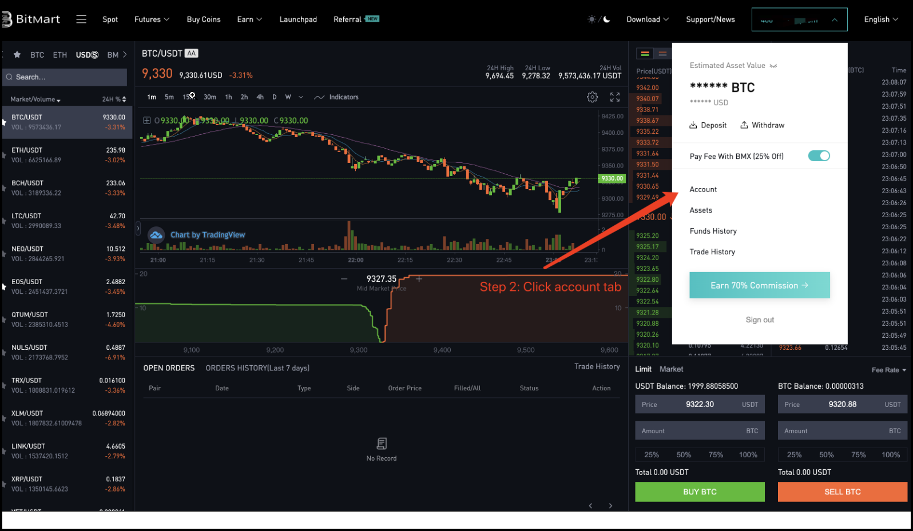
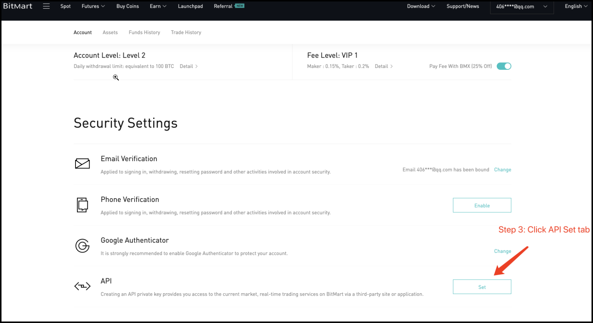
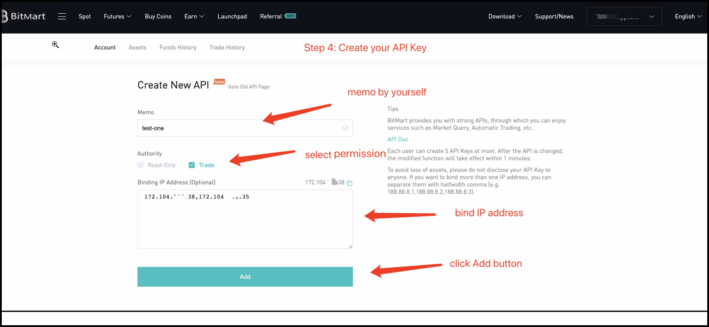
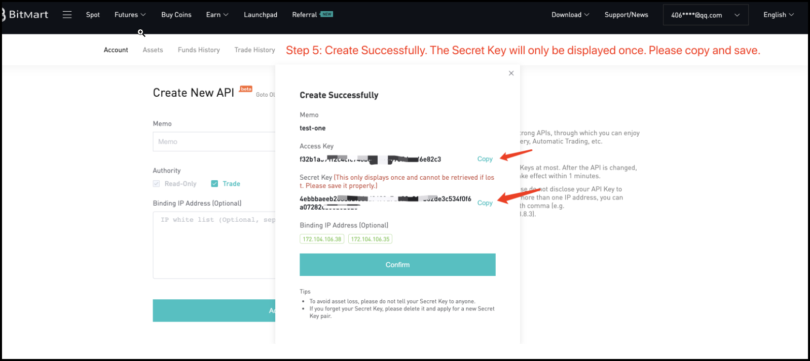

!!! tip "Foundation Partner"
    Bitmart is an [exchange partner](/about/sponsors) of Hummingbot Foundation, so when you use Hummingbot to run bots on Bitmart, a portion of your fees goes to support the Foundation and our mission to democratize algo trading with open source software. To help support us, create an account using our [Bitmart referral link](https://www.bitmart.com/invite/Hummingbot/en) and enter that account's API keys into Hummingbot and run bots! Thanks for your help! 🙏

## 🛠 Connector Info

- **Exchange Type**: Centralized Exchange (**CEX**)
- **Market Type**: Central Limit Order Book (**CLOB**)

| Component | Status | Connector Version | V2 Strategies | Notes | 
| --------- | ------ | ----------------- |  ------------ | ----- |
| [🔀 Spot Connector](#spot-connector) | ✅ | v2.1 | Yes | |
| [🔀 Perp Connector](#perp-connector) | ✅ | v2.1 | Yes | |
| [🕯 Spot Candles Feed](#spot-candles-feed) | Not built  | 
| [🕯 Perp Candles Feed](#perp-candles-feed) | Not built  | 

## ℹ️ Exchange Info

- **Website**: <https://www.bitmart.com/>
- **CoinMarketCap**: <https://coinmarketcap.com/exchanges/bitmart/>
- **CoinGecko**: <https://www.coingecko.com/en/exchanges/bitmart>
- **API Docs**: <https://www.bitmart.com/api-docs>
- **Fees**: <https://www.bitmart.com/fee/en>
- **Referral link:** <https://www.bitmart.com/invite/Hummingbot/en>

## 🔑 How to Connect

### Generate API Keys

- Login

    

- Click Account tab

    

- Click Settings in the API tab

    

- Create your API KEY

    

- Create Successfully. The Secret Key will only be displayed once. Please copy and save.

    

- Click Confirm button to exit. Now you can use your new API.

### Add Keys to Hummingbot

From inside the Hummingbot client, run `connect bitmart`:

```
Enter your bitmart API key >>>
Enter your bitmart secret key >>>
```

If connection is successful:

```
You are now connected to bitmart
```


## 🔀 Spot Connector
*Integration to spot markets API endpoints*

- **ID**: `bitmart`
- **Connection Type**: WebSocket
- **Folder**: <https://github.com/hummingbot/hummingbot/tree/master/hummingbot/connector/exchange/bitmart>

### Order Types

This connector supports the following `OrderType` constants:

- `LIMIT`
- `LIMIT_MAKER`

### Paper Trading

Access the [Paper Trade](/global-configs/paper-trade/) version of this connector by running `connect bitmart_paper_trade` instead of `connect bitmart`.

If this is not available by default, you can configure Hummingbot to add this paper trade exchange. See [Adding Exchanges](/global-configs/paper-trade/#adding-exchanges) for more information.

## 🔀 Perp Connector
*Integration to perpetual futures markets API endpoints*

- **ID**: `bitmart_perpetual`
- **Connection Type**: WebSocket
- **Folder**: <https://github.com/hummingbot/hummingbot/tree/master/hummingbot/connector/derivative/bitmart_perpetual>

### Order Types

This connector supports the following `OrderType` constants:

- `LIMIT`
- `MARKET`

### Position Modes

This connector supports the following position modes:

- One-way
- Hedge

### Paper Trading

Access the [Paper Trade](/global-configs/paper-trade/) version of this connector by running `connect bitmart_paper_trade` instead of `connect bitmart_perpetual`.

If this is not available by default, you can configure Hummingbot to add this paper trade exchange. See [Adding Exchanges](/global-configs/paper-trade/#adding-exchanges) for more information.
