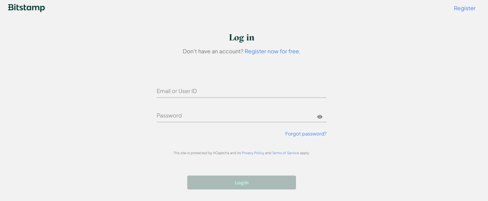
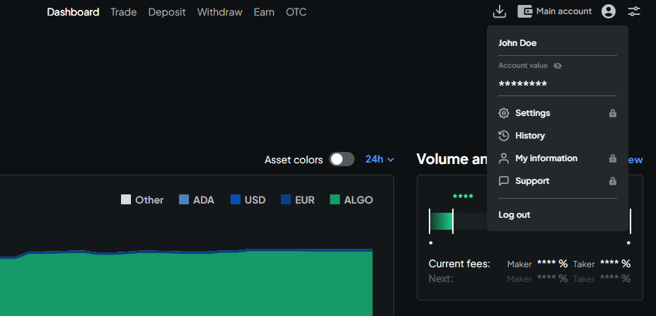
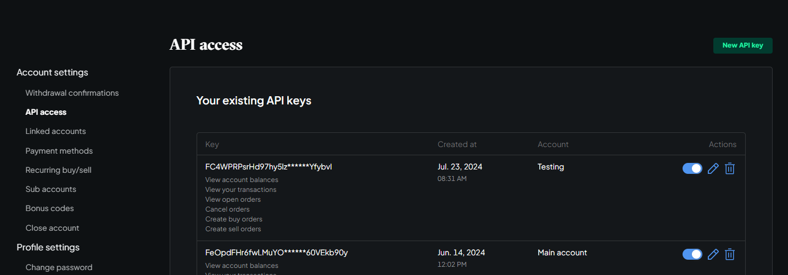
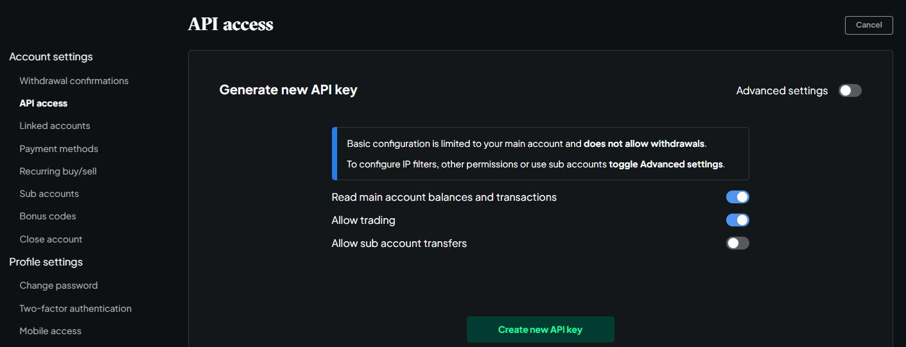
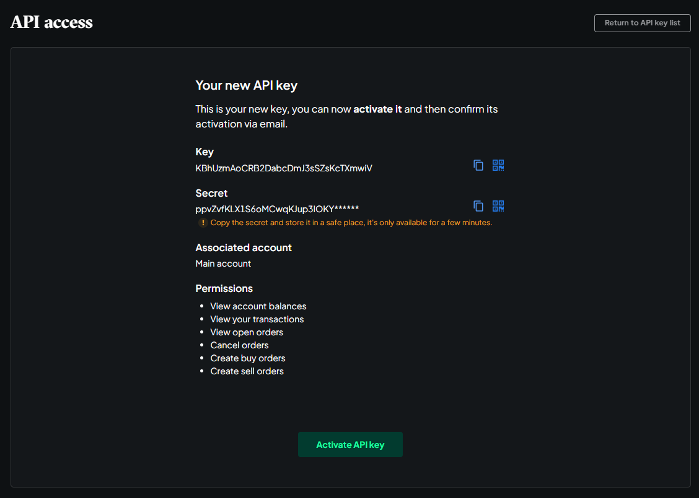

## 🛠 Connector Info

- **Exchange Type**: Centralized Exchange (**CEX**)
- **Market Type**: Central Limit Order Book (**CLOB**)

| Component | Status | Connector Version | V2 Strategies | Notes | 
| --------- | ------ | ----------------- |  ------------ | ----- |
| [🔀 Spot Connector](#spot-connector) | ✅ | v2.1 | Yes | |
| [🔀 Perp Connector](#perp-connector) | Not available |
| [🕯 Spot Candles Feed](#spot-candles-feed) | Not built  | 
| [🕯 Perp Candles Feed](#perp-candles-feed) | Not built  | 

## ℹ️ Exchange Info

- **Website**: <https://www.bitstamp.net/>
- **CoinMarketCap**: <https://coinmarketcap.com/exchanges/bitstamp/>
- **CoinGecko**: <https://www.coingecko.com/en/exchanges/bitstamp>
- **API Docs**: <https://www.bitstamp.net/api/>
- **Fees**: <https://www.bitstamp.net/fee-schedule/>
- **Supported Countries**: Not available

## 🔑 How to Connect

### Generate API Keys

- Login

    

- Click the profile icon and click on `Settings` in the menu.

    

- Click API access and press and press `New API key`.

    

- Create your API Key, optionally press `Advanced settings` to configure an IP Address filter or associate the API Key with a sub-account.

    

- Create Successfully. The Secret Key will only be displayed once. Please copy and save.

    

- Click `Activate API key` button to exit. Now you can use your new API.

### Add Keys to Hummingbot

From inside the Hummingbot client, run `connect bitstamp`:

```
Enter your bitstamp API key >>>
Enter your bitstamp secret key >>>
```

If connection is successful:

```
You are now connected to bitstamp
```


## 🔀 Spot Connector
*Integration to spot markets API endpoints*

- **ID**: `bitstamp`
- **Connection Type**: WebSocket
- **Folder**: <https://github.com/hummingbot/hummingbot/tree/master/hummingbot/connector/exchange/bitstamp>

### Order Types

This connector supports the following `OrderType` constants:

- `LIMIT`
- `LIMIT_MAKER`
- `MARKET`

### Paper Trading

Access the [Paper Trade](/global-configs/paper-trade/) version of this connector by running `connect bitstamp_paper_trade` instead of `connect bitstamp`.

If this is not available by default, you can configure Hummingbot to add this paper trade exchange. See [Adding Exchanges](/global-configs/paper-trade/#adding-exchanges) for more information.
