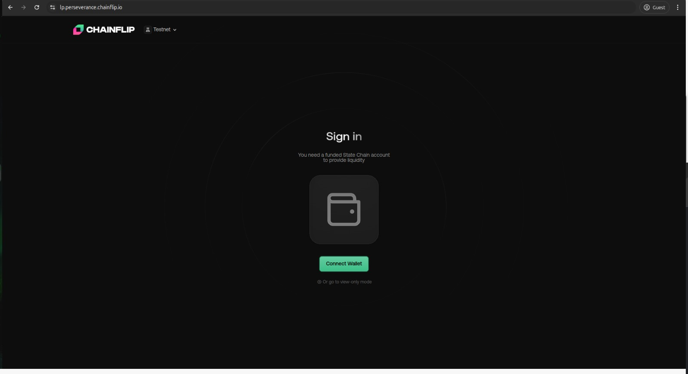
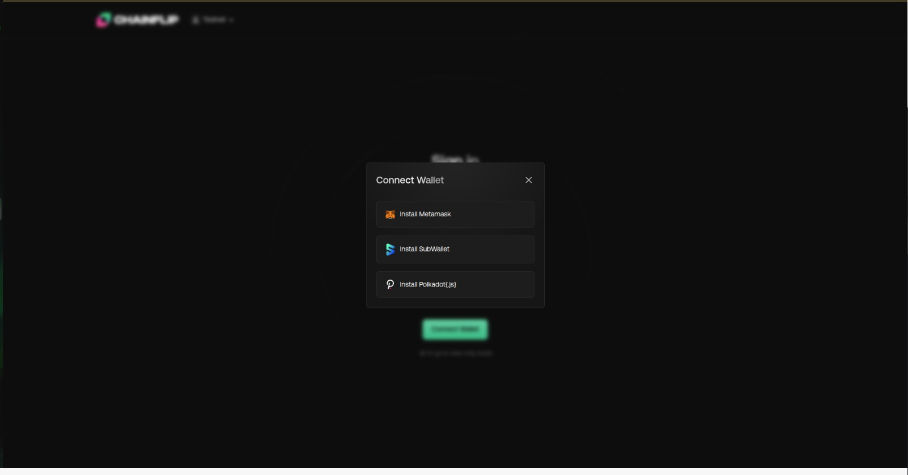

## 🛠 Connector Info

- **Exchange Type**: Decentralized Exchange (**DEX**)
- **Market Type**: Central Limit Order Book (**CLOB**)

| Component | Status | Notes | 
| --------- | ------ | ----- |
| [🔀 Spot Connector](#spot-connector) | ✅ | Supports testnet
| [🔀 Perp Connector](#perp-connector) | Not available | 
| [🕯 Spot Candles Feed](#spot-candles-feed) | Not available | 
| [🕯 Perp Candles Feed](#perp-candles-feed) | Not available |

## ℹ️ Exchange Info

- **Website**: <https://chainflip.io/>
- **CoinMarketCap**: <https://coinmarketcap.com/currencies/chainflip/>
- **CoinGecko**: <https://www.coingecko.com/en/coins/chainflip>
- **API Docs**: <https://docs.chainflip.io/lp/introduction>
- **Fees**: To be determined
- **Supported Countries**: Global 

## 🔑 How to Connect

### Create Chainflip LP Account

**Step 1**

Navigate in to [Chainflip](https://lp.chainflip.io), click the connect wallet button.

**Step 2**

Select a wallet of your choice

