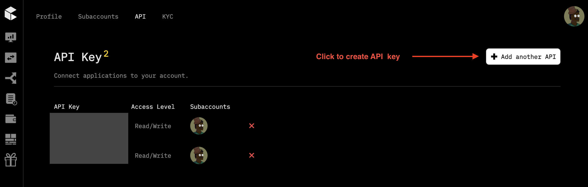
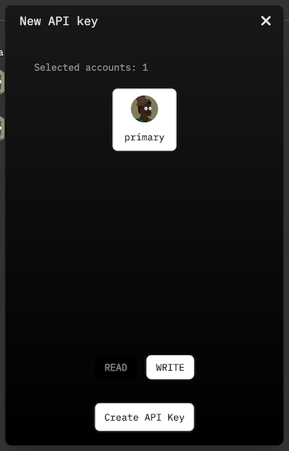
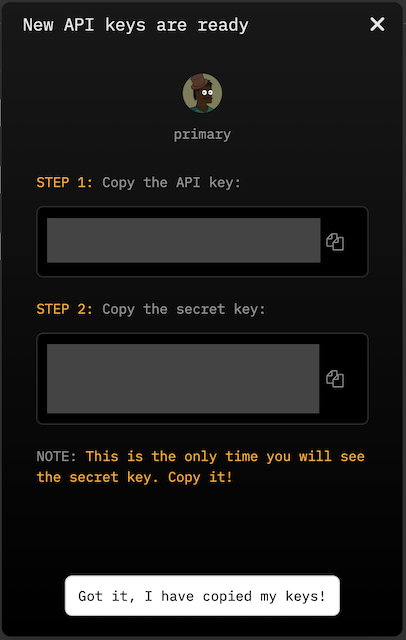
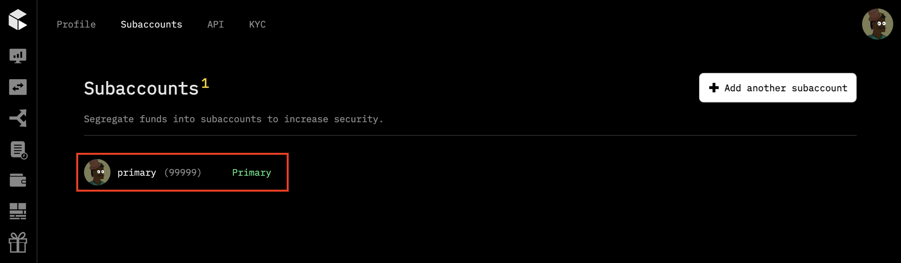

## 🛠 Connector Info

- **Exchange Type**: Centralized Exchange (CEX)
- **Market Type**: Central Limit Order Book (CLOB)

| Component | Status | Connector Version | V2 Strategies | Notes | 
| --------- | ------ | ----------------- |  ------------ | ----- |
| [🔀 Spot Connector](#spot-connector) | ✅ | v2.1 | Yes | Supports `MARKET` order type
| [🕯 Spot Candles Feed](#spot-candles-feed) | Not built | 

## ℹ️ Exchange Info

- **Website**: <https://www.cube.exchange>
- **CoinGecko**: <https://www.coingecko.com/en/exchanges/cube>
- **API Docs**: <https://cubexch.gitbook.io/cube-api>
- **Fees**: <https://www.cube.exchange/fees>
- **Unsupported Countries**:
  - Cube does not engage in business with: Afghanistan, Algeria, Angola, Belarus, Bosnia & Herzegovina, Burundi, Cambodia, Central African Republic, China, Crimea (Ukraine), Cuba, North Korea, Donetsk and Luhansk (Ukraine), Egypt, Guyana, Haiti, Iran, Iraq, Laos, Lebanon, Libya, Mali, Macao, Myanmar, Pakistan, Qatar, Russia, Somalia, Sudan, South Sudan, United States of America, Yemen.
  - Sanctioned countries include: Central African Republic, Democratic Republic of the Congo, North Korea, Iran, Iraq, Lebanon, Libya, Mali, Myanmar, Russia, Somalia, Sudan, South Sudan, Syria, Yemen, Zimbabwe.

## 🔑 How to Connect

### Generate API Keys

1. Go to [Cube Exchange](https://www.cube.exchange/) and log in or create a new account.

2. Open the API Key page by clicking over the profile icon on the top right corner and go to the Setting/API page at https://www.cube.exchange/settings/api.
   
3. Click on the ***Add another API*** button

    

4. Choose your account, select ***WRITE*** permission and click ***Create API Key***
  
    

5. Copy your API keys and store them somewhere safe. 
    
    

6. Go to Subaccounts page and copy your ***Subaccount ID*** number. You will need this to connect to Hummingbot.

    

77. Now, you have created API keys for your Cube Exchange!

### Add Keys to Hummingbot

From inside the Hummingbot client, run `connect cube`:

```
>>> connect cube

Enter your Cube Exchange API key >>>
Enter your Cube Exchange secret key >>>
Enter your Cube Exchange Subaccount ID >>>
Enter your Cube environment (live or staging) >>>
```

If connection is successful:

```
You are now connected to cube
```


## 🔀 Spot Connector
*Integration to spot markets API endpoints*

- **ID**: `cube`
- **Connection Type**: WebSocket
- **Folder**: <https://github.com/hummingbot/hummingbot/tree/master/hummingbot/connector/exchange/cube>

### Order Types

This connector supports the following `OrderType` constants:

- `LIMIT`
- `LIMIT_MAKER`
- `MARKET`

## 🔮 Rate Orcale
The connector comes with its own rate oracle implementation. You can use it by using the folllowing command:

```
config rate_oracle_source cube
```

Make sure to set global token name to `USDC` as `USDC` is the main quote token for trading on Cube Exchange

```
config global_token.global_token_name USDC
```