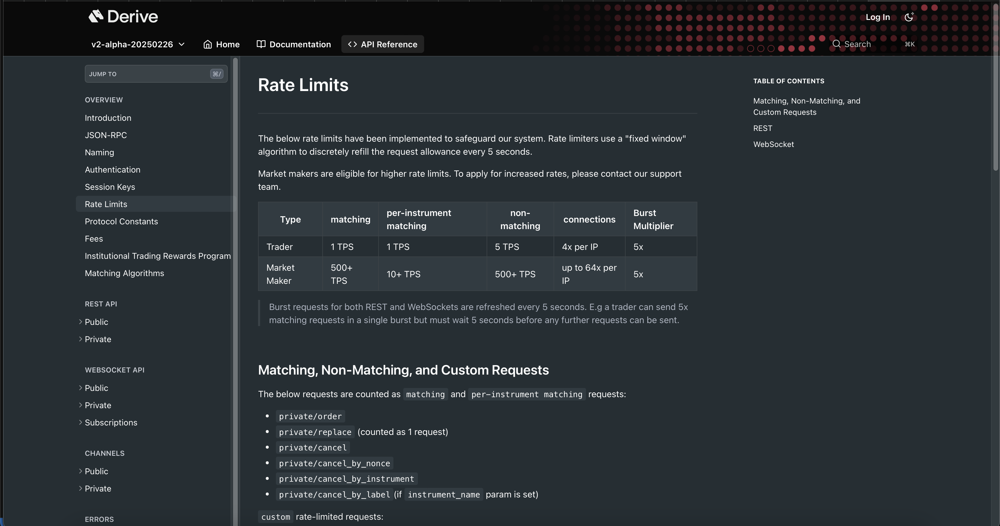
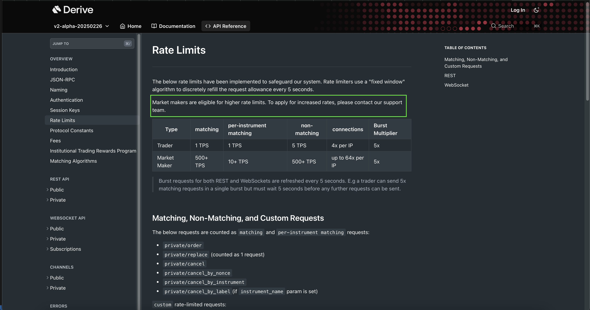
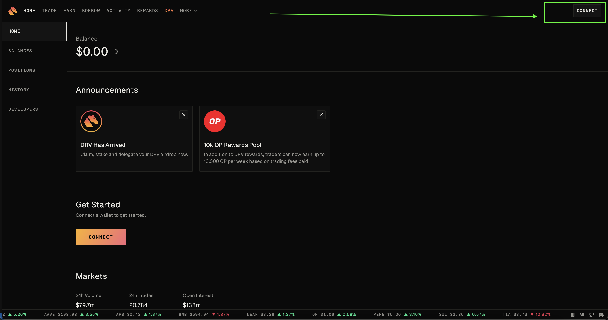
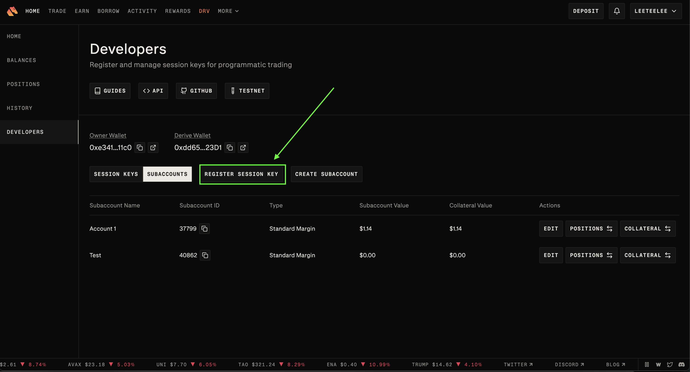
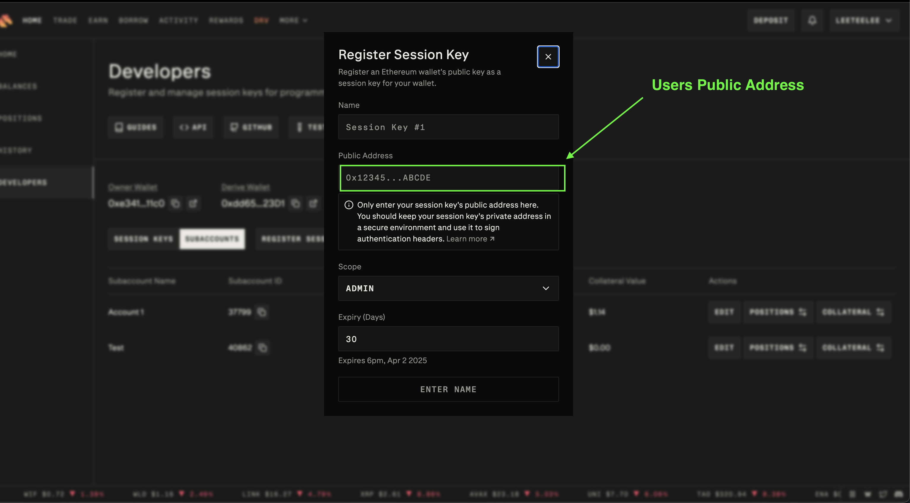
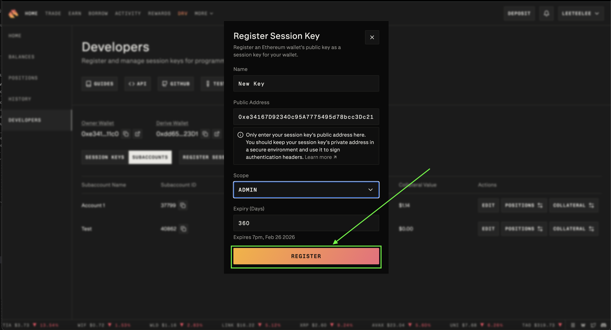
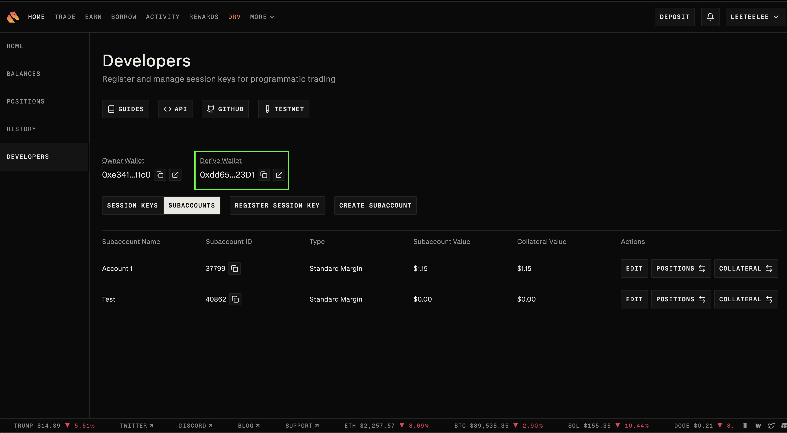
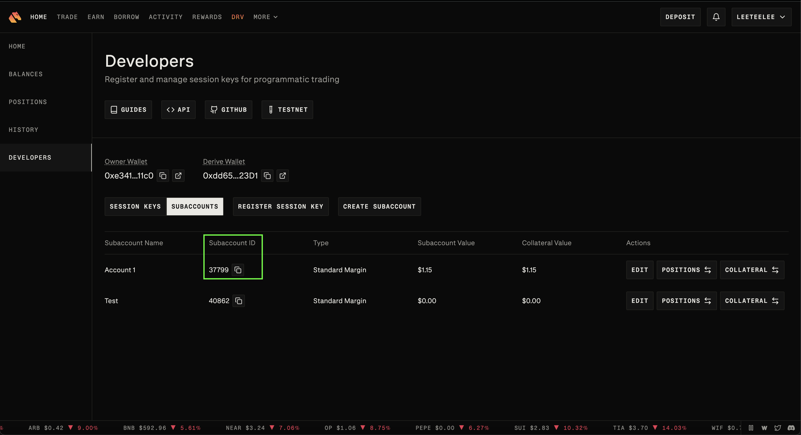
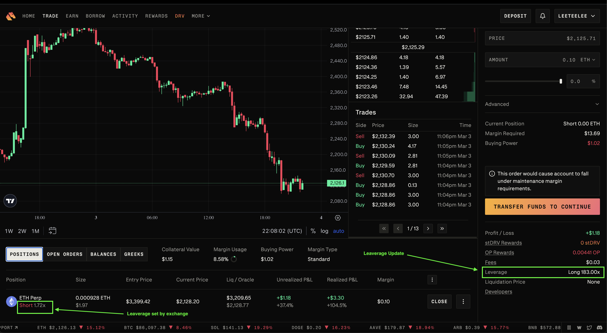

!!! tip "Foundation Sponsor"
    Derive is a [sponsor](/about/sponsors) of Hummingbot Foundation, so when you use Hummingbot to run bots on Derive, you're supporting the Foundation and our mission to democratize algo trading with open source software. To help support us, create an account using our [Derive referral link](https://www.derive.xyz/invite/7SA0V). Thanks for your help! 🙏

## 🛠 Connector Info

- **Exchange Type**: Decentralized Exchange (**DEX**)
- **Market Type**: Central Limit Order Book (**CLOB**)

| Component | Status | Connector Version | V2 Strategies | Notes | 
| --------- | ------ | ----------------- |  ------------ | ----- |
| [🔀 Spot Connector](#spot-connector) | ✅ | v2.1 | Yes | Supports `MARKET` order type
| [🔀 Perp Connector](#perp-connector) | ✅ | v2.1 | Yes | Supports testnet
| [🕯 Spot Candles Feed](#spot-candles-feed) | | 
| [🕯 Perp Candles Feed](#perp-candles-feed) | |
| [📓 Connector Guide](../../blog/running-a-trading-bot-with-hummingbot-on-derive-perpetual/) | ✅ | 

## ℹ️ Exchange Info

- **Website**: <https://www.derive.xyz>
- **CoinMarketCap**: <https://coinmarketcap.com/currencies/derive/>
- **CoinGecko**: <https://www.coingecko.com/en/coins/derive>
- **Fees**: <https://docs.derive.xyz/reference/fees-1>
- **Supported Countries**: <https://www.derive.xyz/terms-of-use#:~:text=restricted%20region>
- **Referral link:** <https://www.derive.xyz/invite/7SA0V>

## 🔑 About Rate Limits

- The system enforces rate limits using a fixed window algorithm, replenishing the request allowance every 5 seconds to maintain system stability. Market makers can access higher rate limits upon request by contacting the support team.

    

    

- **Derive Rate Limit:**  <https://docs.derive.xyz/reference/rate-limits>

# Rate Limits

The below rate limits have been implemented to safeguard our system. Rate limiters use a **"fixed window" algorithm** to discretely refill the request allowance every 5 seconds.

**Market makers are eligible for higher rate limits.**  
To apply for increased rates, please contact our support team.

| Type          | Matching | Per-Instrument Matching | Non-Matching | Connections      | Burst Multiplier |
|---------------|----------|--------------------------|---------------|------------------|------------------|
| Trader        | 1 TPS    | 1 TPS                    | 5 TPS         | 4x per IP        | 5x               |
| Market Maker  | 500+ TPS | 10+ TPS                  | 500+ TPS      | up to 64x per IP | 5x               |

> **Note:**  
> Burst requests for both REST and WebSockets are refreshed every 5 seconds.  
> For example, a trader can send 5× matching requests in a single burst but must wait 5 seconds before any further requests can be sent.


## Matching, Non-Matching, and Custom Requests

The below requests are counted as **matching** and **per-instrument matching** requests:

- `private/order`
- `private/replace` *(counted as 1 request)*
- `private/cancel`
- `private/cancel_by_nonce`
- `private/cancel_by_instrument`
- `private/cancel_by_label` *(if `instrument_name` param is set)*

### Custom Rate-Limited Requests

- `private/cancel_all` – **1 TPS**
- `private/cancel_by_label` – **10 TPS** *(if `instrument_name` param is **NOT** set)*

All requests outside of the above are counted as **non-matching**.

---

## REST

All **non-matching** requests over the **REST API** are rate limited per IP at a flat **10 TPS** with a **5x burst**.

If the limit is crossed, a **`429 Too Many Requests`** response is returned.


## 🔑 How to Connect

### Generate API Keys

- Connect

    

- Click Home tab

    

- Click Developers tab

    

- Register your session KEY (i.e your public address e.g metamask)

    

- Input a Name and your public address

    

- Click Register button to exit. Now you can use your new Session Key.

    

### Add Keys to Hummingbot

From inside the Hummingbot client, run `connect derive`:

- Input a Derive address as Derive Wallet address

    

- Input your Subaccount ID
  
    

```
>>> connect derive

Enter Your Derive Wallet address >>>

Enter your wallet private key >>>

Enter your Subaccount ID >>>

Enter your Derive Account Type (trader/market_maker) >>>

```

If connection is successful:

```
You are now connected to derive
```

## 🔀 Spot Connector
*Integration to spot markets API endpoints*

- **ID**: `derive`
- **Connection Type**: WebSocket
- **API Docs**: <https://docs.derive.xyz>
- **[Github Folder](https://github.com/hummingbot/hummingbot/tree/master/hummingbot/connector/exchange/derive)** 

### Order Types

This connector supports the following `OrderType` constants:

- `LIMIT`
- `LIMIT_MAKER`
- `MARKET`

### Paper Trading

Access the [Paper Trade](/global-configs/paper-trade/) version of this connector by running `connect derive_paper_trade` instead of `connect derive`.

If this is not available by default, you can configure Hummingbot to add this paper trade exchange. See [Adding Exchanges](/global-configs/paper-trade/#adding-exchanges) for more information.

## 🔀 Perp Connector
*Integration to perpetual futures markets API endpoints*

- **ID**: `derive_perpetual`
- **Connection Type**: WebSocket
- **[Github Folder](https://github.com/hummingbot/hummingbot/tree/master/hummingbot/connector/derivative/derive_perpetual)** 

### Usage

From inside the Hummingbot client, run `connect derive_perpetual`:

- Input a Derive address as DerivePerpetual Wallet address

    

- Input your Subaccount ID
  
    

```
>>> connect derive_perpetual

Enter Your DerivePerpetual Wallet address >>>
Enter your wallet private key >>>
Enter your Subaccount ID >>>
Enter your Derive Account Type (trader/market_maker) >>>

```

If connection is successful:

```
You are now connected to derive_perpetual
```

### Order Types

This connector supports the following `OrderType` constants:

- `LIMIT`
- `LIMIT_MAKER`
- `MARKET`

### Position Modes

This connector supports the following position modes:

- One-way

### Paper Trading (Derive Testnet)

This perp exchange offers a paper trading mode: <https://testnet.derive.xyz>

Afer you create an account and create the API keys, you can enter them by using the `connect derive_perpetual_testnet` command within the Hummingbot client. Once connected, you should be able to use the testnet with the available perpetual strategies / scripts.

### Additional Information: Perp Connector

- Note: Only for perps. Leverage of the position, defined as abs(notional) / collateral net of options.
- **Derive Leverage:** <https://docs.derive.xyz/reference/private-get_positions#:~:text=leverage>

- Sample View
    
