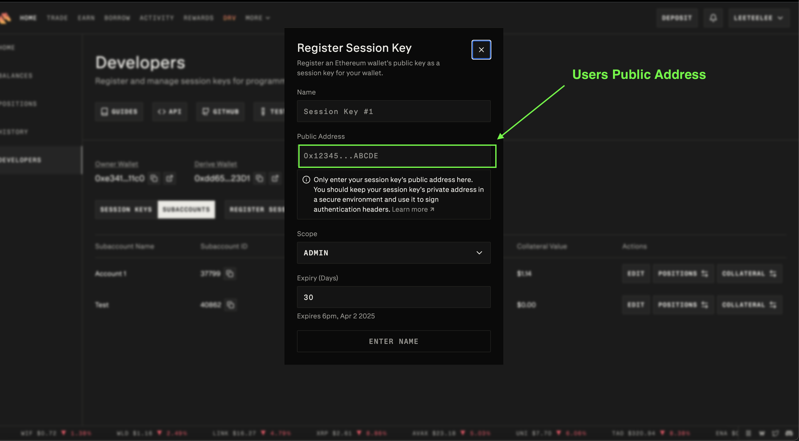
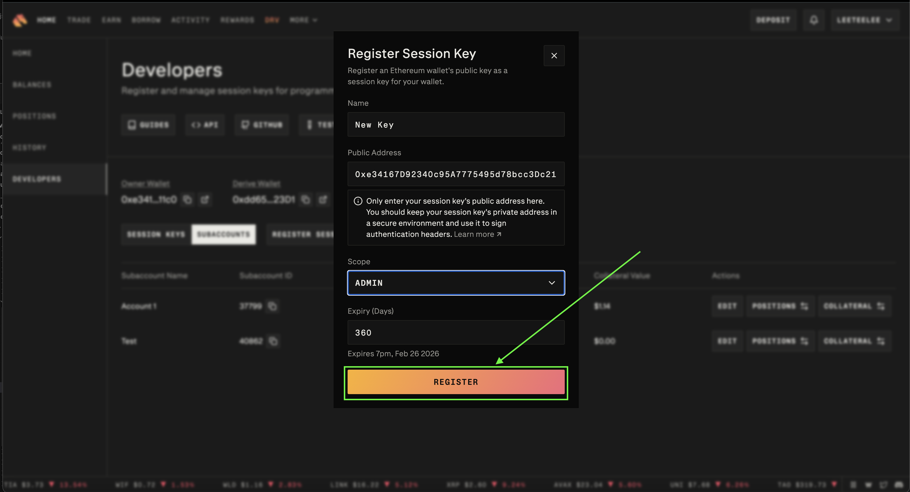

!!! tip "Foundation Sponsor"
    Derive is a [sponsor](../../about/sponsors.md) of Hummingbot Foundation, so when you use Hummingbot to run bots on Derive, you're supporting the Foundation and our mission to democratize algo trading with open source software. To help support us, create an account using our [Derive referral link](https://www.derive.xyz/invite/7SA0V). Thanks for your help! 🙏

!!! tip "Hackathon Sponsor"
    Derive is a sponsor of the [Agent Builders Cup](../../release-notes/2.16.0.md#agent-builders-cup-hackathon), a Hummingbot strategy hackathon with a \$20,000 total prize pool. Build an agent that trades on Derive and apply to the Derive team at [botcamp.xyz/hackathons](https://www.botcamp.xyz/hackathons)!

## 🛠 Connector Info

- **Exchange Type**: Decentralized Exchange (**DEX**)
- **Market Type**: Central Limit Order Book (**CLOB**)

| Component | Status | Connector Version | V2 Strategies | Notes | 
| --------- | ------ | ----------------- |  ------------ | ----- |
| [🔀 Spot Connector](#spot-connector) | ✅ | v2.1 | Yes | Supports `MARKET` order type
| [🔀 Perp Connector](#perp-connector) | ✅ | v2.1 | Yes | Supports testnet
| 🕯 Spot Candles Feed | | 
| 🕯 Perp Candles Feed | |
| [📓 Connector Guide](../../blog/posts/using-derive-with-hummingbot/index.md) | ✅ | 

## ℹ️ Exchange Info

- **Website**: <https://www.derive.xyz>
- **CoinMarketCap**: <https://coinmarketcap.com/currencies/derive/>
- **CoinGecko**: <https://www.coingecko.com/en/coins/derive>
- **Fees**: <https://docs.derive.xyz/reference/fees-1>
- **Supported Countries**: <https://www.derive.xyz/terms-of-use#:~:text=restricted%20region>
- **Referral link:** <https://www.derive.xyz/invite/7SA0V>

## 🔑 About Rate Limits

- The system enforces rate limits using a fixed window algorithm, replenishing the request allowance every 5 seconds to maintain system stability. Market makers can access higher rate limits upon request by contacting the support team.

    

    

- **Derive Rate Limit:**  <https://docs.derive.xyz/reference/rate-limits>

# Rate Limits

The below rate limits have been implemented to safeguard our system. Rate limiters use a **"fixed window" algorithm** to discretely refill the request allowance every 5 seconds.

**Market makers are eligible for higher rate limits.**  
To apply for increased rates, please contact our support team.

| Type          | Matching | Per-Instrument Matching | Non-Matching | Connections      | Burst Multiplier |
|---------------|----------|--------------------------|---------------|------------------|------------------|
| Trader        | 1 TPS    | 1 TPS                    | 5 TPS         | 4x per IP        | 5x               |
| Market Maker  | 500+ TPS | 10+ TPS                  | 500+ TPS      | up to 64x per IP | 5x               |

> **Note:**  
> Burst requests for both REST and WebSockets are refreshed every 5 seconds.  
> For example, a trader can send 5× matching requests in a single burst but must wait 5 seconds before any further requests can be sent.


## Matching, Non-Matching, and Custom Requests

The below requests are counted as **matching** and **per-instrument matching** requests:

- `private/order`
- `private/replace` *(counted as 1 request)*
- `private/cancel`
- `private/cancel_by_nonce`
- `private/cancel_by_instrument`
- `private/cancel_by_label` *(if `instrument_name` param is set)*

### Custom Rate-Limited Requests

- `private/cancel_all` – **1 TPS**
- `private/cancel_by_label` – **10 TPS** *(if `instrument_name` param is **NOT** set)*

All requests outside of the above are counted as **non-matching**.

---

## REST

All **non-matching** requests over the **REST API** are rate limited per IP at a flat **10 TPS** with a **5x burst**.

If the limit is crossed, a **`429 Too Many Requests`** response is returned.


## 🔑 How to Connect

Use the same credential set for both connectors:

| Hummingbot prompt | What to enter | Notes |
| --- | --- | --- |
| Wallet address (`api_key`) | **Derive wallet address** (smart-contract wallet shown in the Derive UI) | **Not** your MetaMask / signer EOA address |
| Wallet private key (`api_secret`) | **Session key** private key | **Not** the MetaMask / owner private key |
| Subaccount ID (`sub_id`) | Numeric ID of a **funded** subaccount | Recommended for bots (see below) |
| Account type (`account_type`) | `trader` or `market_maker` | Matches the client prompt |

Validated against Derive’s API via Hummingbot (`derive` spot and `derive_perpetual`). Wrong wallet address or owner key typically fails with HTTP **403** on `private/get_subaccount`.

### 1. Connect your owner wallet and fund Derive

1. Open [https://www.derive.xyz](https://www.derive.xyz) and connect your owner wallet (e.g. MetaMask).
2. Complete any sign-in / ownership verification prompts.
3. Deposit funds (USDC is common; funding rails may include bridging from networks such as Base — Derive itself runs on **Derive Chain**, not Base).

    

### 2. Create a subaccount (recommended)

1. In the Derive UI, open account / subaccount settings.
2. Create a dedicated **subaccount** for bot trading (e.g. `Sub1`).
3. Transfer the balance you want the bot to use onto that subaccount.
4. Copy the **Subaccount ID** (numeric).

**Why a subaccount?**  
Hummingbot can connect to the main account ID, but **spot** (`derive`) often shows an **empty balance** on main even when a subaccount is funded. Perp (`derive_perpetual`) may still show main-account balances depending on where funds sit. For bots, always prefer a **funded subaccount** and confirm with `balance` after connecting.

### 3. Register a session key

1. Open **Home**, then **Developers**.

    

2. Click **Register Session Key**.

    

3. Enter a name and register the session key (confirm the signature in your owner wallet).

    

4. Save the **session key private key** securely. This is the value Hummingbot asks for as “wallet private key”.

    

!!! warning "Session key ≠ owner (MetaMask) private key"
    Hummingbot’s secret field must be the **session key** private key from Developers.

    Using the MetaMask / owner EOA private key was tested and **does not work** (API returns **403** on `get_subaccount`). Do not export or paste your main wallet key into Hummingbot for Derive.

### 4. Collect the Derive wallet address

In the Derive UI, copy the **Derive wallet** address (the smart-contract / trading wallet Derive shows for the account).

    

- **Correct:** Derive wallet address  
- **Incorrect:** MetaMask / Rabby / Ledger owner address (signer EOA)

### 5. Add keys in Hummingbot

#### Spot — `derive`

```
>>> connect derive

Enter Your Derive Wallet address >>>
Enter your wallet private key >>>
Enter your Subaccount ID >>>
Enter your Derive Account Type (trader/market_maker) >>>
```

If connection is successful:

```
You are now connected to derive
```

#### Perpetual — `derive_perpetual`

```
>>> connect derive_perpetual

Enter Your DerivePerpetual Wallet address >>>
Enter your wallet private key >>>
Enter your Subaccount ID >>>
Enter your Derive Account Type (trader/market_maker) >>>
```

If connection is successful:

```
You are now connected to derive_perpetual
```

Same values work for both connectors (wallet address, session key, subaccount ID, account type).

### 6. Verify

```
>>> balance
```

Confirm the balances match the **subaccount** you configured.  
If balances are empty: check you used the Derive wallet (not the EOA), the session key (not the owner key), and the subaccount ID that actually holds funds.

### Troubleshooting

| Symptom | Likely cause | Fix |
| --- | --- | --- |
| Connect fails / `403` on `get_subaccount` | `api_key` is signer/MetaMask EOA, or secret is owner key | Use **Derive wallet** + **session key** |
| Connected but **spot** balance empty | Main account ID, or funds only on another subaccount | Use funded **subaccount** ID; move funds there |
| Connected, unexpected balances | Wrong subaccount ID | Re-check ID in Derive UI vs `connect` input |
| Account type confusion | Client offers `trader` / `market_maker` | Use one of those. Other strings may still connect for balance reads but are not the supported prompt values |

### Account type

Enter **`trader`** or **`market_maker`** as shown by the client.  
Market makers can request higher rate limits from Derive support (see rate limits above).

## 🔀 Spot Connector
*Integration to spot markets API endpoints*

- **ID**: `derive`
- **Connection Type**: WebSocket
- **API Docs**: <https://docs.derive.xyz>
- **[Github Folder](https://github.com/hummingbot/hummingbot/tree/master/hummingbot/connector/exchange/derive)** 

### Order Types

This connector supports the following `OrderType` constants:

- `LIMIT`
- `LIMIT_MAKER`
- `MARKET`

### Paper Trading

Access the [Paper Trade](../../client/global-configs/paper-trade.md) version of this connector by running `connect derive_paper_trade` instead of `connect derive`.

If this is not available by default, you can configure Hummingbot to add this paper trade exchange. See [Adding Exchanges](../../client/global-configs/paper-trade.md#adding-exchanges) for more information.

## 🔀 Perp Connector
*Integration to perpetual futures markets API endpoints*

- **ID**: `derive_perpetual`
- **Connection Type**: WebSocket
- **[Github Folder](https://github.com/hummingbot/hummingbot/tree/master/hummingbot/connector/derivative/derive_perpetual)** 

### Usage

See [How to Connect](#how-to-connect) above for the full credential walkthrough. Summary:

```
>>> connect derive_perpetual

Enter Your DerivePerpetual Wallet address >>>
Enter your wallet private key >>>
Enter your Subaccount ID >>>
Enter your Derive Account Type (trader/market_maker) >>>
```

Use the **Derive wallet address**, **session key** private key, and a **funded subaccount ID**.

### Order Types

This connector supports the following `OrderType` constants:

- `LIMIT`
- `LIMIT_MAKER`
- `MARKET`

### Position Modes

This connector supports the following position modes:

- One-way

### Paper Trading (Derive Testnet)

This perp exchange offers a paper trading mode: <https://testnet.derive.xyz>

Afer you create an account and create the API keys, you can enter them by using the `connect derive_perpetual_testnet` command within the Hummingbot client. Once connected, you should be able to use the testnet with the available perpetual strategies / scripts.

### Additional Information: Perp Connector

- Note: Only for perps. Leverage of the position, defined as abs(notional) / collateral net of options.
- **Derive Leverage:** <https://docs.derive.xyz/reference/private-get_positions#:~:text=leverage>

- Sample View
    
