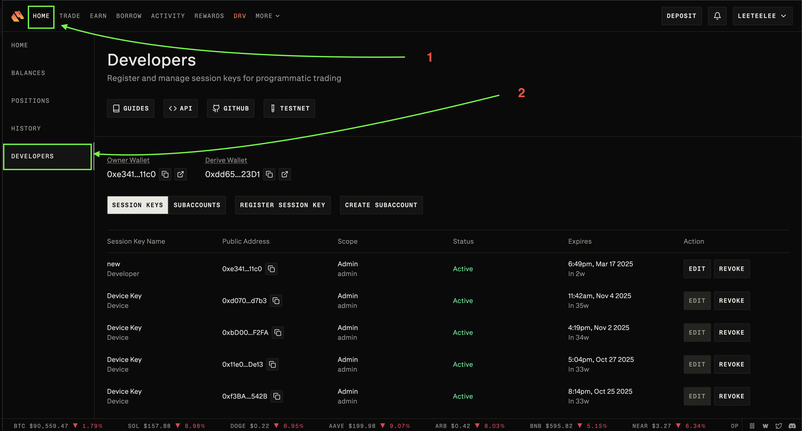

!!! tip "Foundation Sponsor"
    Derive is a [sponsor](/about/sponsors) of Hummingbot Foundation, so when you use Hummingbot to run bots on Derive, you're supporting the Foundation and our mission to democratize algo trading with open source software.

## 🛠 Connector Info

- **Exchange Type**: Decentralized Exchange (**Dex**)
- **Market Type**: Central Limit Order Book (**CLOB**)

| Component | Status | Connector Version | V2 Strategies | Notes | 
| --------- | ------ | ----------------- |  ------------ | ----- |
| [🔀 Spot Connector](#spot-connector) | ✅ | v2.1 | Yes | Supports `MARKET` order type
| [🔀 Perp Connector](#perp-connector) | ✅ | v2.1 | Yes | Supports testnet
| [🕯 Spot Candles Feed](#spot-candles-feed) | | 
| [🕯 Perp Candles Feed](#perp-candles-feed) | |
| [📓 Connector Guide](../../blog/running-a-trading-bot-with-hummingbot-on-derive-perpetual/) | ✅ | 

## ℹ️ Exchange Info

- **Website**: <https://www.derive.xyz>
- **CoinMarketCap**: <https://coinmarketcap.com/currencies/derive/>
- **CoinGecko**: <https://www.coingecko.com/en/coins/derive>
- **Fees**: <https://docs.derive.xyz/reference/fees-1>
- **Supported Countries**: <https://www.derive.xyz/terms-of-use#:~:text=restricted%20region>
- **Referral link:** <https://www.derive.xyz/invite/7SA0V>

## 🔑 About Rate Limits

- The system enforces rate limits using a fixed window algorithm, replenishing the request allowance every 5 seconds to maintain system stability. Market makers can access higher rate limits upon request by contacting the support team.

    

    

- **Derive Rate Limit:**  <https://docs.derive.xyz/reference/rate-limits>

## 🔑 How to Connect

### Generate API Keys

- Connect

    

- Click Home tab

    

- Click Developers tab

    

- Register your session KEY (i.e your public address e.g metamask)

    

- Input a Name and your public address

    

- Click Register button to exit. Now you can use your new Session Key.

    

### Add Keys to Hummingbot

From inside the Hummingbot client, run `connect derive`:

- Input a Derive address as Derive Wallet address

    

- Input your Subaccount ID
  
    

```
>>> connect derive

Enter Your Derive Wallet address >>>

Enter your wallet private key >>>

Enter your Subaccount ID >>>

```

If connection is successful:

```
You are now connected to derive
```

## 🔀 Spot Connector
*Integration to spot markets API endpoints*

- **ID**: `derive`
- **Connection Type**: WebSocket
- **API Docs**: <https://docs.derive.xyz>
- **[Github Folder](https://github.com/hummingbot/hummingbot/tree/master/hummingbot/connector/exchange/derive)** 

### Order Types

This connector supports the following `OrderType` constants:

- `LIMIT`
- `LIMIT_MAKER`
- `MARKET`

### Paper Trading

Access the [Paper Trade](/global-configs/paper-trade/) version of this connector by running `connect derive_paper_trade` instead of `connect derive`.

If this is not available by default, you can configure Hummingbot to add this paper trade exchange. See [Adding Exchanges](/global-configs/paper-trade/#adding-exchanges) for more information.

## 🔀 Perp Connector
*Integration to perpetual futures markets API endpoints*

- **ID**: `derive_perpetual`
- **Connection Type**: WebSocket
- **[Github Folder](https://github.com/hummingbot/hummingbot/tree/master/hummingbot/connector/derivative/derive_perpetual)** 

### Usage

From inside the Hummingbot client, run `connect derive_perpetual`:

- Input a Derive address as DerivePerpetual Wallet address

    

- Input your Subaccount ID
  
    

```
>>> connect derive_perpetual

Enter Your DerivePerpetual Wallet address >>>
Enter your wallet private key >>>
Enter your Subaccount ID >>>

```

If connection is successful:

```
You are now connected to derive_perpetual
```

### Order Types

This connector supports the following `OrderType` constants:

- `LIMIT`
- `LIMIT_MAKER`
- `MARKET`

### Position Modes

This connector supports the following position modes:

- One-way

### Paper Trading (Derive Testnet)

This perp exchange offers a paper trading mode: <https://testnet.derive.xyz>

Afer you create an account and create the API keys, you can enter them by using the `connect derive_perpetual_testnet` command within the Hummingbot client. Once connected, you should be able to use the testnet with the available perpetual strategies / scripts.

### Additional Information: Perp Connector

- Note: Only for perps. Leverage of the position, defined as abs(notional) / collateral net of options.
- **Derive Leverage:** <https://docs.derive.xyz/reference/private-get_positions#:~:text=leverage>

- Sample View
    
