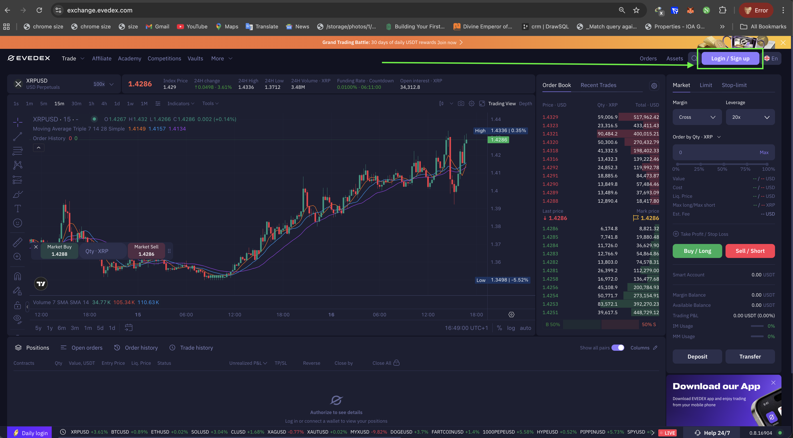
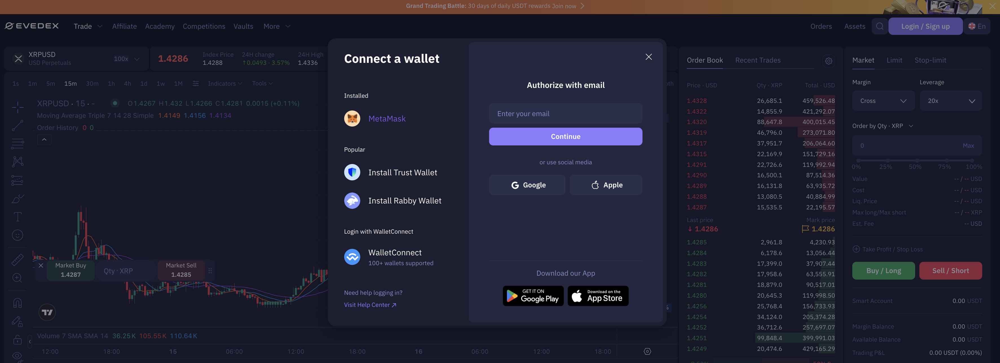
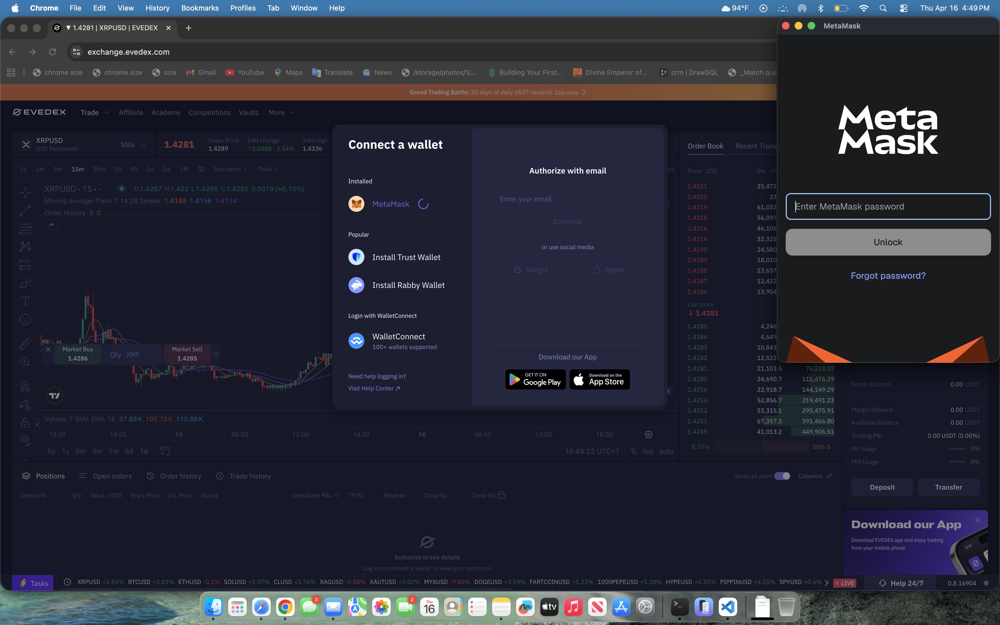
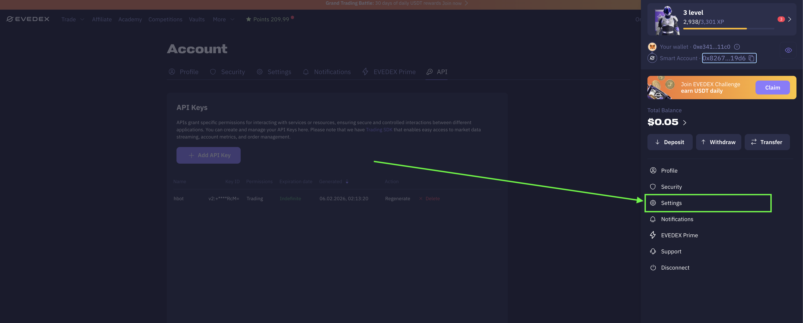
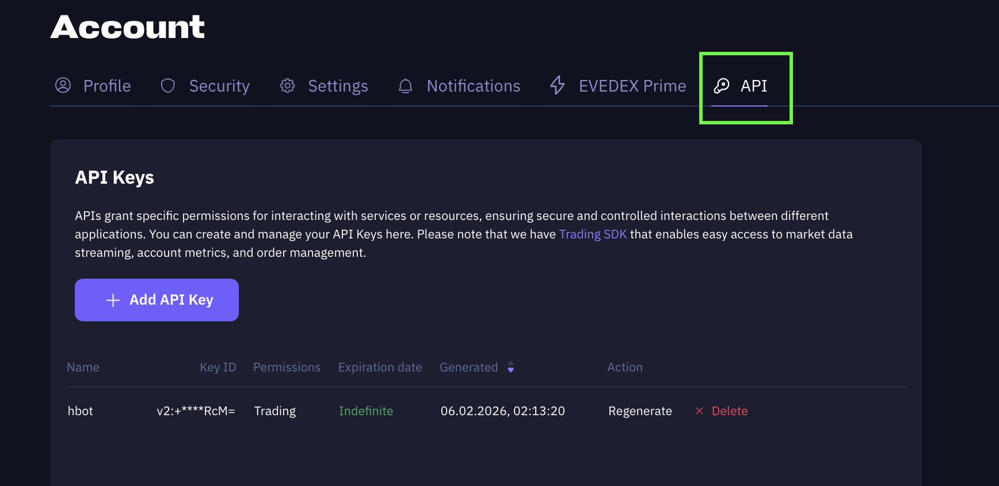
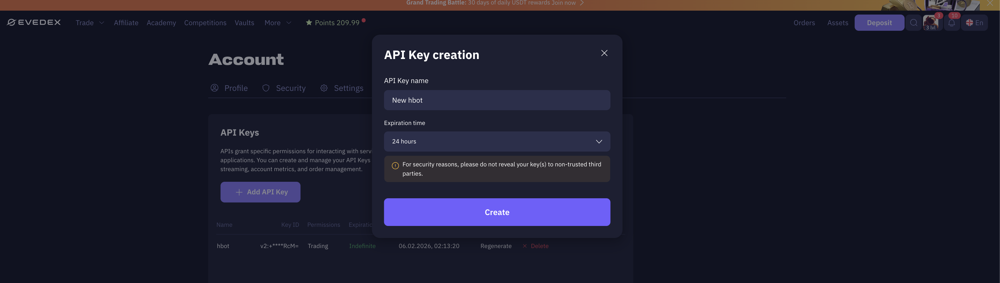
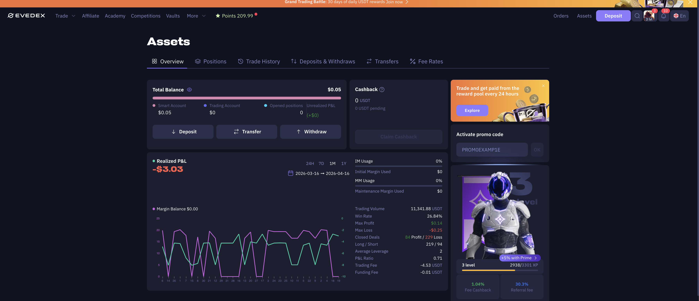
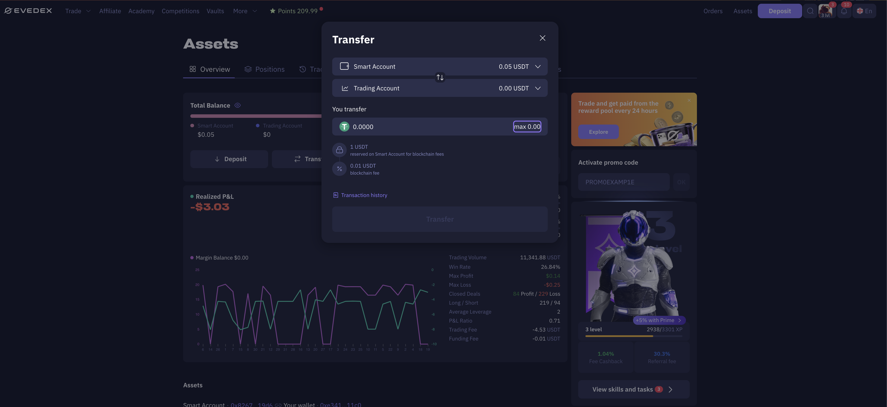

## 🛠 Connector Info

- **Exchange Type**: Decentralized Exchange (**DEX**)
- **Market Type**: Central Limit Order Book (**CLOB**)

| Component                            | Status | V2 Strategies | Notes |
|--------------------------------------|--------|---------------|-------|
| [🔀 Perp Connector](#perp-connector) | ✅      | Yes           |

## ℹ️ Exchange Info

- **Website**: [https://evedex.exchange](https://exchange.evedex.com)
- **evedex referral link:** <https://partner.evedex.com/en-US/>
- **CoinMarketCap**: <https://coinmarketcap.com/exchanges/evedex/?type=perpetual/>
- **CoinGecko**: <https://www.coingecko.com/en/exchanges/evedex>
- **Fees**: <https://docs.evedex.com/key-features-and-components/trading-platform-and-matching-engine/trading-fees>

## 🔑 How to Connect

### Generate API Keys

    The same API keys on evedex.

    Note: Use wallet(e.g metamask) secret keys on evedex e.g Get your secret key from your metamask.

**Step 1**

Log in to your evedex account and navigate to [Homepage](https://exchange.evedex.com).

[](evedex-login-1.png)

[](evedex-login-2.png)

[](evedex-login-3.png)

**Step 2**

Click **Create New API Key**.

[](settings-1.png)

[](evedex-apikey.png)

**Step 3**

[](evedex-key-creation.png)

Configure your API key:

- Enter a label/name for your API key
- Select Expiration time
- Click create

**Step 4**

Go to asset page after making deposit

[](evedex-asset-1.png)

**Step 5**

Move funds to trading account for hummingbot balance display and trading enable

[](evedex-transfer-1.png)

**Step 6**

Generating secret Key

Secret key is you wallet secret key used for creating the evedex account

### Connecting to Hummingbot


## 🔀 Perp Connector
*Integration to perpetual futures markets API endpoints*

- **ID**: `evedex_perpetual`
- **Connection Type**: WebSocket
- **[Github Folder](https://github.com/hummingbot/hummingbot/tree/master/hummingbot/connector/derivative/evedex_perpetual)**

### Usage

From inside the Hummingbot client, run `connect evedex_perpetual`:

```
>>> connect evedex_perpetual

Enter your evedex_perpetual API key >>>
Enter your evedex_perpetual secret key >>>
```

If connection is successful:

```
You are now connected to evedex_perpetual
```

### Order Types

This connector supports the following `OrderType` constants:

- `LIMIT`
- `LIMIT_MAKER`
- `MARKET`

### Position Modes

This connector supports the following position modes:

- One-way
