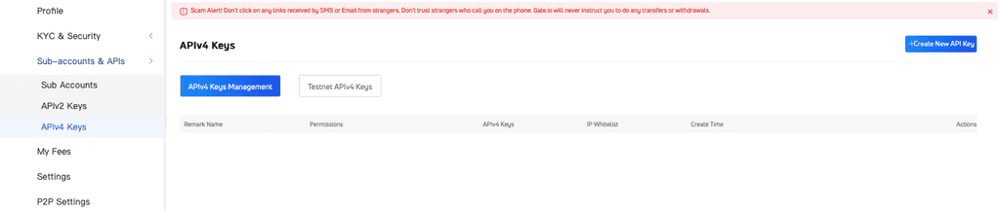
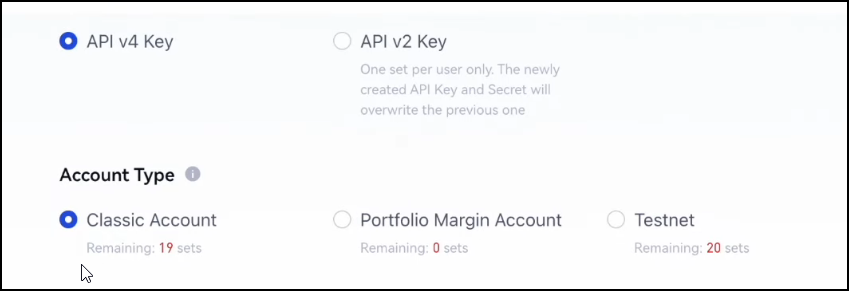
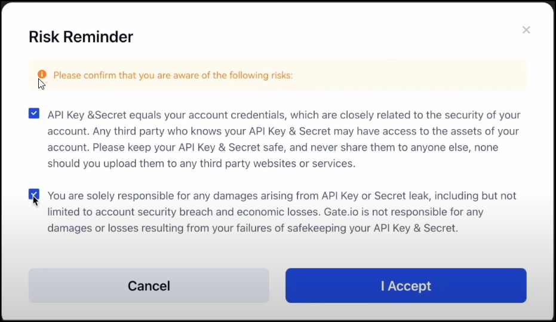
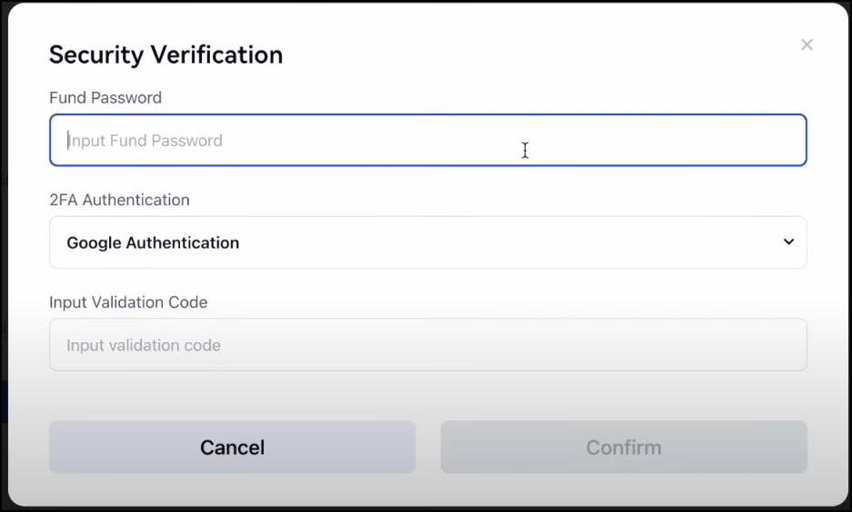

!!! tip "Foundation Partner"
    Gate.io is an [exchange partner](/about/sponsors) of Hummingbot Foundation, so when you use Hummingbot to run bots on Gate.io, a portion of your fees goes to support the Foundation and our mission to democratize algo trading with open source software. To help support us, create an account using our [Gate.io referral link](https://www.gate.io/referral/invite/HBOTGATE_0_103) and enter that account's API keys into Hummingbot and run bots! Thanks for your help! 🙏


## 🛠 Connector Info

- **Exchange Type**: Centralized Exchange (CEX)
- **Market Type**: Central Limit Order Book (CLOB)

| Component | Status | Connector Version | V2 Strategies | Notes | 
| --------- | ------ | ----------------- |  ------------ | ----- |
| [🔀 Spot Connector](#spot-connector) | ✅ | v2.1 | Yes | Supports `MARKET` order type
| [🔀 Perp Connector](#perp-connector) | ✅ | v2.1 | Yes |
| [🕯 Spot Candles Feed](#spot-candles-feed) | ✅ | 
| [🕯 Perp Candles Feed](#perp-candles-feed) | ✅ | 

## ℹ️ Exchange Info

- **Website**: <https://www.gate.io>
- **CoinMarketCap**: <https://coinmarketcap.com/exchanges/>
- **CoinGecko**: <https://www.coingecko.com/en/exchanges/gate-io>
- **API Docs**: <https://www.gate.io/docs/apiv4/en/index.html>
- **Fees**: <https://www.gate.io/fee?>
- **Supported Countries**: <https://www.gate.io/help/c2c/c2ctrade/21130/Which-Counties-Regions-are-supported-by-our-OTC-Services>
- **Gate.io referral link:** <https://www.gate.io/referral/invite/HBOTGATE_0_103>


## 🔑 How to Connect

### Generate API Keys

**Step 1**

1. Go to Gate.io
Log in or create a new account at https://www.gate.io/.

2. Open the API Management page
Hover over the profile icon on the top right corner and go to the [API Management](https://www.gate.io/myaccount/api_key_manage) page:
   
3. Click on the Create API Key button

    

4. Name your API keys

5. Add IP whitelist (optional)
Enable `Bind IP` and input the IP addresses, separated by a comma. You'll need to find the public IP address of the machine you are running Hummingbot 
If you don't want to whitelist your IP then select `Later` instead but the API keys you create will only be valid for 90 days.

6. Choose API v4 Key and a Classic Account type

    

7. Select Permissions
Please select the following permissions and then click on the Submit button.

    - [Spot/Margin Trade] -> [Read And Write] - it allows trading Spot and Margin
    - [Perpetual Contract] -> [Read And Write] - this will allow trading Futures. 
    - [Wallet ] -> [Read Only] -> this is necessary to display the balances correctly.


8. Carefully read the **Risk Reminder**, tick both paragraphs, and click **I Accept**

    

9. Enter **Fund Password**, choose **2FA Authentication** method and enter its code

    

10. Copy your API keys and store them somewhere safe. 

11. Now, you have created API keys for your Gate.io exchange!

### Add Keys to Hummingbot

From inside the Hummingbot client, run `connect gate_io`:

```
>>> connect gate_io

Enter your gate_io API key >>>
Enter your gate_io secret key >>>
```

If connection is successful:

```
You are now connected to gate_io
```


## 🔀 Spot Connector
*Integration to spot markets API endpoints*

- **ID**: `gate_io`
- **Connection Type**: WebSocket
- **Folder**: <https://github.com/hummingbot/hummingbot/tree/master/hummingbot/connector/exchange/gate_io>

### Order Types

This connector supports the following `OrderType` constants:

- `LIMIT`
- `LIMIT_MAKER`
- `MARKET`

### Paper Trading

Access the [Paper Trade](/global-configs/paper-trade/) version of this connector by running `connect gate_io_paper_trade` instead of `connect gate_io`.

If this is not available by default, you can configure Hummingbot to add this paper trade exchange. See [Adding Exchanges](/global-configs/paper-trade/#adding-exchanges) for more information.

## 🔀 Perp Connector
*Integration to perpetual futures markets API endpoints*

- **ID**: `gate_io_perpetual`
- **Connection Type**: WebSocket
- **Folder**: <https://github.com/hummingbot/hummingbot/tree/master/hummingbot/connector/derivative/gate_io_perpetual>

### Order Types

This connector supports the following `OrderType` constants:

- `LIMIT`
- `LIMIT_MAKER`
- `MARKET`

### Position Modes

This connector supports the following position modes:

- One-way
- Hedge

### Paper Trading

This perp exchange offers a paper trading mode: https://www.gate.io/testnet/futures_trade/USDT/BTC_USDT

Users can use the perpetual testnet by clicking on the link above - however the testnet does not currently work with Hummingbot

## 🕯 Spot Candles Feed
*Collect historical OHCLV data from this exchange's spot markets*

- **ID**: `gate_io`
- **Supported Intervals**: `10s` | `1m` | `5m` | `15m` | `30m` | `1h` | `2h` | `4h` | `6h` | `8h` | `12h` |  `1d` | `7d` | `30d`
- **Folder**: <https://github.com/hummingbot/hummingbot/tree/master/hummingbot/data_feed/candles_feed/gate_io_spot_candles>

### Usage

In a Hummingbot script, import `CandlesFactory` to create the candles that you want:
```python
    from hummingbot.data_feed.candles_feed.candles_factory import CandlesFactory
    candles = CandlesFactory.get_candle(connector="gate_io",
                                        trading_pair="ETH-USDT",
                                        interval="1m", max_records=50)
```

See [candles_example.py](https://github.com/hummingbot/hummingbot/blob/master/scripts/candles_example.py) for more details.

## 🕯 Perp Candles Feed
*Collect historical OHCLV data from this exchange's perp markets*

- **ID**: `gate_io_perpetual`
- **Supported Intervals**: `1m` | `5m` | `15m` | `30m` | `1h` | `2h` | `4h` | `6h` | `8h` | `12h` |  `1d` | `7d`
- **Folder**: <https://github.com/hummingbot/hummingbot/tree/master/hummingbot/data_feed/candles_feed/gate_io_perpetual_candles>

### Usage

In a Hummingbot script, import `CandlesFactory` to create the candles that you want:
```python
    from hummingbot.data_feed.candles_feed.candles_factory import CandlesFactory
    candles = CandlesFactory.get_candle(connector="gate_io_perpetual",
                                        trading_pair=trading_pair,
                                        interval="3m", max_records=50)
```

See [candles_example.py](https://github.com/hummingbot/hummingbot/blob/master/scripts/candles_example.py) for more details.