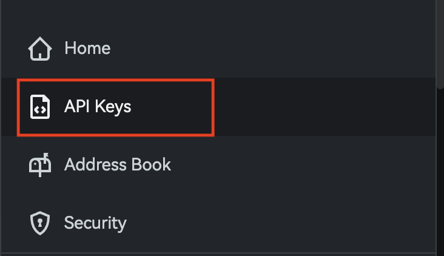
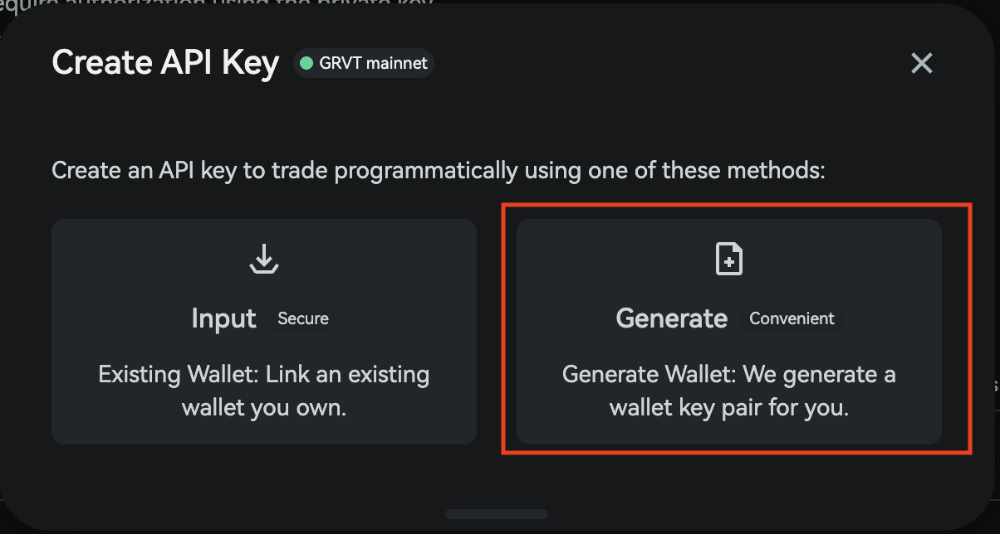
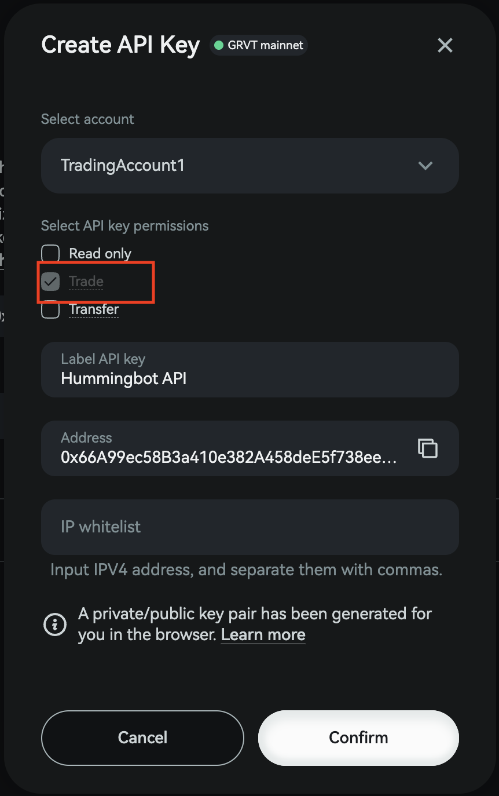
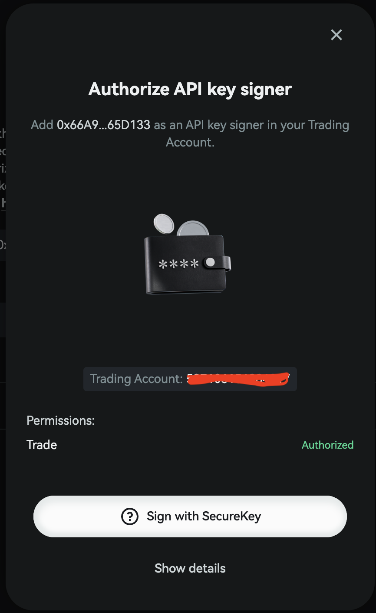
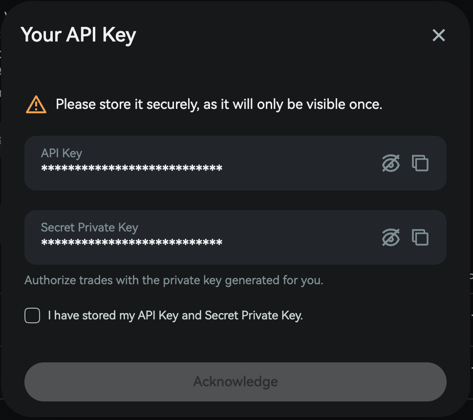
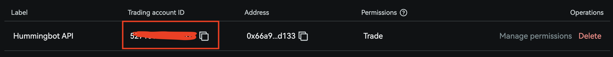

## 🛠 Connector Info

- **Exchange Type**: Decentralized Exchange (**DEX**)
- **Market Type**: Central Limit Order Book (**CLOB**)

| Component | Status | Notes |
| --------- | ------ | ----- |
| [🔀 Spot Connector](#spot-connector) | Not available |
| [🔀 Perp Connector](#perp-connector) | ✅ | Uses API key authentication with Trading ID |
| [🕯 Spot Candles Feed](#spot-candles-feed) | Not available |
| [🕯 Perp Candles Feed](#perp-candles-feed) | ✅ |

## ℹ️ Exchange Info

- **Website**: <https://grvt.io/>
- **CoinMarketCap**: <https://coinmarketcap.com/exchanges/grvt/>
- **CoinGecko**: <https://www.coingecko.com/en/exchanges/grvt-futures>
- **API Docs**: <https://api-docs.grvt.io/auth/>
- **Fees**: <https://help.grvt.io/en/articles/9614699-how-does-grvt-s-fee-model-work>
- **Supported Countries**: Not available

## 🔑 Getting Keys Ready

To connect GRVT in Hummingbot, you need the following credentials:

1. **API Key**
2. **Secret Private Key**
3. **Trading ID** (`sub_account_id` in the GRVT API docs)

### Generate API Credentials

Open the **API Keys** page from the GRVT menu.



Click **Create**, then select the trading account you want to use for the API key.

In the creation window, choose **Generate** so GRVT creates the wallet-key pair for you.



Enable the **Trade** permission for the API key.



Confirm the action in your connected wallet.



Once the API key is created, copy the **API Key** and **Secret Private Key** immediately.

!!! warning
    The **Secret Private Key** is shown only once. Store it securely before closing the window. If you lose it, you will need to create a new API key.



After closing the API key window, copy the **Trading ID** for the same trading account. This value is also required for authentication in Hummingbot.



!!! tip
    In the GRVT API documentation, the Trading ID is referred to as `sub_account_id`. Use the Trading ID from the GRVT UI when Hummingbot asks for it.

## 🔀 Spot Connector

Not available.

## 🔀 Perp Connector

*Integration to perpetual futures markets API endpoints*

- **ID**: `grvt_perpetual`
- **Authentication**: API key, Secret Private Key, Trading ID

### Usage

From inside the Hummingbot client, run `connect grvt_perpetual`:

```text
>>> connect grvt_perpetual
```

```text
Enter your GRVT API key >>>
Enter your GRVT secret private key >>>
Enter your GRVT trading account ID >>>
```

If connection is successful:

```text
You are now connected to grvt_perpetual.
```