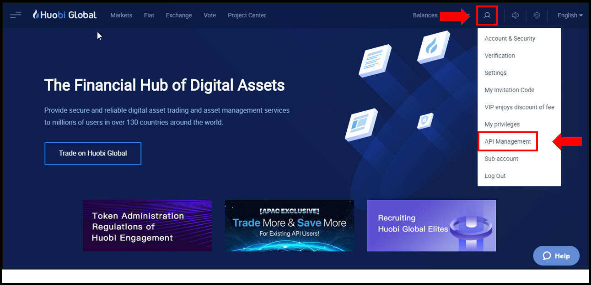
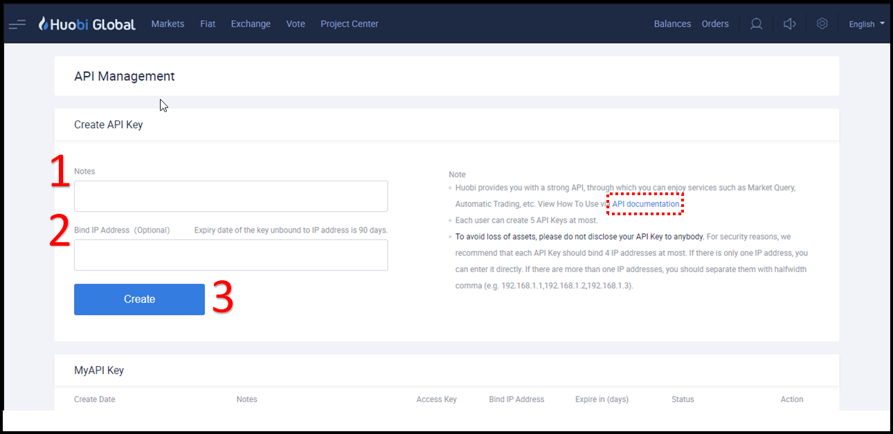
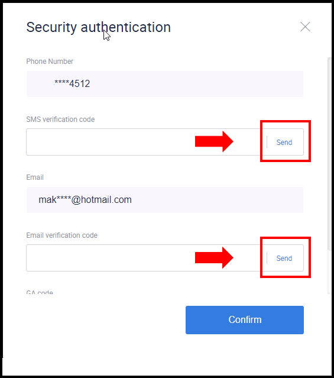
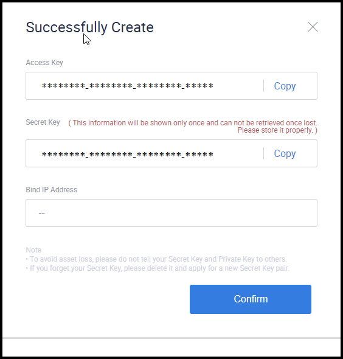
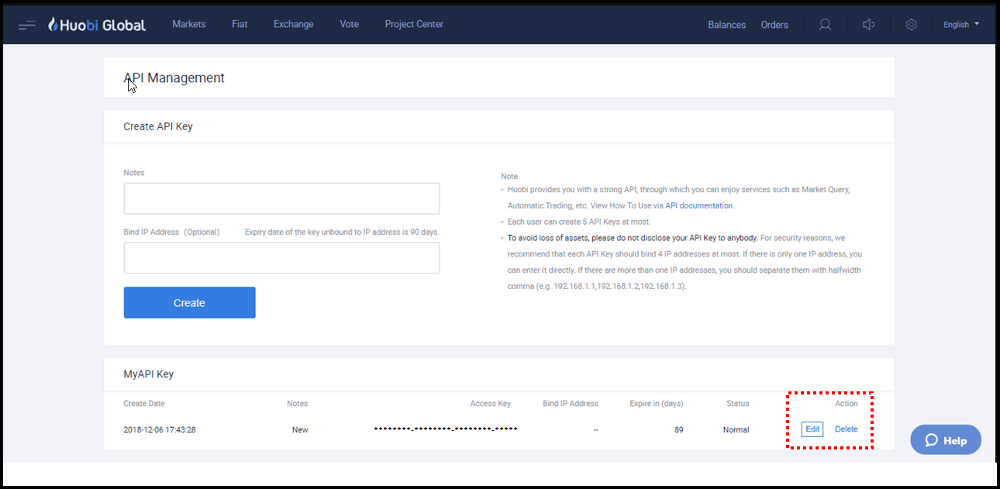

!!! tip "Foundation Partner"
    Huobi is an [exchange partner](/about/sponsors) of Hummingbot Foundation, so when you use Hummingbot to run bots on Huobi, a portion of your fees goes to support the Foundation and our mission to democratize algo trading with open source software. To help support us, create an account using our [Huobi referral link](https://www.htx.com.pk/invite/en-us/1h?invite_code=re4w9223) and enter that account's API keys into Hummingbot and run bots! Thanks for your help! 🙏

## 🛠 Connector Info

- **Exchange Type**: Centralized Exchange (**CEX**)
- **Market Type**: Central Limit Order Book (**CLOB**)

| Component | Status | Connector Version | V2 Strategies | Notes | 
| --------- | ------ | ----------------- |  ------------ | ----- |
| [🔀 Spot Connector](#spot-connector) | ✅ | v2.0 | No | market order type not supported |
| [🔀 Perp Connector](#perp-connector) | Not built |
| [🕯 Spot Candles Feed](#spot-candles-feed) | Not built  | 
| [🕯 Perp Candles Feed](#perp-candles-feed) | Not built  | 

## ℹ️ Exchange Info

- **Website**: <https://www.htx.com/>
- **CoinMarketCap**: <https://coinmarketcap.com/exchanges/huobi/>
- **CoinGecko**: <https://www.coingecko.com/en/exchanges/huobi>
- **API Docs**: <https://www.htx.com/en-in/opend/newApiPages/>
- **Fees**: <https://www.htx.com/support/en-us/detail/360000312282>
- **OKX referral link:** <https://www.htx.com.pk/invite/en-us/1h?invite_code=re4w9223>

## 🔑 How to Connect

### Generate API Keys

- Go to https://www.htx.com/en-us

- Click “Account Icon” for a drop-down menu, select “API Management”

    

- Each user is only allowed to create up to 5 API Keys. For security reasons, we recommend that each API Key should bind up to a maximum of four (4) IP addresses per key. If there is only one IP address, you can enter it directly. If there are more than one IP addresses, you should separate them with halfwidth comma (e.g. 192.168.1.1,192.168.1.2,192.168.1.3).

    - It is compulsory to fill in the ‘Note’ field
    - Insert your IP address that you wish to bind (optional)
    - Click “Create” to proceed.
    - Please visit [HuobiAPI Github](https://huobiapi.github.io/docs/spot/v1/en) for code references.

    

- Please complete the SMS, Email & Google Authenticator(GA) security authentication. To generate the security code for SMS and Email, you are required to click the “Send” button.

- Once you have completed the security authentication, click "Confirm" to proceed.

    

- Once you completed the security authentication, your API "Access Key" and "Secret Key" will pop-up. Click "Confirm" to close the pop-up window.

- Kindly note that the “Secret Key” will only be visible at this stage. Should you misplace or lose your 'Secret Key”, you will need to create a new API Key.

    

- You have successfully created an API key with a standard validity of 90 days. You may edit the API key note and bind IP address simply by clicking “Edit”. You may choose to delete the API key by clicking “Delete”.

    

### Add Keys to Hummingbot

From inside the Hummingbot client, run `connect htx`:

```
Enter your htx API key >>>
Enter your htx secret key >>>
```

If connection is successful:

```
You are now connected to HTX
```


## 🔀 Spot Connector
*Integration to spot markets API endpoints*

- **ID**: `htx`
- **Connection Type**: WebSocket
- **Folder**: <https://github.com/hummingbot/hummingbot/tree/master/hummingbot/connector/exchange/htx>

### Order Types

This connector supports the following `OrderType` constants:

- `LIMIT`
- `LIMIT_MAKER`

### Paper Trading

Access the [Paper Trade](/global-configs/paper-trade/) version of this connector by running `connect htx_paper_trade` instead of `connect htx`.

If this is not available by default, you can configure Hummingbot to add this paper trade exchange. See [Adding Exchanges](/global-configs/paper-trade/#adding-exchanges) for more information.
```