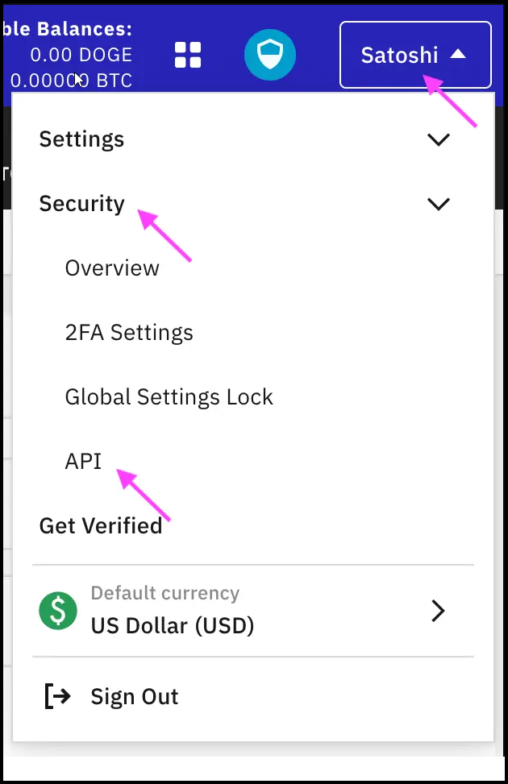
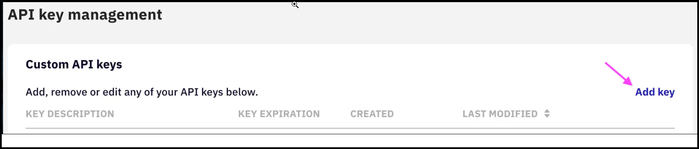
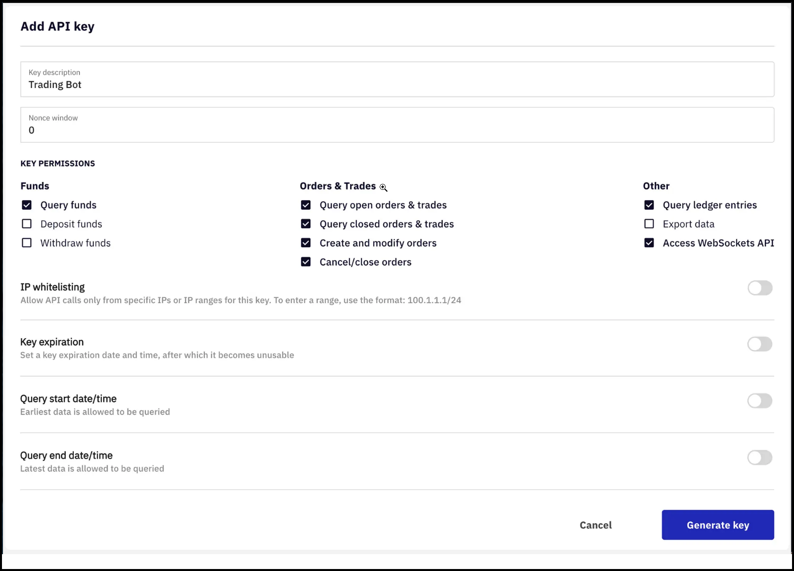

## 🛠 Connector Info

- **Exchange Type**: Centralized Exchange (**CEX**)
- **Market Type**: Central Limit Order Book (**CLOB**)

| Component | Status | Connector Version | V2 Strategies | Notes | 
| --------- | ------ | ----------------- |  ------------ | ----- |
| [🔀 Spot Connector](#spot-connector) | ✅ | v1.0 | No | |
| [🔀 Perp Connector](#perp-connector) | Not available |
| [🕯 Spot Candles Feed](#spot-candles-feed) | Not built  | 
| [🕯 Perp Candles Feed](#perp-candles-feed) | Not built  | 

## ℹ️ Exchange Info

- **Website**: <https://www.kraken.com/>
- **CoinMarketCap**: <https://coinmarketcap.com/exchanges/kraken/>
- **CoinGecko**: <https://www.coingecko.com/en/exchanges/kraken>
- **API Docs**: <https://docs.kraken.com/rest/>
- **Fees**: <https://www.kraken.com/en-us/features/fee-schedule>
- **Supported Countries**: Not available

## 🔑 How to Connect

### Generate API Keys

   - Sign in to your Kraken account
   - Open the account menu (click on your name in the upper-right corner of the page)
   - Select the Security option
   - Select the API option
        
[](kraken-api1.png)

   - Click the "Add Key" link (you will be able to configure the API in the next steps)

[](kraken-api2.png)

   - Configure the API key by adding the name / description and selecting the necessary access permissions

[](kraken-api3.png)

   - Once the API key settings have been configured appropriately, the new API key can be created by clicking on the Generate key button. Make sure to store the API keys in a safe place. 

### Add Keys to Hummingbot

From inside the Hummingbot client, run `connect kraken`:

```
Enter your kraken API key >>>
Enter your kraken secret key >>>
```

If connection is successful:

```
You are now connected to kraken
```


## 🔀 Spot Connector
*Integration to spot markets API endpoints*

- **ID**: `kraken`
- **Connection Type**: WebSocket
- **Folder**: <https://github.com/hummingbot/hummingbot/tree/master/hummingbot/connector/exchange/kraken>

### Order Types

This connector supports the following `OrderType` constants:

- `LIMIT`
- `LIMIT_MAKER`


### Paper Trading

Access the [Paper Trade](/global-configs/paper-trade/) version of this connector by running `connect kraken_paper_trade` instead of `connect kraken`.

If this is not available by default, you can configure Hummingbot to add this paper trade exchange. See [Adding Exchanges](/global-configs/paper-trade/#adding-exchanges) for more information.


