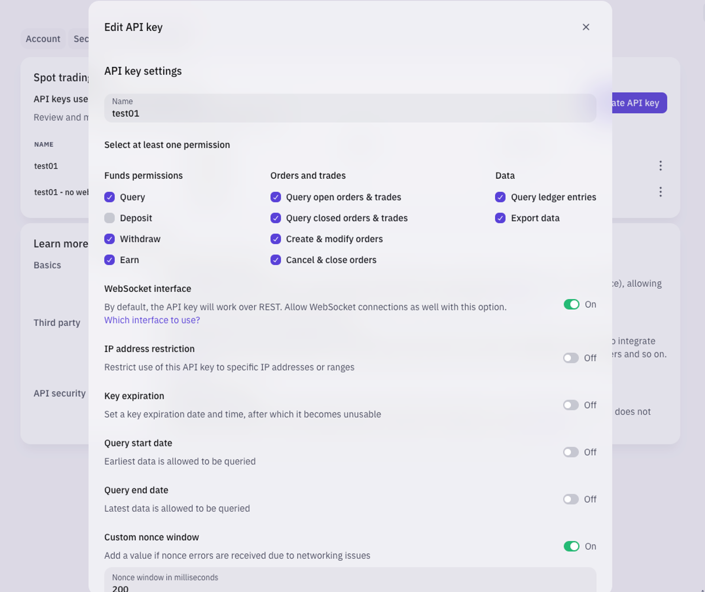

## 🛠 Connector Info

- **Exchange Type**: Centralized Exchange (**CEX**)
- **Market Type**: Central Limit Order Book (**CLOB**)

| Component | Status | Connector Version | V2 Strategies | Notes | 
| --------- | ------ | ----------------- |  ------------ | ----- |
| [🔀 Spot Connector](#spot-connector) | ✅ | v2.1 | Yes | |
| [🔀 Perp Connector](#perp-connector) | Not available |
| [🕯 Spot Candles Feed](#spot-candles-feed) | ✅  | 
| [🕯 Perp Candles Feed](#perp-candles-feed) | Not built  | 

## ℹ️ Exchange Info

- **Website**: <https://www.kraken.com/>
- **CoinMarketCap**: <https://coinmarketcap.com/exchanges/kraken/>
- **CoinGecko**: <https://www.coingecko.com/en/exchanges/kraken>
- **API Docs**: <https://docs.kraken.com/rest/>
- **Fees**: <https://www.kraken.com/en-us/features/fee-schedule>
- **Supported Countries**: Not available

## 🔑 How to Connect

### Generate API Keys

- Open the account menu (click the profile icon in the top right corner of the page)
- Select the Settings option
- Select the Security tab
- Scroll down and look for Create API Key, you will be prompted to go to Kraken-Pro
- Select Create API key (you will be able to configure your API key in the next steps)

[](1.png)

!!! important
     Ensure the **Access Websockets connection box is on**. This step is necessary to obtain an authentication token for the WebSocket APIs through the GetWebSocketsToken endpoint. Without this, the Kraken connector will be unable to reconstruct the order book and place trades. See [Troubleshooting](../../troubleshooting.md#valueerror-no-order-book-exists-for-btc-usd) for an example of an error message in Hummingbot when this box is left unchecked

- Once the API key settings have been configured appropriately, the new API key can be created by clicking on the Generate key button. Make sure to store the API keys in a safe place. 

### Add Keys to Hummingbot

From inside the Hummingbot client, run `connect kraken`:

```
Enter your Kraken API key >>>
Enter your Kraken secret key >>>
Enter your Kraken API Tier (Starter/intermediate/Pro) >>> 
```

If connection is successful:

```
You are now connected to kraken
```


## 🔀 Spot Connector
*Integration to spot markets API endpoints*

- **ID**: `kraken`
- **Connection Type**: WebSocket
- **Folder**: <https://github.com/hummingbot/hummingbot/tree/master/hummingbot/connector/exchange/kraken>

### Order Types

This connector supports the following `OrderType` constants:

- `LIMIT`
- `LIMIT_MAKER`
- `MARKET`


### Paper Trading

Access the [Paper Trade](/global-configs/paper-trade/) version of this connector by running `connect kraken_paper_trade` instead of `connect kraken`.

If this is not available by default, you can configure Hummingbot to add this paper trade exchange. See [Adding Exchanges](/global-configs/paper-trade/#adding-exchanges) for more information.
