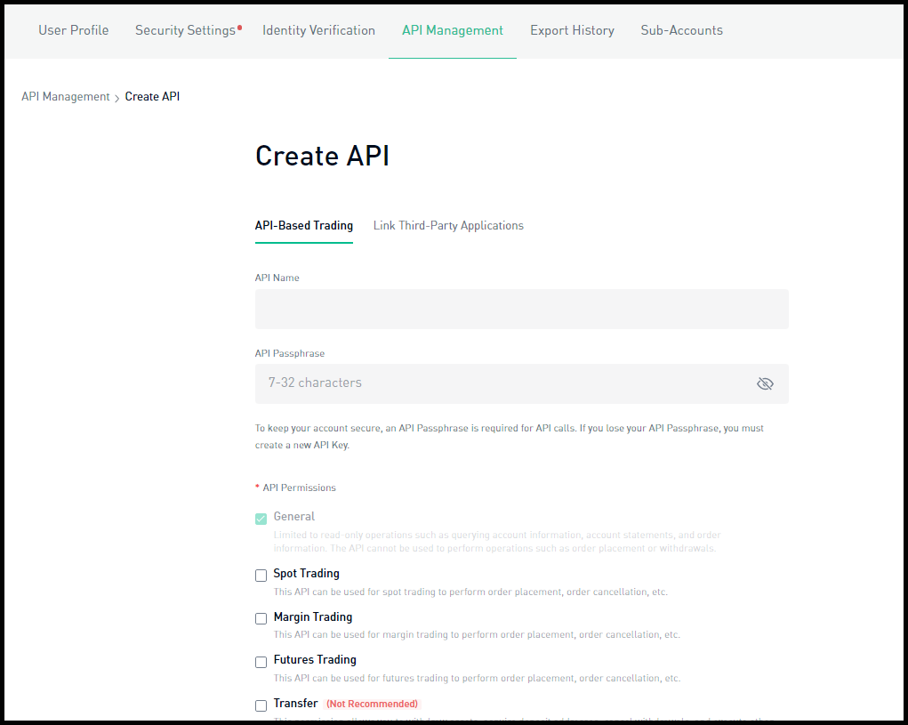
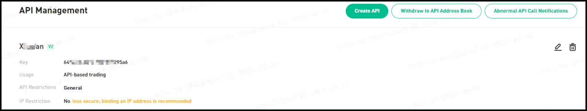

!!! tip "Support Hummingbot"
    Hummingbot Foundation has a fee share partnership with Kucoin. When you use our software to trade on Kucoin, a custom API header tells Kucoin that the trade was executed using Hummingbot, so they share a portion of your fees with us, at no cost to you. To support us, just enter your API keys into Hummingbot and run bots! Thanks for your support! 🙏

## 🛠 Connector Info

- **Exchange Type**: Centralized Exchange (**CEX**)
- **Market Type**: Central Limit Order Book (**CLOB**)
- **Maintenance Tier**: 
- **Maintainer**: Hummingbot Foundation

Currently, Kucoin is a **Silver** exchange, as voted by HBOT holders in each quarterly [Epoch](/governance/epochs). This means that Hummingbot Foundation maintains the components below via [Bounties](/governance/bounties), tracking improvements made to the Gold exchange connectors of that type.

| Component | Status | Notes | 
| --------- | ------ | ----- |
| [🔀 Spot Connector](#spot-connector) | ✅ | Supports `MARKET` order type
| [🔀 Perp Connector](#perp-connector) | ✅ | Supports testnet
| [🕯 Spot Candles Feed](#spot-candles-feed) | ✅ | 
| [🕯 Perp Candles Feed](#perp-candles-feed) | ✅ | 

## ℹ️ Exchange Info

- **Website**: <https://www.kucoin.com>
- **CoinMarketCap**: <https://coinmarketcap.com/exchanges/kucoin/>
- **CoinGecko**: <https://www.coingecko.com/en/exchanges/kucoin>
- **API Docs**: <https://docs.kucoin.com>
- **Fees**: <https://www.kucoin.com/vip/level>
- **Supported Countries**: <https://www.kucoin.com/support/10247584234521> 

## 🔑 How to Connect

### Generate API Keys

**Step 1**

Log in to [Kucoin](https://www.kucoin.com), click the avatar, in the drop-down menu, select **API Management** > **Create API**.


**Step 2**

A window will pop up where you can choose either **API Trading** or **Link Third-Party Applications**. 

For API trading, enter the API name and API passphrase.



For linking to a third-party application, first select the name of the third-party app you wish to link. Then, enter the API name and API passphrase, and select API permissions.

For account security purposes, withdrawals are not supported by linking a third-party application, and there is no need to link an IP address. During transactions, the platform will use the configured third-party IP addresses.


During the creation process, pay attention to the relevant prompts and rules on the API creation page. Here are some points for your special attention:

- The API passphrase is crucial. It is highly recommended to write it down and store it in a secure location. You will need the API passphrase for verification when using the API. Additionally, do not disclose your API key to prevent any potential loss of assets.

- To ensure the security of your funds, API keys that are enabled for spot, margin, or futures trading but not linked to an IP address will be automatically deleted or have their trade permissions disabled after 30 days of inactivity. However, there is no expiration limit for API keys that 
only have the General permissions.

- To enable access to permissions, you must add your IP address to the whitelist.

**Step 3**

A security verification will pop up. Enter your trading password, email verification code, and Google verification code.

**Step 4**

Click the button to confirm and complete the creation.




### Add Keys to Hummingbot

From inside the Hummingbot client, run `connect kucoin`:

```
>>> connect kucoin

Enter your kucoin API key >>>
Enter your kucoin secret key >>>
Enter your kucoin passphrase >>>
```

If connection is successful:

```
You are now connected to kucoin
```

## 🔀 Spot Connector
*Integration to spot markets API endpoints*

- **ID**: `kucoin`
- **Connection Type**: WebSocket
- **[Github Folder](https://github.com/hummingbot/hummingbot/tree/master/hummingbot/connector/exchange/kucoin)** 

### Order Types

This connector supports the following `OrderType` constants:

- `LIMIT`
- `LIMIT_MAKER`
- `MARKET`

### Paper Trading

Access the [Paper Trade](/global-configs/paper-trade/) version of this connector by running `connect kucoin_paper_trade` instead of `connect kucoin`.

If this is not available by default, you can configure Hummingbot to add this paper trade exchange. See [Adding Exchanges](/global-configs/paper-trade/#adding-exchanges) for more information.

## 🔀 Perp Connector
*Integration to perpetual futures markets API endpoints*

- **ID**: `kucoin_perpetual`
- **Connection Type**: WebSocket
- **[Github Folder](https://github.com/hummingbot/hummingbot/tree/master/hummingbot/connector/derivative/kucoin_perpetual)** 

### Order Types

This connector supports the following `OrderType` constants:

- `LIMIT`
- `LIMIT_MAKER`
- `MARKET`

### Position Modes

This connector supports the following position modes:

- One-way
- Hedge

### Paper Trading

This perp exchange offers a paper trading mode: <https://www.kucoin.com/support/7909075578521>

Afer you create an account and create the API keys, you can enter them by using the `connect kucoin_perpetual_testnet` command within the Hummingbot client. Once connected, you should be able to use the testnet with the available perpetual strategies / scripts. 

## 🕯 Spot Candles Feed
*Collect historical OHCLV data from this exchange's spot markets*

- **ID**: `kucoin`
- **Supported Intervals**: 1min | 3min | 5min | 15min | 30min | 1hour | 2hour | 4hour | 6hour | 8hour | 12hour |  1day | 1week
- **[Github Folder](https://github.com/hummingbot/hummingbot/tree/master/hummingbot/data_feed/candles_feed/kucoin_spot_candles)** 

### Usage

In a Hummingbot script, import `CandlesFactory` to create the candles that you want:
```python
    from hummingbot.data_feed.candles_feed.candles_factory import CandlesFactory
    candles = CandlesFactory.get_candle(connector="kucoin",
                                        trading_pair="ETH-USDT",
                                        interval="1m", max_records=50)
```

See [candles_example.py](https://github.com/hummingbot/hummingbot/blob/master/scripts/candles_example.py) for more details.

## 🕯 Perp Candles Feed

Candles Feed not available for Perpetual
