## 🛠 Connector Info

- **Exchange Type**: Decentralized Exchange (**DEX**)
- **Market Type**: Central Limit Order Book (**CLOB**)

| Component | Status | Connector Version | V2 Strategies | Notes |
| --------- | ------ | ----------------- |  ------------ | ----- |
| [🔀 Spot Connector](#spot-connector) | ✅ | v2.1 | Yes | Supports `MARKET` order type
| [🔀 Perp Connector](#perp-connector) | ✅ | v2.1 | Yes | Supports testnet
| 🕯 Spot Candles Feed | ✅ |
| 🕯 Perp Candles Feed | ✅ |


## ℹ️ Exchange Info

- **Website**: [https://lighter.xyz](https://lighter.xyz/)
- **CoinMarketCap**: <https://coinmarketcap.com/exchanges/lighter/?type=perpetual>
- **Referral**: <https://app.lighter.xyz/referrals>
- **CoinGecko**: <https://www.coingecko.com/en/exchanges/lighter>
- **Fees**: <https://docs.lighter.xyz/trading/trading-fees>

## 🔑 How to Connect

### Generate API Keys

    Note: your L1 wallet address is you public address

**Step 1**

Log in to your lighter account and navigate to [Homepage](https://lighter.xyz).

1. **Log in** to your Lighter account at <https://app.lighter.xyz/>.

[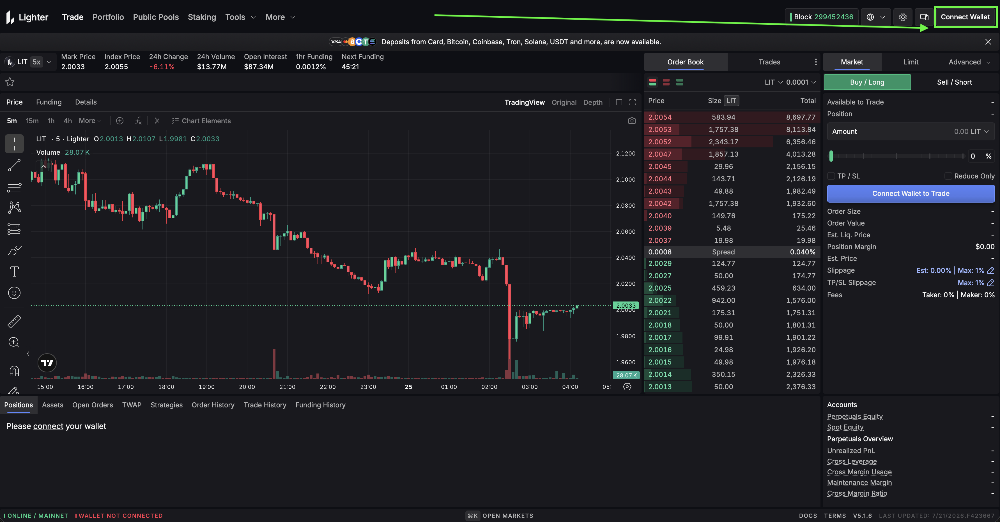](ligher-login-1.png)

[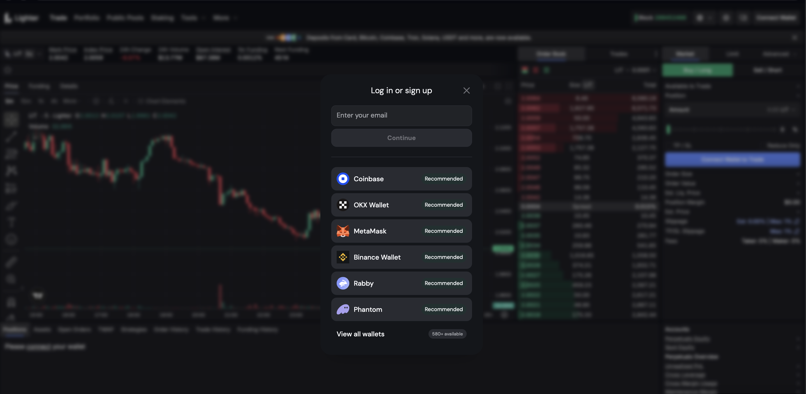](ligher-login-2.png)

[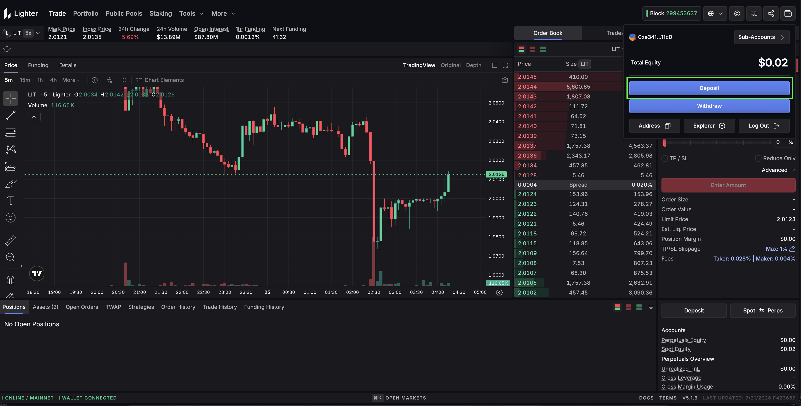](ligher-login-3.png)

**Step 2**

Click **Create New API Key**.

2. In the top menu, go to **Tools -> API Keys**.

[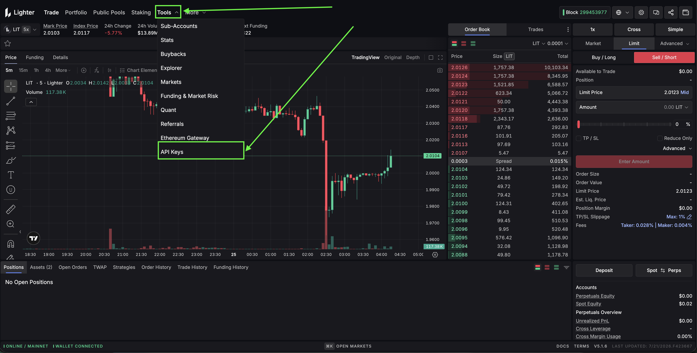](settings-1.png)

Configure your API key:

3. Click **Generate API Key** and enter your desired **API Key Index**.

    !!! note
        Indexes 0-3 are reserved (Desktop and Mobile). You can create up to 251 keys per account using **indexes 4-254**.

[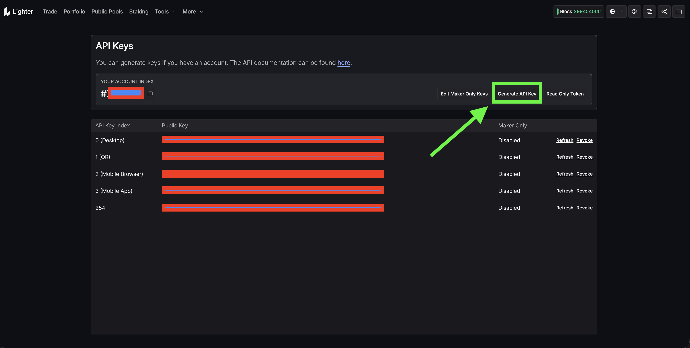](ligher-apikey.png)

**Step 3**

4. Click **Generate**, then **sign the request** in your connected wallet.

[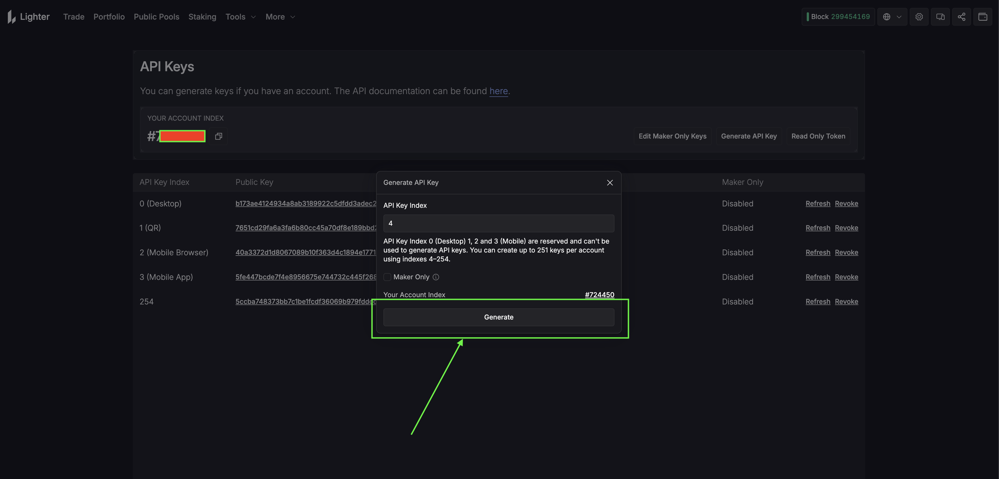](ligher-key-creation.png)

5. The dashboard will display your **API Key Index**, **Public Key**, and **Private Key**.

    !!! warning
        Save your **Private Key** somewhere safe immediately - it is only shown once. Only use it in trusted environments.

    - Remember your **API Key Index** - you will need it when connecting.

- Click Confirm if using metamask

[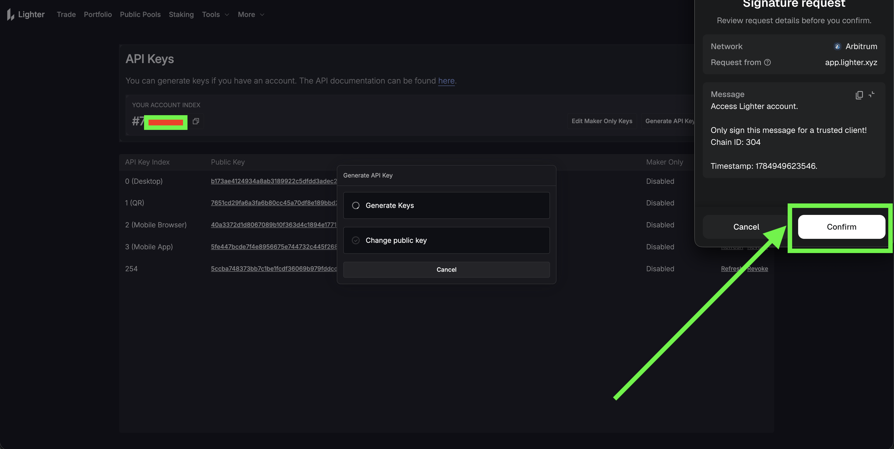](ligher-key-creation2.png)

- On successfull creation

[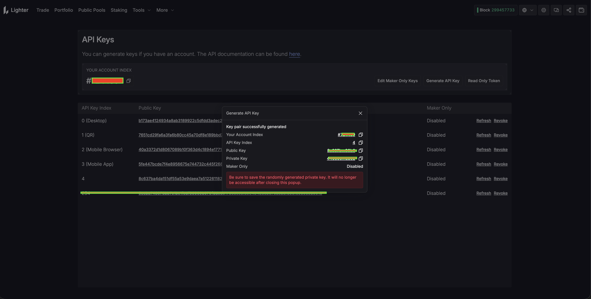](ligher-key-created.png)

Your **Account Index** is required to connect. To find it:

- Click your wallet address in the **top-right corner** of the Lighter app.
- Click **Explorer** - your Account Index will be shown on the account page.
- Alternatively, open the explorer directly at <https://app.lighter.xyz/explorer> and search using your L1 wallet address.

!!! note
    The same API keys can be used for both spot and perpetual trading.

**Step 4**
Go to asset page after making deposit

[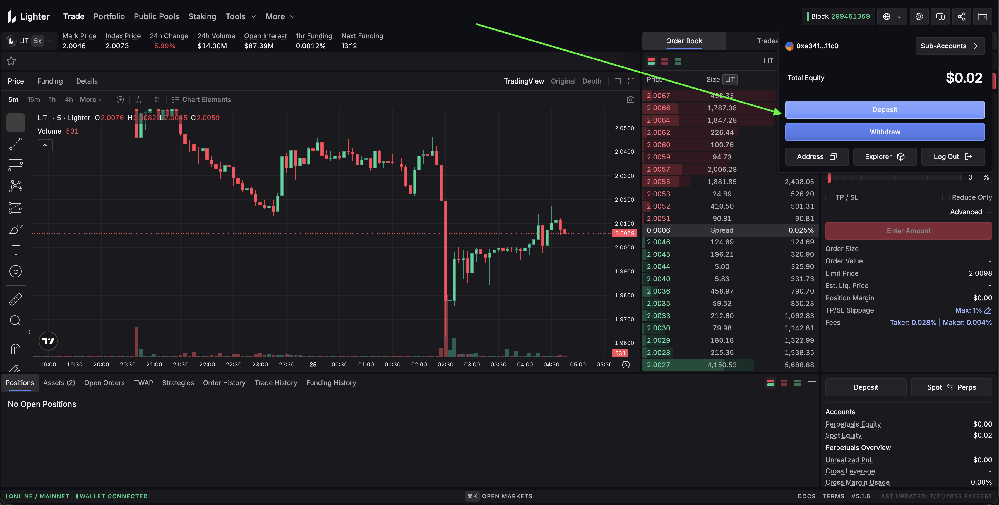](ligher-asset-1.png)

Select network for deposit

[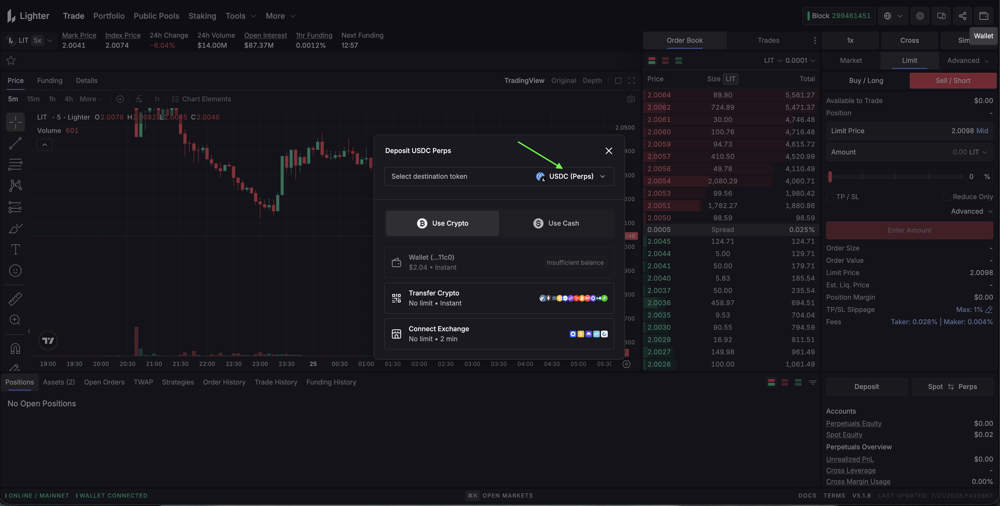](ligher-asset-2.png)

**Step 5**

Move funds to between Perps and Spot

[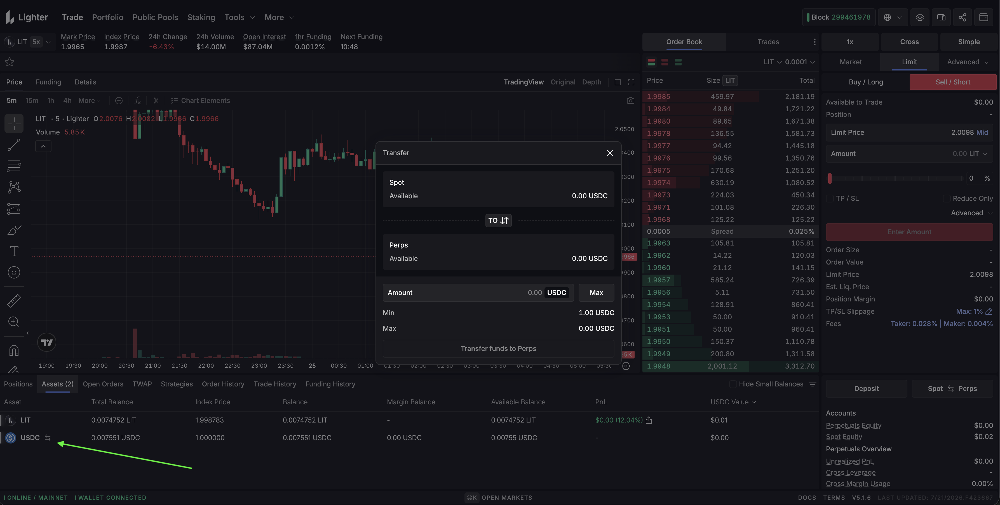](ligher-transfer-1.png)


### Connecting to Hummingbot

## 🔀  Spot Connector
*Integration to perpetual futures markets API endpoints*

- **ID**: `lighter`
- **Connection Type**: WebSocket
- **[Github Folder](https://github.com/hummingbot/hummingbot/tree/master/hummingbot/connector/exchange/lighter)**

### Usage

From inside the Hummingbot client, run `connect lighter`:

```
>>> connect lighter

Enter your Lighter L1 wallet address >>>
Enter your Lighter account index (leave blank to use the main account for your L1 address) >>>
Enter your Lighter API key index >>>
Enter your Lighter API private key >>>
Enter your Lighter account limit(Standard/Premium/Plus/Builder) >>>
```

If connection is successful:

```
You are now connected to lighter
```

### Order Types

This connector supports the following `OrderType` constants:

- `LIMIT`
- `LIMIT_MAKER`
- `MARKET`

## 🔀 Perp Connector
*Integration to perpetual futures markets API endpoints*

- **ID**: `lighter_perpetual`
- **Connection Type**: WebSocket
- **[Github Folder](https://github.com/hummingbot/hummingbot/tree/master/hummingbot/connector/derivative/lighter_perpetual)**

### Usage

From inside the Hummingbot client, run `connect lighter_perpetual`:

```
>>> connect lighter_perpetual

Enter your Lighter L1 wallet address >>>
Enter your Lighter account index (leave blank to use the main account for your L1 address) >>>
Enter your Lighter API key index >>>
Enter your Lighter API private key >>>
Enter your Lighter account limit(Standard/Premium/Plus/Builder) >>>
```

If connection is successful:

```
You are now connected to lighter_perpetual
```

### Order Types

This connector supports the following `OrderType` constants:

- `LIMIT`
- `LIMIT_MAKER`
- `MARKET`

### Position Modes

This connector supports the following position modes:

- One-way

### Paper Trading

This exchange offers a testnet environment. After creating an account and API keys on the Lighter testnet, connect using `connect lighter_perpetual_testnet` inside the Hummingbot client.
