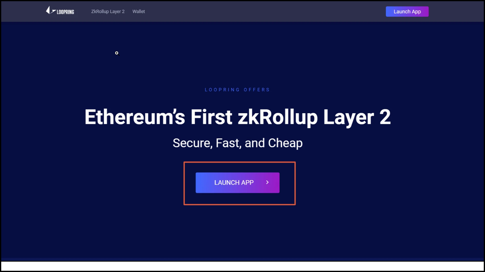
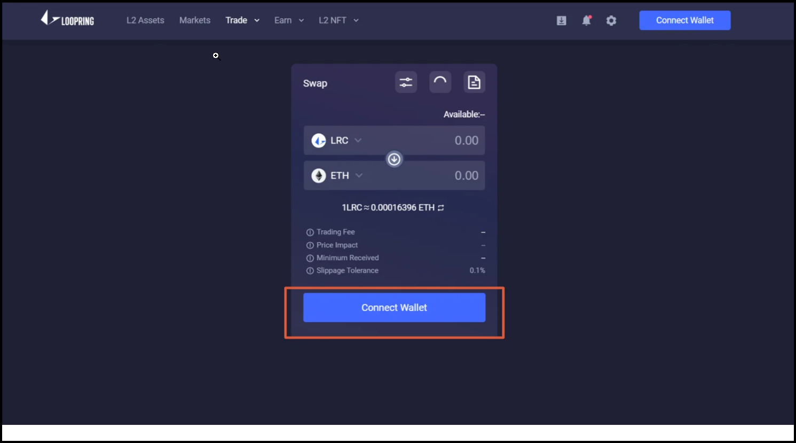
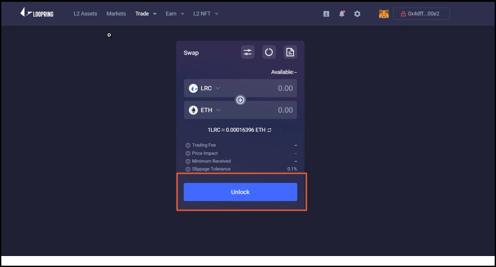
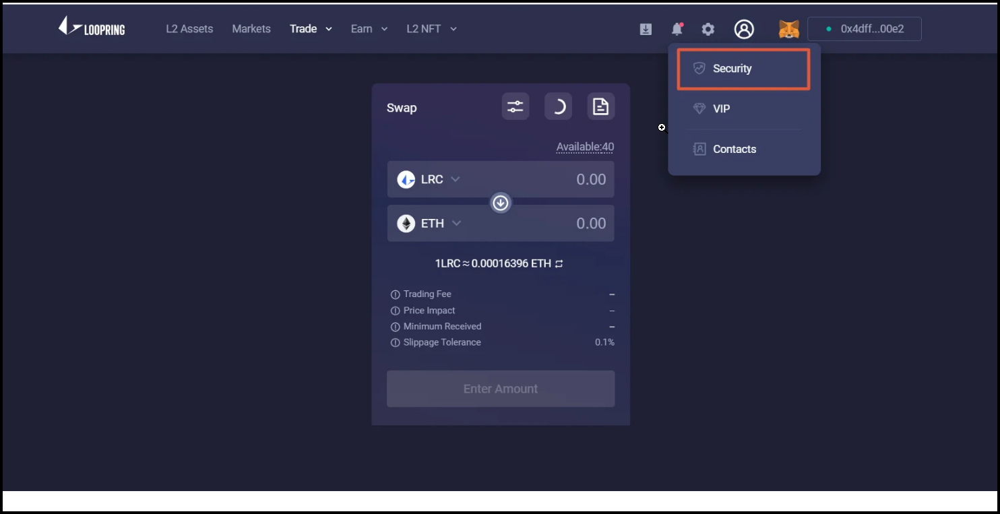
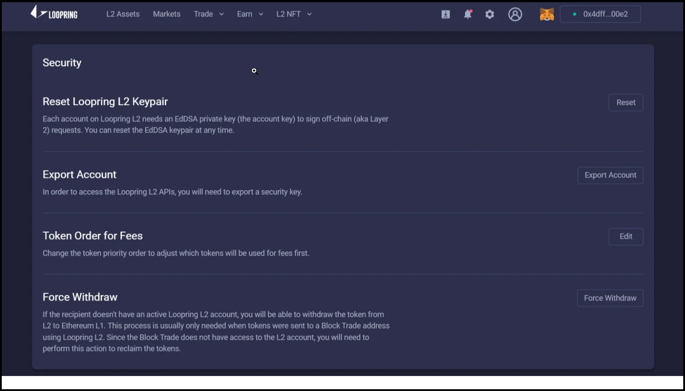
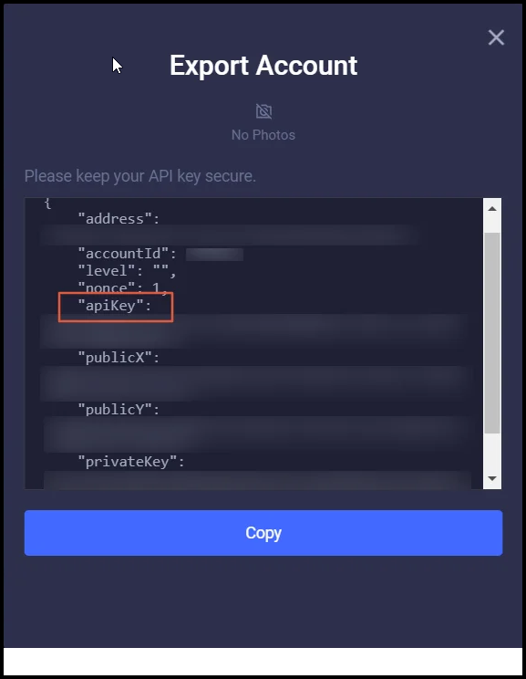

## 🛠 Connector Info

- **Exchange Type**: Decentralized Exchange (**DEX**)
- **Market Type**: Central Limit Order Book (**CLOB**)
- **Maintenance Tier**: 
- **Maintainer:** [CoinAlpha](https://coinalpha.com)

Currently, Loopring is a **Bronze** exchange, as voted by HBOT holders in each quarterly [Epoch](/governance/epochs). This means the Hummingbot Foundation does not maintain the components below, but community members may submit [Proposals](/governance/proposals) to fund development bounties and approve pull requests to fix bugs and add enhancements to them.

| Component | Status | Notes | 
| --------- | ------ | ----- |
| [🔀 Spot Connector](#spot-connector) | ✅ |
| [🔀 Perp Connector](#perp-connector) | Not available | 
| [🕯 Spot Candles Feed](#spot-candles-feed) | Not available | 
| [🕯 Perp Candles Feed](#perp-candles-feed) | Not available | 

## ℹ️ Exchange Info

- **Website**: <https://loopring.io/>
- **CoinMarketCap**: <https://coinmarketcap.com/exchanges/loopring-exchange/>
- **CoinGecko**: <https://www.coingecko.com/en/exchanges/loopring>
- **API Docs**: <https://docs.loopring.io/>
- **Fees**: <https://blogs.loopring.org/loopring-exchange-faq/>
- **Supported Countries**: 

## 🔑 How to Connect

### Generate API Keys

Go to https://loopring.io/#/ and click on Launch App



Connect Wallet which is Layer 2 activated.



Click on unlock to access account details.



Click on Security in Details which will ask you for your signature from a connected Ethereum Wallet.



Click on Export Account.



A popup will open which gives you details about your account fetch the API key from here.



### Add Keys to Hummingbot

From inside the Hummingbot client, run `connect loopring` in Hummingbot in order to connect your API keys:

```
Enter your Loopring account id >>>
Enter the Loopring exchange address >>>
Enter your Loopring private key >>>
Enter your loopring api key >>>
```

If connection is successful:

```
You are now connected to loopring.
```


## 🔀 Spot Connector
*Integration to spot markets API endpoints*

- **ID**: `loopring`
- **Connection Type**: WebSocket
- **Folder**: <https://github.com/hummingbot/hummingbot/tree/master/hummingbot/connector/exchange/loopring>

### Order Types

This connector supports the following `OrderType` constants:

- `LIMIT`
- `LIMIT_MAKER`


### Paper Trading

Access the [Paper Trade](/global-configs/paper-trade/) version of this connector by running `connect loopring_paper_trade` instead of `connect loopring`.

If this is not available by default, you can configure Hummingbot to add this paper trade exchange. See [Adding Exchanges](/global-configs/paper-trade/#adding-exchanges) for more information.