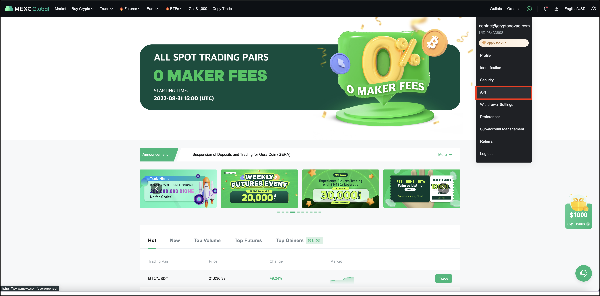
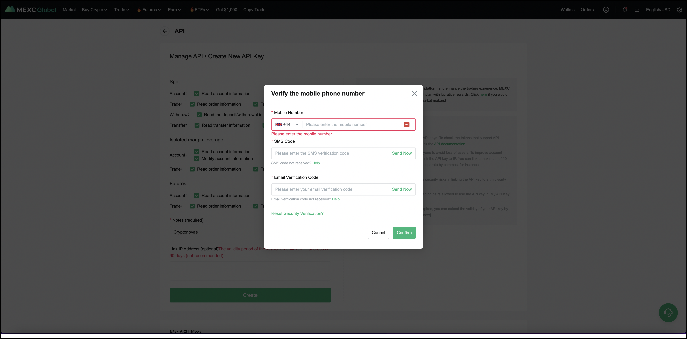
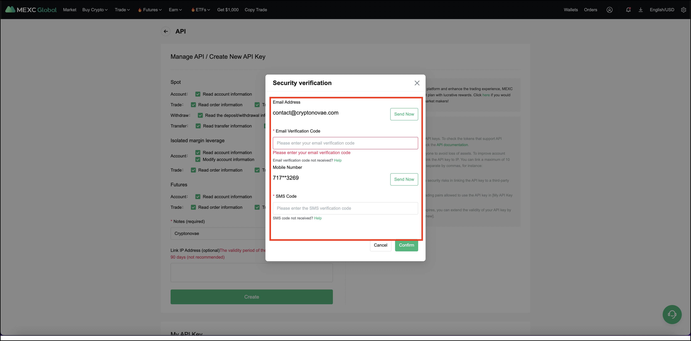
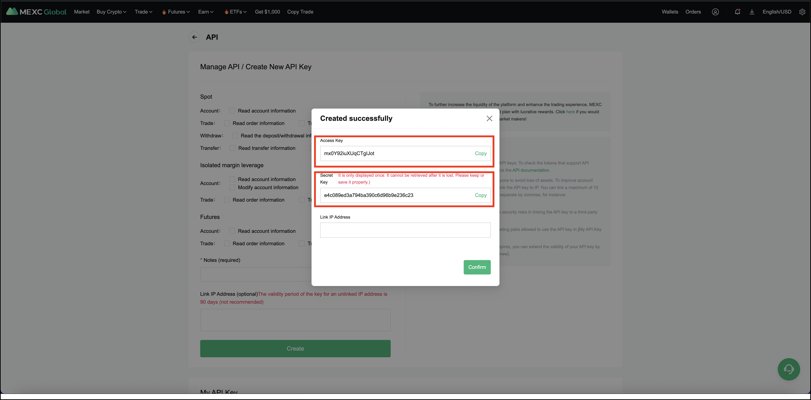

!!! tip "Support Hummingbot"
    Hummingbot Foundation has a fee share partnership with MEXC. When you use our software to trade on MEXC, a custom API header tells MEXC that the trade was executed using Hummingbot, so they share a portion of your fees with us, at no cost to you. To support us, just enter your API keys into Hummingbot and run bots! Thanks for your support! 🙏

## 🛠 Connector Info

- **Exchange Type**: Centralized Exchange (**CEX**)
- **Market Type**: Central Limit Order Book (**CLOB**)

| Component | Status | Connector Version | V2 Strategies | Notes | 
| --------- | ------ | ----------------- |  ------------ | ----- |
| [🔀 Spot Connector](#spot-connector) | ✅ | v2.0 | Yes | |
| [🔀 Perp Connector](#perp-connector) | Not built |
| [🕯 Spot Candles Feed](#spot-candles-feed) | Not built  | 
| [🕯 Perp Candles Feed](#perp-candles-feed) | Not built  | 

## ℹ️ Exchange Info

- **Website**: <https://www.mexc.com/>
- **CoinMarketCap**: <https://coinmarketcap.com/exchanges/mexc/>
- **CoinGecko**: <https://www.coingecko.com/en/exchanges/mexcglobal>
- **API Docs**: <https://www.mexc.com/mexc-api>
- **Fees**: <https://www.mexc.com/fee>
- **Supported Countries**: Worldwide

## 🔑 How to Connect

### Generate API Keys

Log into your MEXC account and click on "API" located under the user centre icon



Tick all boxes on the next page except for the Withdraw section (Hummingbot doesn't support withdraw at the moment) name your API KEY and click on create

Add your phone number and validate it



Complete the security verification with your email and your phone number



Your API is now created. Please keep your Secret Key secure. It will not be shown again. If you forget your Secret Key, you will need to delete the API and create a new one.



### Add Keys to Hummingbot

!!! tip "Trading Pairs"
    Please note that not all trading pairs are available for trading by the MEXC API. For a list of trading pairs that are available please check this link - <https://www.mexc.com/user/openapi>


From inside the Hummingbot client, run `connect mexc`:

```
Enter your mexc API key >>>
Enter your mexc secret key >>>
```

If connection is successful:

```
You are now connected to mexc
```

## 🔀 Spot Connector
*Integration to spot markets API endpoints*

- **ID**: `mexc`
- **Connection Type**: WebSocket
- **Folder**: <https://github.com/hummingbot/hummingbot/tree/master/hummingbot/connector/exchange/mexc>

### Order Types

This connector supports the following `OrderType` constants:

- `LIMIT`
- `MARKET`

### Paper Trading

Access the [Paper Trade](/global-configs/paper-trade/) version of this connector by running `connect mexc_paper_trade` instead of `connect mexc`.

If this is not available by default, you can configure Hummingbot to add this paper trade exchange. See [Adding Exchanges](/global-configs/paper-trade/#adding-exchanges) for more information.
```
