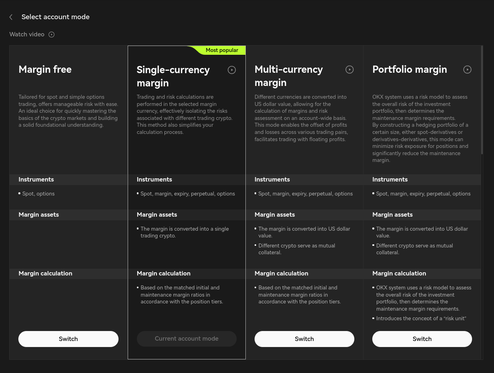

!!! tip "Foundation Partner"
    OKX is an [exchange partner](/about/sponsors) of Hummingbot Foundation, so when you use Hummingbot to run bots on OKX, a portion of your fees goes to support the Foundation and our mission to democratize algo trading with open source software. To help support us, create an account using our [OKX referral link](https://www.okx.com/join/1931920269) and enter that account's API keys into Hummingbot and run bots! Thanks for your help! 🙏


## 🛠 Connector Info

- **Exchange Type**: Centralized Exchange (**CEX**)
- **Market Type**: Central Limit Order Book (**CLOB**)

| Component | Status | Connector Version | V2 Strategies | Notes | 
| --------- | ------ | ---------------- |  ------------ | ----- |
| [🔀 Spot Connector](#spot-connector) | ✅ | v2.1 | Yes | |
| [🔀 Perp Connector](#perp-connector) | ✅ | v2.1 | Yes | |
| [🕯 Spot Candles Feed](#spot-candles-feed) | Not built  | 
| [🕯 Perp Candles Feed](#perp-candles-feed) | ✅  | 

## ℹ️ Exchange Info

- **Website**: <https://www.okx.com/>
- **CoinMarketCap**: <https://coinmarketcap.com/exchanges/okx/>
- **CoinGecko**: <https://www.coingecko.com/en/exchanges/okx>
- **API Docs**: <https://www.okx.com/docs-v5/en/#overview>
- **Fees**: <https://www.okx.com/fees>
- **OKX referral link:** <https://www.okx.com/join/1931920269>

## 🔑 How to Connect

### Generate API Keys

1. Log into your OKX account and click the user icon
2. Select API from the dropdown menu
3. Choose the account you want to create API Keys for
4. Click Create API Keys

### Add Keys to Hummingbot

From inside the Hummingbot client, run `connect okx`:

```
>>> connect okx

Enter your okx API key >>>
Enter your okx secret key >>>
Enter your okx passphrase >>>
```

If connection is successful:

```
You are now connected to okx.
```

## 🔀 Spot Connector
*Integration to spot markets API endpoints*

- **ID**: `okx`
- **Connection Type**: WebSocket
- **Folder**: <https://github.com/hummingbot/hummingbot/tree/master/hummingbot/connector/exchange/okx>

### Order Types

This connector supports the following `OrderType` constants:

- `LIMIT`
- `LIMIT_MAKER`

### Paper Trading

Access the [Paper Trade](/global-configs/paper-trade/) version of this connector by running `connect okx_paper_trade` instead of `connect okx`.

If this is not available by default, you can configure Hummingbot to add this paper trade exchange. See [Adding Exchanges](/global-configs/paper-trade/#adding-exchanges) for more information.

## 🔀 Perp Connector
*Integration to perpetual markets API endpoints*

- **ID**: `okx_perpetual`
- **Connection Type**: WebSocket
- **API Docs**: <https://www.okx.com/docs-v5/en/>
- **[Github Folder](<https://github.com/hummingbot/hummingbot/tree/master/hummingbot/connector/derivative/okx_perpetual>)**

### Order Types

This connector supports the following `OrderType` constants:

- `LIMIT`
- `MARKET`

### Usage

- Before connecting, be sure to switch to **Single-currency margin** mode in your OKX account settings. Here is a screenshot from the OKX website default:



- As position mode (one-way or hedge) is set every time Hummingbot starts, if you want to restart hummingbot you need to check if there are any open positions. If so, you'll need to close them before.