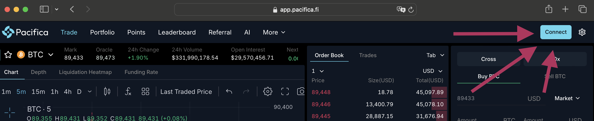
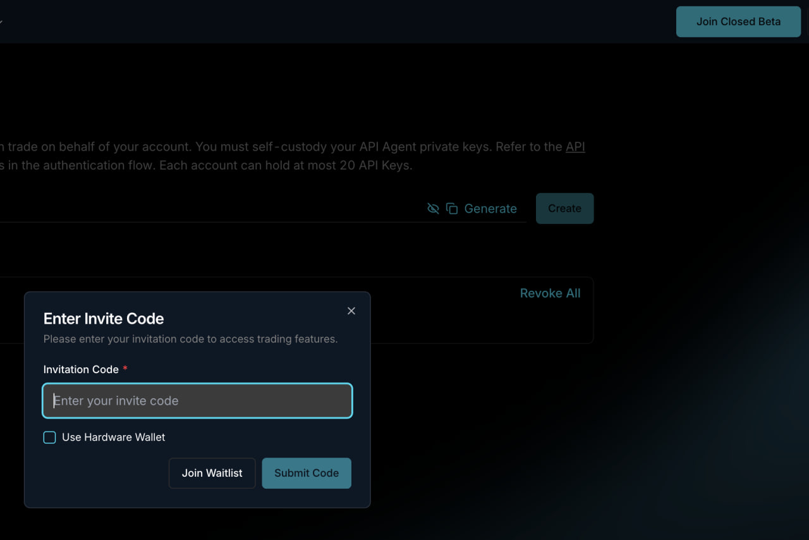
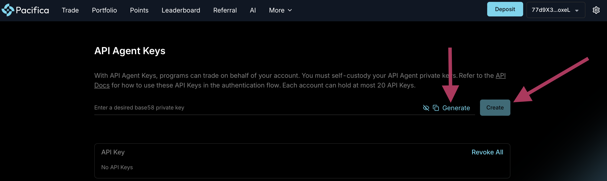
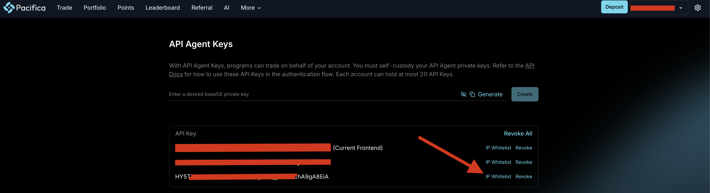
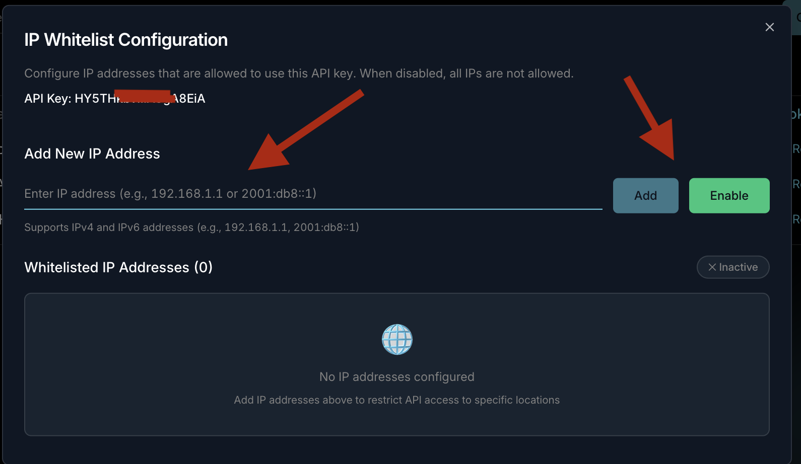

## 🛠 Connector Info

- **Exchange Type**: Decentralized Exchange (**DEX**)
- **Market Type**: Central Limit Order Book (**CLOB**)

| Component | Status | Notes | 
| --------- | ------ | ----- |
| [🔀 Spot Connector](#spot-connector) | Not available |
| [🔀 Perp Connector](#perp-connector) | ✅ | Supports testnet |
| [🕯 Spot Candles Feed](#spot-candles-feed) | Not available |
| [🕯 Perp Candles Feed](#perp-candles-feed) | ✅ |

## ℹ️ Exchange Info

- **Website**: <https://app.pacifica.fi/>
- **CoinMarketCap**: <https://coinmarketcap.com/exchanges/pacifica/?type=perpetual>
- **CoinGecko**: <https://www.coingecko.com/en/exchanges/pacifica>
- **API Docs**: <https://docs.pacifica.fi/>
- **Fees**: <https://docs.pacifica.fi/trading-on-pacifica/trading-fees>
- **Supported Countries**: Not available


## 🔑 Getting Keys Ready

In order to start trading, you would need the following parts ready:

1. [API Agent Keys](https://docs.pacifica.fi/api-documentation/api/signing/api-agent-keys) (aka Agent Wallet)
   1. Public key
   2. Private key
2. Public key of your Solana wallet

Another important key is [API Config Key](https://docs.pacifica.fi/api-documentation/api/rate-limits/api-config-keys),
which would be automatically generated for you. If you have one already, then the first one would be picked.

It all starts with "Connect" button, so you could login and have you Solana wallet connected.



Then you should go to [API Keys page.](https://app.pacifica.fi/apikey)

If you see "Join Closed Beta" button at the top right cortner, then you need to click it first. And use one of the
invitation codes.



Now you could generate Agent Wallet. You should click on "Generate" and then on "Create" button. What you've just
generated is your **Agent Wallet Private Key**. What you see below (and what you'll see after key creation) is your
**Agent Wallet Public Key**.



Don't forget to whitelist the IP address





## 🔀 Perp Connector

*Integration to perpetual futures markets API endpoints*

- **ID**: `pacifica_perpetual`
- **Connection Type**: REST / WebSocket
- **Folder**: <https://github.com/hummingbot/hummingbot/tree/master/hummingbot/connector/derivative/pacifica_perpetual>


### Usage

From inside the Hummingbot client, run `connect pacifica_perpetual`:

```
>>> connect pacifica_perpetual

```

```
Enter your Pacifica Perpetual Agent Wallet Public Key >>>
Enter your Pacifica Perpetual Agent Wallet Private Key >>>
Enter your Pacifica Perpetual User Wallet Public Key >>>
```

If connection is successful:

```
You are now connected to pacifica_perpetual.
```

### Order Types

This connector supports the following `OrderType` constants:

- `LIMIT`
- `LIMIT_MAKER`
- `MARKET`

### Position Modes

This connector supports the following position modes:

- One-way

### Rate Oracle

The connector comes with its own rate oracle implementation. You can use it by using the following command:

```
config rate_oracle_source pacifica_perpetual
```

Make sure to set global token name to `USDC` as `USDC` is the main quote token for trading on Pacifica

```
config global_token.global_token_name USDC
```

### Paper Trading (Pacifica Testnet)

This perp exchange offers a paper trading mode: <https://test-app.pacifica.fi/>

> [!NOTE]
> Please note that Testnet is a separate environment from Mainnet. It has different URL, different balances and you would need to generate new API keys (Agent Wallet) for it.
> [More about Agent Wallets](https://docs.pacifica.fi/api-documentation/api/signing/api-agent-keys)
>
> You would also need to connect a **Solana Devnet Wallet**.
> To trade on Testnet, you need **USDP** (Pacifica's testing token). You can get it from the [Pacifica Faucet](https://test-app.pacifica.fi/faucet).
> To enable the **Deposit** button and fund your account with USDP, you might need to enter an invitation code at [Pacifica Referral](https://test-app.pacifica.fi/referral).
> Note: Claiming from the Pacifica Faucet requires some **SOL** on your Devnet wallet for transaction fees. You can get Devnet SOL from the [Solana Faucet](https://faucet.solana.com/).

After you create an account and create the API keys, you can enter them by using the `connect pacifica_perpetual_testnet` command within the Hummingbot client. Once connected, you should be able to use the testnet with the available perpetual strategies / scripts.

```
connect pacifica_perpetual_testnet
```

## 🕯 Perp Candles Feed

*OHLCV candles data collector from perpetual futures markets*

- **ID**: `pacifica_perpetual`
- **Supported Intervals**: 1m | 3m | 5m | 15m | 30m | 1h | 2h | 4h | 8h | 12h | 1d
- **[Github Folder](https://github.com/hummingbot/hummingbot/tree/master/hummingbot/data_feed/candles_feed/pacifica_perpetual_candles)**

### Usage

In a Hummingbot script, import `CandlesFactory` to create the candles that you want:
```python
    from hummingbot.data_feed.candles_feed.candles_factory import CandlesFactory
    candles = CandlesFactory.get_candle(connector="pacifica_perpetual",
                                        trading_pair=trading_pair,
                                        interval="3m", max_records=50)
```
