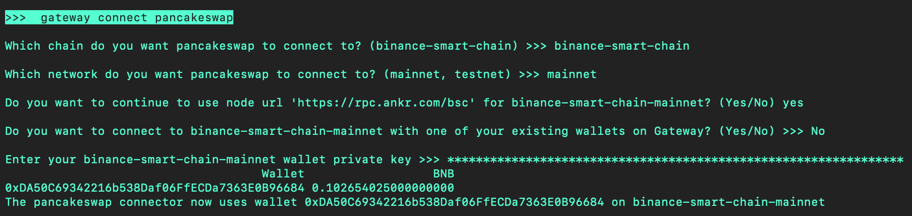
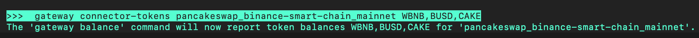

## 🛠 Connector Info

- **Exchange Type**: Decentralized Exchange (DEX)
- **Market Type**: Automatic Market Maker (AMM)
- **Maintenance Tier**: 
- **Maintainer:** Hummingbot Foundation

Currently, PancakeSwap is a **Bronze** exchange, as voted by HBOT holders in each quarterly [Epoch](/governance/epochs). This means that Hummingbot Foundation maintains the components below via [Bounties](/governance/bounties), tracking improvements made to the Gold exchange connectors of that type.

| Component | Status | Notes | 
| --------- | ------ | ----- |
| [2️⃣ AMM Connector](#2-amm-connector) | ✅ |
| [3️⃣ Range AMM Connector](#3-range-amm-connector) | Not built |
| [🕯 AMM Data Feed](#amm-data-feed) | ✅ |

## ℹ️ Exchange Info

- **Website**: <https://pancakeswap.finance>
- **CoinMarketCap**: <https://coinmarketcap.com/exchanges/pancakeswap/>
- **CoinGecko**: <https://www.coingecko.com/en/exchanges/pancakeswap>
- **Fees**: <https://docs.pancakeswap.finance/products/pancakeswap-exchange/pancakeswap-pools>

## 🔑 How to Connect

Create a wallet on one of the supported networks below:

| Chain | Networks | 
| ----- | -------- |
| `binance-smart-chain` | `mainnet`, `testnet`

From inside the Hummingbot client, run `gateway connect pancakeswap` in order to connect your wallet:

```
Which chain do you want pancakeswap to connect to? (binance-smart-chain) >>> 
Which network do you want pancakeswap to connect to? (mainnet, testnet) >>>
Enter your binance-smart-chain-mainnet private key >>>>
```

If connection is successful (binance-smart-chain-mainnet):
```
The pancakeswap connector now uses wallet [pubKey] on binance-smart-chain-mainnet
```



Run `gateway connector-tokens` to add tokens to the `gateway balance` command:



## 2️⃣ AMM Connector
*Integration to this DEX's swap pricing and execution endpoints*

- **ID**: `pancakeswap`
- **Connection Type**: REST via [Gateway](/gateway)
- **API Docs**: <https://docs.pancakeswap.finance/>
- **Folder**: <https://github.com/hummingbot/gateway/tree/main/src/connectors/pancakeswap>
- **Default Configs**: <https://github.com/hummingbot/gateway/blob/main/src/templates/pancakeswap.yml>

### Endpoints

- `/amm/price`
- `/amm/trade`
- `/amm/estimateGas`

For more info, run Gateway and go to <https:localhost:8080> in your browser to see detailed documentation for each endpoint.

## 🕯 AMM Data Feed
*Data feed of this exchange's real-time prices*

- **ID**: `pancakeswap_[CHAIN]_[NETWORK]`
- **Connection Type**: REST via [Gateway](/gateway)
- **Folder**: <https://github.com/hummingbot/hummingbot/blob/master/hummingbot/data_feed/amm_gateway_data_feed.py>

### Usage

```python
from hummingbot.data_feed.amm_gateway_data_feed import AmmGatewayDataFeed
prices = AmmGatewayDataFeed(
        connector_chain_network="pancakeswap_binance_smart_chain_mainnet",
        trading_pairs={"WBNB-USDT", "CAKE-USDT"},
        order_amount_in_base=Decimal("1"),
    )
```