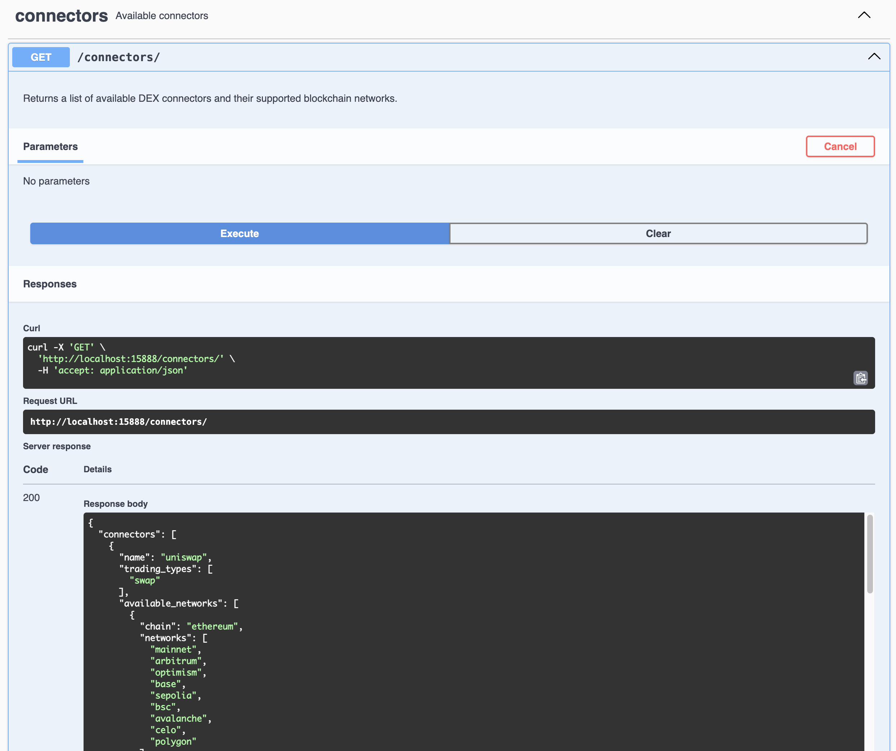

Hummingbot Gateway is an API/CLI client that exposes standardized REST endpoints to interact with blockchain networks and decentralized exchanges (DEXs). It provides a language-agnostic approach to interacting with these protocols through a unified interface.

!!! tip "New: Manage Gateway via Hummingbot API"
    **If you installed Hummingbot using the [recommended Hummingbot API method](/installation/docker/#installation-recommended-hummingbot-api)**, you can manage Gateway directly through the API - no separate installation needed!

    The Hummingbot API includes the `manage_gateway_container` tool that handles Gateway lifecycle:

    - **Start Gateway**: Via MCP with "Start Gateway in development mode with passphrase 'admin'"
    - **Check Status**: "Check Gateway status"
    - **Restart/Stop**: Manage Gateway without manual Docker commands

    See the [Hummingbot API documentation](https://github.com/hummingbot/hummingbot-api) for more details on Gateway management through the API.

    The methods below are for **standalone Gateway installation** (without Hummingbot API).

There are two main ways to install Gateway standalone:

1. **Docker Installation** (Recommended for most users)
2. **Source Installation** (For developers and advanced users)

## Install with Docker

This assumes that you want to use Gateway alongside Hummingbot to enable DEX trading. The Docker process enables seamless communication between the two services.

1 - Navigate to your Hummingbot directory

2 - Edit `docker-compose.yml` and uncomment the Gateway-related lines:
```yaml
  gateway:
   restart: always
   container_name: gateway
   image: hummingbot/gateway:latest
   ports:
     - "15888:15888"
   volumes:
     - "./gateway-files/conf:/home/gateway/conf"
     - "./gateway-files/logs:/home/gateway/logs"
     - "./certs:/home/gateway/certs"
   environment:
     - GATEWAY_PASSPHRASE=admin
     - DEV=true
```

3 - Start both services
```bash
docker compose up -d

[+] Running 3/3
 ✔ Network hummingbot_default  Created                                                                                                                                              0.0s 
 ✔ Container hummingbot        Started                                                                                                                                              0.2s 
 ✔ Container gateway           Started
```

4 - Attach to Hummingbot
```
docker attach hummingbot
```

After setting your password, you should see `Gateway: 🟢 ONLINE` in the upper right corner.

!!! note
    By default, Gateway runs in development mode (`DEV=true`) which uses HTTP for easier setup. For production environments requiring HTTPS, set `DEV=false` and ensure certificates are properly configured.

## Install from Source

You can install Gateway on a standalone basis and then link it to Hummingbot manually. These instructions assume that you have already installed Hummingbot on the machine where you are installing Gateway, either from source or via Docker. See [Installation](/installation) for how to install Hummingbot.

### Install Prerequisites

Install the following dependencies:

- [NodeJS](https://nodejs.org/) (v20.0.0 or higher)
- [pnpm](https://pnpm.io/) package manager

!!! tip
    The new version of Gateway uses pnpm instead of npm because it efficiently handles dependencies with a disk space-saving approach. Since Gateway imports multiple libraries with redundant dependencies, pnpm creates a single content-addressable storage for all packages, significantly reducing installation size and improving performance.

From CLI: 

First, install NodeJS 20+ using the `sudo` administrator prefix:
```bash
# For Ubuntu 20+
sudo apt update && sudo apt install -y curl
curl -fsSL https://deb.nodesource.com/setup_20.x | sudo -E bash -
sudo apt install -y nodejs
```

Afterwards, install pnpm:
```bash
sudo npm install -g pnpm
```

### Install and Setup Gateway

1. Clone the Gateway repo and navigate into the folder:
```bash
# Clone repository
git clone https://github.com/hummingbot/gateway.git
cd gateway
```

2. Install and build Javascript dependencies defined in `package.json`:
```bash
pnpm install
pnpm build
```

### Run Setup Script

The `gateway-setup.sh` script, located in the root Gateway directory, copies the default Gateway [configuration](./configuration.md) files from `/src/templates` to `/conf/` folder.

Run the script:
```bash
pnpm run setup
```

The script will prompt you to select which configurations to update:

- `server.yml` - Gateway server configuration
- `chains/` - Chain and network configurations
- `connectors/` - DEX connector configurations
- `tokens/` - Token lists for each chain/network
- `pools/` - Pool lists for each DEX connector

For a fresh installation, select all options. The script will preserve any existing wallet configurations and `defaultWallet` settings.

### Optional: Generate Certificates

!!! note
    Certificate generation is optional. By default, Gateway runs in development mode (HTTP) which doesn't require certificates. You only need certificates if you want to run Gateway in production mode (HTTPS).

If you want to enable HTTPS mode for secure communication:

1. Start your Hummingbot [client](/client) and run `gateway generate-certs`
2. Enter a secure passphrase when prompted
3. Note the **certs_path** where certificates are stored
4. When running `pnpm run setup`, choose to link certificates and provide the path

To connect Hummingbot to Gateway running in HTTPS mode, set `gateway_use_ssl: true` in Hummingbot's `conf_client.yml`.

## Running Gateway

### Development vs Production Modes

Gateway can run in one of two modes:

**Development Mode (HTTP)** - Default

   - Started with `--dev` flag or by default
   - Exposes HTTP (unencrypted) REST endpoints
   - Interactive Swagger docs at <http://localhost:15888/docs>
   - Shows 🔴 indicator in logs
   - Compatible with Hummingbot when `gateway_use_ssl: false` in `conf_client.yml`

**Production Mode (HTTPS)** - Optional

   - Started without `--dev` flag
   - Exposes HTTPS (encrypted) REST endpoints
   - Requires SSL certificates
   - Shows 🟢 indicator in logs
   - Compatible with Hummingbot when `gateway_use_ssl: true` in `conf_client.yml`

!!! note
    HTTPS is no longer required to connect to Hummingbot. By default, both Gateway and Hummingbot are configured to use HTTP for easier setup. You can change the `gateway_use_ssl` setting in Hummingbot's `conf_client.yml` to switch between HTTP and HTTPS modes.

### Development Mode (Default)

For development mode (HTTP), which is now the default and works with Hummingbot:
```bash
pnpm start --passphrase=<PASSPHRASE> --dev
```

Or simply:
```bash
pnpm start --passphrase=<PASSPHRASE>
```

The passphrase is required for endpoints that handle wallet operations.

If the server has started successfully, you should see:
```bash
bigint: Failed to load bindings, pure JS will be used (try npm run rebuild?)

╔██████╗  █████╗ ████████╗███████╗██╗    ██╗ █████╗ ██╗   ██╗
██╔════╝ ██╔══██╗╚══██╔══╝██╔════╝██║    ██║██╔══██╗╚██╗ ██╔╝
██║  ███╗███████║   ██║   █████╗  ██║ █╗ ██║███████║ ╚████╔╝ 
██║   ██║██╔══██║   ██║   ██╔══╝  ██║███╗██║██╔══██║  ╚██╔╝  
╚██████╔╝██║  ██║   ██║   ███████╗╚███╔███╔╝██║  ██║   ██║   
 ╚═════╝ ╚═╝  ╚═╝   ╚═╝   ╚══════╝ ╚══╝╚══╝ ╚═╝  ╚═╝   ╚═╝
2025-04-04 10:09:59 | info | 	⚡️ Gateway version 2.8.0 starting at http://localhost:15888
2025-04-04 10:09:59 | info | 	Checking for processes using port 15888...
2025-04-04 10:09:59 | info | 	No process found using port 15888
2025-04-04 10:09:59 | info | 	🔴 Running in development mode with (unsafe!) HTTP endpoints
2025-04-04 10:09:59 | info | 	Read token file from conf/lists/solana.json, content length: 619791
2025-04-04 10:09:59 | info | 	Parsed token count: 3859
2025-04-04 10:09:59 | info | 	Loaded 3859 tokens for mainnet-beta
2025-04-04 10:09:59 | info | 	📓 Documentation available at http://localhost:15888/docs
```

### Production Mode (Optional)

For production mode (HTTPS), which requires SSL certificates:

1. Ensure SSL certificates are properly configured (see "Optional: Generate Certificates" section above)
2. Set `gateway_use_ssl: true` in Hummingbot's `conf_client.yml`
3. Run Gateway without the `--dev` flag:

```bash
pnpm start --passphrase=<PASSPHRASE> --prod
```

If the server has started successfully, you should see:
```bash
bigint: Failed to load bindings, pure JS will be used (try npm run rebuild?)

╔██████╗  █████╗ ████████╗███████╗██╗    ██╗ █████╗ ██╗   ██╗
██╔════╝ ██╔══██╗╚══██╔══╝██╔════╝██║    ██║██╔══██╗╚██╗ ██╔╝
██║  ███╗███████║   ██║   █████╗  ██║ █╗ ██║███████║ ╚████╔╝ 
██║   ██║██╔══██║   ██║   ██╔══╝  ██║███╗██║██╔══██║  ╚██╔╝  
╚██████╔╝██║  ██║   ██║   ███████╗╚███╔███╔╝██║  ██║   ██║   
 ╚═════╝ ╚═╝  ╚═╝   ╚═╝   ╚══════╝ ╚══╝╚══╝ ╚═╝  ╚═╝   ╚═╝
2025-04-04 10:12:32 | info | 	⚡️ Gateway version 2.8.0 starting at https://localhost:15888
2025-04-04 10:12:32 | info | 	Checking for processes using port 15888...
2025-04-04 10:12:32 | info | 	No process found using port 15888
2025-04-04 10:12:32 | info | 	🟢 Running in secured mode with behind HTTPS endpoints
2025-04-04 10:12:33 | info | 	Read token file from conf/lists/solana.json, content length: 619791
2025-04-04 10:12:33 | info | 	Parsed token count: 3859
2025-04-04 10:12:33 | info | 	Loaded 3859 tokens for mainnet-beta
2025-04-04 10:12:33 | info | 	📓 Documentation available at https://localhost:15888/docs
```

### Connecting to Hummingbot

Once Gateway is running, go back to your Hummingbot client or restart it if you have exited. In the upper right corner, you should see **GATEWAY: 🟢 ONLINE** if your Hummingbot client is successfully connected to Gateway.

[](./legacy/gateway-status.png)

If you see **GATEWAY: OFFLINE**, check that:

1. Gateway is running on port 15888
2. The `gateway_use_ssl` setting in Hummingbot's `conf_client.yml` matches your Gateway mode (false for HTTP, true for HTTPS)
3. If using HTTPS, certificates are properly configured in both Gateway and Hummingbot


## Interactive Swagger Docs



Gateway provides interactive API documentation through Swagger UI when running in development mode. This interface allows you to:

1. Browse all available API endpoints
2. Test API calls directly from your browser
3. View request/response schemas
4. Execute live API calls

To access the Swagger documentation:

1. Start Gateway in development mode using `pnpm start --passphrase=<PASSPHRASE> --dev`
2. Open your browser and navigate to <http://localhost:15888/docs>
3. You'll see the Swagger UI interface with all available endpoints grouped by category

Each endpoint in the documentation displays detailed information (method, path, description, parameters, request/response examples) and allows you to test API calls directly by filling in parameters and viewing the server's response.

The documentation is automatically generated from the Gateway route files, ensuring it's always up to date with the latest API changes.
